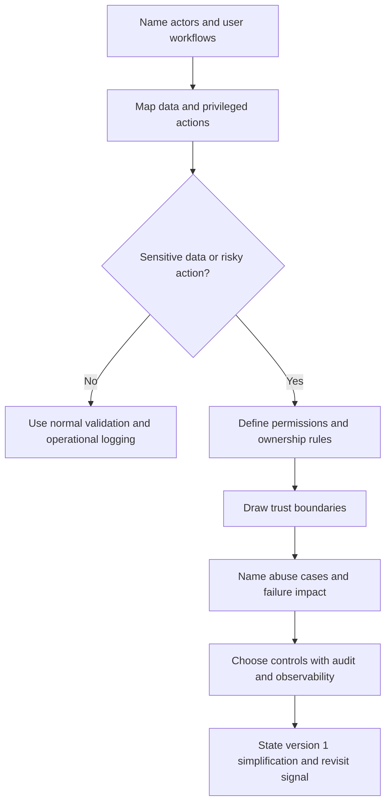

# Security Design

Security design makes abuse, data exposure, and permission mistakes visible
before the architecture hardens. It is not a final checkbox after choosing
components. It is part of requirements, data modeling, API design, operations,
and version 1 scope.

Use this overview to decide what must be protected, who can do what, where trust
changes, and which controls are justified by the system's risk.

## Purpose

A system design should make these security decisions explicit:

- which users, services, operators, partners, and background jobs interact with
  the system;
- which permissions are required for reads, writes, approvals, exports, admin
  actions, and support actions;
- which sensitive data is collected, stored, transmitted, logged, retained, or
  deleted;
- where trust boundaries exist between browsers, mobile apps, APIs, workers,
  databases, queues, vendors, and internal tools;
- which abuse cases could harm users, operators, infrastructure cost, data
  quality, or system availability.

The goal is not to add every control. The goal is to connect each control to a
specific action, data class, boundary, or abuse path.

## When This Matters

Security matters for every design, but it changes the architecture most when:

- public users, partners, or untrusted clients can send requests;
- users belong to organizations, teams, tenants, or roles;
- support or admin users can see or change other users' data;
- the system stores personal, financial, health, credential, location, or
  business-sensitive data;
- APIs trigger expensive work, irreversible state changes, notifications,
  payments, exports, or external calls;
- logs, analytics, search indexes, backups, and caches can copy sensitive data;
- a compromised account, leaked key, or abusive script could affect many users.

## Questions To Ask

Start with questions that change the design:

- Who are the users and non-human actors?
- Which actor performs each read, write, approval, export, deletion, and admin
  action?
- Which permissions are checked before each sensitive action?
- What sensitive data enters the system, and where can it appear later?
- Which components are outside the same trust boundary?
- What can a malicious or careless client do repeatedly, cheaply, or at scale?
- Which actions need audit records so operators can answer who did what and
  why?
- What should happen if a security control, such as an authorization check,
  rate-limit store, or audit sink, is unavailable?
- What is the smallest version 1 control set that protects the riskiest
  workflow?

## Security Review Flow

Use this flow while reviewing a design doc, walkthrough, or interview answer.



## Decision Guidance

### Identify Users And Actors

Do not reduce actors to "the user." Name the groups that have different power
or risk:

- anonymous visitors;
- signed-in end users;
- organization owners, managers, reviewers, or members;
- support agents and administrators;
- internal services, scheduled workers, and data pipelines;
- partner systems, webhook senders, and external API clients.

Each actor should map to the workflows they can start and the data they can see.
If an actor can bypass the normal user interface, such as an admin tool or
worker, treat that path as a first-class part of the design.

### Model Permissions Around Actions

Permissions should be tied to actions and data ownership, not just page access.

For each important action, write:

```text
Actor: <who is asking>
Action: <read, create, update, approve, export, delete, impersonate>
Resource: <which object or collection>
Condition: <ownership, role, organization, state, limit, or policy>
Outcome: <allowed, denied, queued for review, or audited>
```

Start simple when possible. A small internal tool may only need two or three
roles. A multi-tenant product may need organization membership, resource
ownership, and explicit admin permissions. A public API may also need client
identity, quotas, request signatures, and revocation.

### Classify Sensitive Data

List sensitive data before choosing storage, logs, caches, exports, or backups.
For each data class, decide:

- whether it is required for version 1;
- who can create, read, update, export, or delete it;
- whether it can be logged, indexed, cached, or copied to analytics;
- how long it should be retained;
- what happens when a user or operator requests deletion;
- whether masking, redaction, hashing, encryption, or stricter access is
  required.

Sensitive data can appear outside the primary database. Search indexes, message
payloads, dead-letter queues, debug logs, monitoring events, spreadsheets,
backups, and support screenshots can all become secondary exposure paths.

### Draw Trust Boundaries

A trust boundary is a place where the system should stop assuming that input,
identity, network position, or intent is safe.

Common boundaries include:

- browser or mobile client to public API;
- public API to internal service;
- application service to database or queue;
- internal service to third-party API;
- webhook sender to webhook receiver;
- admin tool to production data;
- production system to analytics, logs, exports, or backups.

At each boundary, decide what proof is required: authentication, authorization,
input validation, request signing, schema validation, rate limits, allowlists,
timeouts, audit logs, or manual review. The control should match the boundary's
risk and the damage of getting it wrong.

### Name Abuse Cases

Abuse cases are ways the system can be misused through technically valid
requests, hostile traffic, malformed input, or repeated automation.

Look for:

- brute-force login or reset attempts;
- scraping or high-volume reads;
- spam, fake accounts, or fraudulent submissions;
- quota abuse that creates unbounded work or cost;
- account takeover followed by exports, deletions, or admin changes;
- cross-tenant access attempts;
- replayed webhook events or duplicated API requests;
- oversized payloads, malformed inputs, and repeated retries;
- support workflows used to bypass normal authorization.

Abuse resistance does not always require complex infrastructure. Version 1 may
use request validation, conservative limits, uniqueness rules, idempotency keys,
manual review, and clear operator alerts before adding dedicated fraud or abuse
systems.

### Make Security Observable

Operators need enough evidence to investigate one risky action without exposing
more data than necessary.

Audit and observability decisions should name:

- actor ID, organization ID, resource ID, request ID, and decision outcome;
- the permission or policy that allowed or denied the action;
- admin, support, export, deletion, and impersonation events;
- suspicious patterns such as repeated denial, rate-limit hits, or unusual
  export volume;
- retention and access rules for security logs.

Logs should support investigation, but they should not become a second copy of
secrets, tokens, personal data, or sensitive payloads.

### Keep Version 1 Practical

The first version should protect the critical path without pretending to solve
every future risk. A useful version 1 security plan might include:

- explicit actors and permissions;
- authentication for signed-in workflows;
- authorization checks on every sensitive action;
- validation at public boundaries;
- conservative rate limits for expensive or anonymous actions;
- redaction rules for logs and support views;
- audit records for admin and data-changing actions;
- a documented revisit signal for stronger controls.

Revisit when the product adds tenants, public APIs, external integrations,
high-value data, stronger compliance needs, higher abuse volume, or more
powerful admin tooling.

## Trade-Offs

| Decision | Benefit | Cost Or Risk |
| --- | --- | --- |
| Few coarse roles | Easy to explain and operate in version 1 | May overgrant access as workflows grow |
| Fine-grained permissions | Better fit for complex organizations and sensitive actions | Harder to test, review, and debug |
| Strict validation at every boundary | Reduces malformed input and unexpected state | Can slow integration work if schemas change often |
| Aggressive rate limits | Protects cost and availability from abusive clients | Can block legitimate bursts unless limits are designed carefully |
| Detailed audit logs | Improves investigations and accountability | Can expose sensitive data if log fields are not controlled |
| Minimal data collection | Reduces exposure, retention, and deletion work | May limit analytics, support, or future features |

## Common Mistakes

- Saying "add auth" without naming actors, actions, resources, and conditions.
- Checking permissions in the UI but not on the server-side action.
- Treating internal admin tools as automatically safe.
- Logging full request bodies, secrets, tokens, or sensitive fields for
  convenience.
- Protecting the primary database while ignoring queues, caches, exports,
  backups, and analytics.
- Adding complex security infrastructure without a clear abuse case or data
  risk.
- Forgetting denial paths, rate-limit behavior, support workflows, and audit
  records.
- Designing for trusted clients when browsers, mobile apps, and partner systems
  can be modified or automated.

## Example

A neighborhood equipment library lets residents borrow tools, staff approve
high-value loans, and volunteers help with pickups.

Security review:

| Area | Design Decision |
| --- | --- |
| Users | Residents request reservations, volunteers manage pickup windows, staff approve high-value loans, admins manage inventory. |
| Permissions | Residents can view and edit their own reservations. Volunteers can update pickup status but cannot see full resident profiles. Staff can approve or reject high-value loans. Admins can change inventory and roles. |
| Sensitive data | Names, contact details, addresses, incident notes, and identity-check status are sensitive. Public tool listings should not expose borrower details. |
| Trust boundaries | Browser to public API, public API to reservation service, reservation service to notification provider, admin UI to production data, and backups to storage. |
| Abuse cases | Fake accounts hoard popular tools, scripts scrape contact details, compromised volunteer accounts view too much data, repeated reservation attempts create notification cost, and admins accidentally export full borrower history. |
| Controls | Server-side authorization for every reservation and admin action, rate limits on reservations and login attempts, masked volunteer views, idempotent reservation requests, audit logs for approvals and role changes, and redacted logs for notification failures. |
| Version 1 simplification | Use a small role model with resident, volunteer, staff, and admin. Defer custom per-tool permissions until multiple branches need different policies. |

The design stays small, but it avoids the most damaging mistake: giving every
helper broad access because "it is an internal community tool."

## Checklist

Before accepting a design, confirm:

- Users, services, partners, operators, and background jobs are named.
- Permissions are tied to actions, resources, ownership, roles, or policies.
- Sensitive data is identified across storage, logs, caches, queues, exports,
  backups, and analytics.
- Trust boundaries are visible in the architecture.
- Public, partner, admin, and support paths have validation and authorization
  decisions.
- Abuse cases are named for the highest-risk workflows.
- Rate limits, quotas, idempotency, manual review, or other abuse controls are
  justified where needed.
- Audit logs exist for privileged, risky, or support-driven actions.
- Version 1 security controls are simple enough to implement and test.
- Revisit signals are stated for stronger controls later.

## Security Pages

Current pages:

- [Security design overview](./)
- [Authentication](authentication.md)
- [Authorization](authorization.md)
- [Access-control models](access-control-models.md)
- [Secrets management](secrets-management.md)
- [Encryption](encryption.md)

Planned pages:

- `docs/security/audit-logs.md`: accountable records for risky, administrative,
  and support actions.
- `docs/security/rate-limiting-and-abuse.md`: brute force, scraping, spam,
  quota abuse, account takeover, and public API protection.
- `docs/security/data-privacy.md`: data minimization, consent, masking, access,
  and privacy-focused design questions.
- `docs/security/data-retention-and-deletion.md`: retention periods, deletion
  workflows, backups, and user-visible expectations.
- `docs/security/admin-tools.md`: safe internal tools, support workflows,
  impersonation, approvals, and auditability.
- `docs/security/third-party-integrations.md`: webhooks, API keys, vendor
  failure, trust boundaries, rate limits, and data sharing.

These paths become linked pages as their tickets are completed.

## Related Pages

- [Requirement discovery](../method/requirement-discovery.md)
- [Functional vs non-functional requirements](../method/functional-vs-nonfunctional-requirements.md)
- [Design review checklist](../method/design-review-checklist.md)
- [Data decisions](../data/)
- [Communication patterns](../communication/)
- [Reliability decisions](../reliability/)
- [Operations](../operations/)
- [Glossary](../glossary.md)
