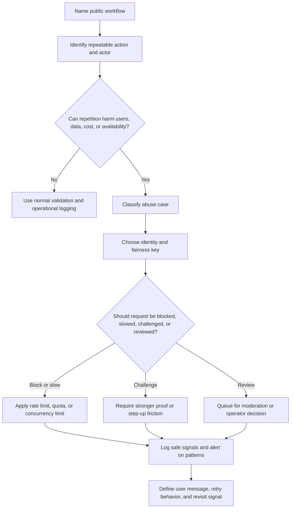

# Rate Limiting And Abuse Resistance

Abuse resistance is the part of system design that asks what a public-facing
system should do when clients behave cheaply, repeatedly, or maliciously. Rate
limiting is one useful control, but it is not the whole design. A good answer
also covers identity, validation, quotas, friction, auditability, recovery, and
what happens to legitimate users during attacks or mistakes.

Use this page to reason from abuse cases to controls. Use the
[scalability rate-limiting guide](../scalability/) when you need to choose
specific algorithms, counters, and distributed limit storage.

## Purpose

Use abuse-resistance design to answer:

- which public or semi-public actions can be repeated cheaply;
- which abuse cases threaten accounts, data, cost, reputation, or availability;
- where rate limits, quotas, validation, friction, or manual review belong;
- how public APIs prove client identity and constrain client behavior;
- how operators detect abuse without collecting unnecessary sensitive data;
- how the system protects legitimate users when controls deny or slow requests.

The goal is to make abuse paths visible early enough that the first version has
practical guardrails without pretending to block every possible attacker.

## When This Matters

Abuse resistance changes the architecture when:

- anonymous users can sign up, search, submit forms, upload content, send
  messages, or trigger emails;
- login, reset, invite, or token-refresh flows can be brute-forced;
- public APIs, partner clients, webhooks, or mobile apps can call the system at
  high volume;
- one account can create cost, consume scarce inventory, send notifications, or
  affect other users;
- scraping can expose sensitive or business-critical data;
- spam or fake submissions can pollute queues, search results, reviews, or
  support workflows;
- account takeover can lead to exports, deletions, purchases, or privilege
  changes.

For a local prototype, a few conservative limits may be enough. For an internet
service, abuse cases belong in the first requirements pass because they affect
API shape, storage, observability, and support behavior.

## Questions To Ask

Start with what an attacker, script, or careless client can repeat:

- Which actions are anonymous, authenticated, privileged, or partner-only?
- Which actions are cheap for a client but expensive for the system?
- Which actions send email, SMS, push notifications, webhooks, payments, or
  provider calls?
- Which reads could be scraped or used to enumerate private resources?
- Which writes create spam, fake accounts, duplicate work, or polluted data?
- Which identifiers define fairness: IP address, account, tenant, API key,
  device, session, phone number, email, or resource?
- What is the normal burst pattern for legitimate users?
- What does a denied user see, and how can they recover if the limit is wrong?
- Which abuse signals are logged, counted, alerted, and reviewed?
- What should fail closed, slow down, queue, or require manual review?

## Abuse-Resistance Decision Flow

## Decision Guidance

### Map Abuse Cases To Workflows

Do not start by saying "add a rate limiter." Start with an abuse case and a
workflow.

| Abuse Case | Workflow | Harm | First Controls |
| --- | --- | --- | --- |
| Brute force | Login, reset, invite, token refresh | Account takeover or lockout noise | Per-account and per-source limits, step-up proof, safe error messages |
| Scraping | Search, listing, profile, report, export | Data exposure, competitive misuse, infrastructure load | Authenticated access, pagination caps, result limits, anomaly alerts |
| Spam | Signup, comments, reviews, messages, submissions | Polluted data, user harm, moderation load | Validation, posting limits, reputation, moderation queue |
| Quota abuse | API calls, exports, provider calls, uploads | Cost, dependency throttling, degraded service | API keys, tenant quotas, budget alerts, backpressure |
| Account takeover | Session reuse, credential stuffing, reset abuse | Data export, deletion, fraud, privilege change | MFA for high-risk actions, session revocation, audit logs |
| Public API abuse | Partner or external clients | Availability loss, unfair usage, noisy incidents | Client identity, per-client limits, idempotency, contract errors |

Each row should connect to an action, actor, limit key, denial behavior, and
operator signal. If a control does not map to a concrete harm, it may add
friction without improving the design.

### Protect Against Brute Force

Brute force happens when a client can repeatedly guess, replay, or probe a
credential or one-time proof.

Common targets:

- password login;
- passwordless codes and email links;
- password reset and account recovery;
- invite acceptance;
- MFA challenges;
- API keys, tokens, and webhook signatures.

Controls:

- limit by account or identifier so one target cannot be attacked forever;
- limit by source, client, device, session, API key, or network range so one
  caller cannot attack many targets cheaply;
- use short-lived, single-use tokens for reset, invite, and verification flows;
- add progressive delay or step-up proof after suspicious attempts;
- avoid error messages that reveal whether an email, username, tenant, or token
  exists;
- notify or audit high-risk credential changes and repeated failures.

Do not rely only on IP limits. Large networks can share one IP, and attackers
can use many sources. Combine multiple signals carefully, and make recovery
possible for legitimate users who trip a control.

### Reduce Scraping And Enumeration

Scraping is high-volume reading that collects data outside the intended product
experience. Enumeration is probing identifiers to discover private resources or
accounts.

Design questions:

- Which list, search, profile, export, and lookup endpoints expose valuable
  data?
- Are resources discoverable by sequential IDs or predictable slugs?
- Can anonymous users access data that should require account or tenant context?
- Are pagination, sorting, filtering, and export endpoints bounded?
- What is a normal read pattern for one user, tenant, or client?
- What signal shows that reads are becoming automated?

Controls:

- require authentication for sensitive reads;
- enforce authorization and tenant scope before returning data;
- use opaque resource identifiers where enumeration would be harmful;
- cap page sizes, result windows, and export sizes;
- limit search frequency and expensive filters;
- return safe denial or not-found responses without leaking private existence;
- audit and alert unusual export volume, high denied reads, and cross-tenant
  probing.

Rate limits can slow scraping, but data minimization and authorization do more
to reduce damage. If the endpoint should not expose a field, do not depend on a
rate limit to hide it.

### Resist Spam And Fake Submissions

Spam abuses write paths that create visible content, user notifications,
moderation load, or polluted data.

Targets:

- signup and invite requests;
- comments, reviews, messages, listings, and reports;
- contact forms and support requests;
- uploads and generated content;
- workflow actions that notify other users.

Controls:

- validate inputs at the public boundary;
- limit new accounts, submissions, messages, uploads, and notifications by actor
  and time window;
- require email, phone, organization, or payment proof only where the risk
  justifies the friction;
- use moderation queues for low-trust or high-impact submissions;
- throttle notification fanout so one account cannot spam many users;
- make duplicate submissions idempotent where retries are expected;
- record safe audit and moderation signals for repeated abuse.

Avoid treating every user as hostile. A good design lets low-risk users complete
normal work while adding friction to unusual bursts, new accounts, risky
content, or high-impact fanout.

### Control Quota Abuse And Cost

Quota abuse happens when clients consume more than their fair share of a shared
resource. The client may be malicious, buggy, or simply growing faster than the
system was designed to support.

Shared resources:

- API request capacity;
- database reads and writes;
- search queries;
- file uploads and storage;
- exports and reports;
- external provider calls;
- background jobs and queues;
- email, SMS, push, and webhook delivery.

Controls:

- define quotas per user, tenant, client, API key, or plan where fairness
  matters;
- separate high-cost actions from low-cost reads;
- use concurrency limits for work that ties up scarce workers or connections;
- use queues and backpressure for expensive asynchronous work;
- set provider-call budgets and alerts before dependencies throttle you;
- expose predictable retry behavior for API clients;
- track quota usage as an operational metric, not only as an error path.

Rate limits are about request pace. Quotas are about total allowed consumption.
Many systems need both: a burst limit to protect immediate capacity and a daily
or monthly quota to protect cost and fairness.

### Limit Account Takeover Damage

Account takeover is not only an authentication failure. It becomes a system
design problem when a compromised account can perform high-impact actions.

High-risk actions:

- exporting sensitive data;
- changing password, email, MFA, roles, or recovery settings;
- deleting, refunding, purchasing, approving, or transferring resources;
- creating API keys or webhook destinations;
- impersonating users or changing tenant configuration.

Controls:

- require MFA, reauthentication, approval, or step-up proof for high-risk
  actions;
- notify users or owners after risky account changes;
- revoke sessions after credential, MFA, or role changes;
- limit export size and frequency even for authenticated users;
- audit actor, action, resource, tenant, reason, and request ID for privileged
  actions;
- give support a narrow recovery workflow that does not bypass normal
  authorization silently.

The design should assume some accounts will be compromised. The question is how
far one compromised identity can go before limits, step-up checks, alerts, and
support processes contain the damage.

### Protect Public APIs

Public APIs need explicit client contracts. A browser UI can hide buttons, but
public clients, partner systems, scripts, and mobile apps can send requests
directly.

Public API protection should define:

- client identity: API key, OAuth client, signed request, session, service
  credential, or partner credential;
- caller context: user, tenant, organization, service, or integration;
- allowed actions and scopes;
- per-client and per-tenant limits;
- request validation and schema behavior;
- idempotency for retries that create work;
- pagination, filtering, sorting, and export bounds;
- error format for denial, quota exhaustion, validation failure, and retry;
- observability for client, tenant, route, result, and rejection reason.

Avoid using one global API key for all partners or scripts. Per-client identity
lets operators revoke, throttle, debug, and contact the right owner. For public
write APIs, pair rate limits with idempotency so legitimate retries do not look
like duplicate abuse.

### Choose The Right Limit Key

The limit key decides who shares a budget. A weak key either blocks legitimate
users together or lets abusive clients spread across identities too easily.

| Limit Key | Good Fit | Watch For |
| --- | --- | --- |
| IP address | Anonymous traffic and coarse network protection | Shared networks and rotating sources |
| Account ID | Signed-in user actions | Compromised accounts and fake-account creation |
| Tenant or organization | Fairness across customers or branches | One noisy user can affect a whole tenant |
| API key or client ID | Public API and partner clients | Leaked keys need revocation and auditability |
| Resource ID | Protect one target from repeated attempts | Attackers can rotate targets |
| Email or phone hash | Signup, reset, invite, and verification abuse | Handle privacy and normalization carefully |

Use more than one key when the harm crosses boundaries. Login may need per
account and per source. Exports may need per user, tenant, and job queue.
Provider calls may need per tenant and global budgets.

### Design Denial And Recovery

Abuse controls are user-facing behavior. If denial is confusing, operators will
disable the control or users will retry harder.

Decide:

- whether the response says slow down, try later, verify identity, contact
  support, or wait for review;
- whether clients receive a retry hint;
- whether denied actions are logged, audited, or alerted;
- whether users can appeal or recover from false positives;
- whether the system fails open, fails closed, queues work, or uses a degraded
  path when the limit store is unavailable.

For public APIs, use stable error codes and documented retry behavior. For user
interfaces, explain the next safe action without revealing private security
rules or enumeration signals.

### Keep Version 1 Practical

Version 1 does not need a full abuse platform. It does need controls for the
riskiest public workflows.

A practical starting point:

- identify anonymous, authenticated, privileged, and partner actions;
- add conservative limits to login, reset, invite, signup, search, export,
  upload, and notification fanout where those actions exist;
- use per-account, per-client, per-tenant, and per-source keys where they match
  the abuse case;
- validate request shape and cap page, search, upload, export, and queue sizes;
- add idempotency for retried writes and provider-triggering actions;
- audit privileged denials, exports, role changes, and repeated suspicious
  attempts;
- alert on unusual denial rates, quota exhaustion, provider throttling, and
  export volume.

Revisit when the product adds public APIs, mobile clients, partner integrations,
user-generated content, expensive provider calls, higher traffic, or evidence of
specific abuse.

## Trade-Offs

| Decision | Benefit | Cost Or Risk |
| --- | --- | --- |
| Strict anonymous limits | Protects signup, search, and reset flows early | Can block shared networks or legitimate bursts |
| Per-account limits | Targets abuse tied to one user | Fake accounts can spread load |
| Per-tenant quotas | Protects customer fairness and cost | One noisy user may affect a whole tenant |
| Step-up proof | Reduces account takeover damage | Adds friction and recovery complexity |
| Manual review | Catches ambiguous or high-impact abuse | Adds queue latency and operator work |
| Fail closed on limit-store outage | Protects high-risk actions | Can create visible outages |
| Fail open with alert | Preserves availability for low-risk actions | Allows abuse during the outage window |

## Common Mistakes

- Adding one global rate limit without naming the abuse case.
- Using only IP address as the fairness key.
- Limiting reads but leaving exports, search windows, and pagination unbounded.
- Protecting login but forgetting reset, invite, MFA, and token-refresh flows.
- Letting one account send unlimited notifications or provider calls.
- Returning denial errors that reveal whether a private account or resource
  exists.
- Logging full payloads while investigating abuse.
- Blocking legitimate users without a retry, appeal, or support path.
- Treating public API clients as trusted because they were issued an API key.
- Adding complex fraud infrastructure before simple validation, limits,
  idempotency, and alerts are in place.

## Example

A neighborhood equipment library exposes public tool search, resident signup,
reservation requests, staff approvals, notification reminders, and a small API
for partner kiosks.

Abuse-resistance design:

| Workflow | Abuse Risk | Control |
| --- | --- | --- |
| Public tool search | Scraping inventory and hammering expensive filters | Cap page size, require branch scope, limit anonymous search bursts, and alert on unusual read volume |
| Signup and reset | Brute-force codes and email flooding | Short-lived single-use tokens, per-email and per-source limits, safe messages, and delayed retries |
| Reservation request | Fake accounts hoard popular tools | Per-account reservation limits, duplicate request idempotency, and staff review for high-value tools |
| Reminder notifications | One account triggers many emails | Notification fanout limit and audit event for repeated sends |
| Partner kiosk API | One kiosk script loops and consumes capacity | Per-client API key, route limits, request validation, and retry guidance |
| Admin export | Compromised staff account exports borrower data | MFA step-up, export quota, audit log, owner notification, and review alert |

Rejected for version 1:

- a custom fraud scoring service, because the first risks are visible enough to
  handle with limits, validation, and manual review;
- device fingerprinting, because it adds privacy and support complexity before
  there is evidence that simpler controls fail;
- a hard global API cap, because partner kiosks and public search need separate
  budgets and error behavior.

The design protects the riskiest loops first while keeping normal reservation
and search workflows usable.

## Checklist

Before accepting an abuse-resistance design, confirm:

- Public, anonymous, authenticated, privileged, partner, and worker actions are
  named.
- Brute-force targets include login, reset, invite, MFA, token, and API-key
  flows where they exist.
- Scraping and enumeration risks are reviewed for search, list, profile, lookup,
  and export endpoints.
- Spam and fake-submission paths have validation, limits, moderation, or review
  where needed.
- Quota abuse is handled for expensive reads, writes, uploads, exports, queues,
  provider calls, and notifications.
- Account takeover damage is limited with step-up proof, session revocation,
  export controls, audit logs, and notifications where risk justifies it.
- Public APIs have client identity, scopes, validation, pagination bounds,
  idempotency, stable errors, and retry behavior.
- Rate-limit and quota keys match the abuse case instead of relying on one
  global key.
- Denial behavior is clear for users, API clients, operators, and support.
- Limit-store failure behavior is explicit for high-risk and low-risk actions.
- Abuse signals are logged without raw secrets, tokens, or sensitive payloads.
- Alerts cover unusual denial rates, quota exhaustion, provider throttling,
  export spikes, and repeated suspicious attempts.
- Version 1 controls are small enough to implement and test.
- The detailed rate-limiting algorithm choice is separated from the abuse case
  requirements.

## Related Pages

- [Security design overview](./)
- [Authentication](authentication.md)
- [Authorization](authorization.md)
- [Audit logs](audit-logs.md)
- [Scalability rate-limiting guide](../scalability/)
- [Capacity estimation](../scalability/capacity-estimation.md)
- [Idempotency](../communication/idempotency.md)
- [Retries and backoff](../communication/retries-and-backoff.md)
- [Timeouts](../reliability/timeouts.md)
- [Operations](../operations/)
- [Glossary](../glossary.md)
