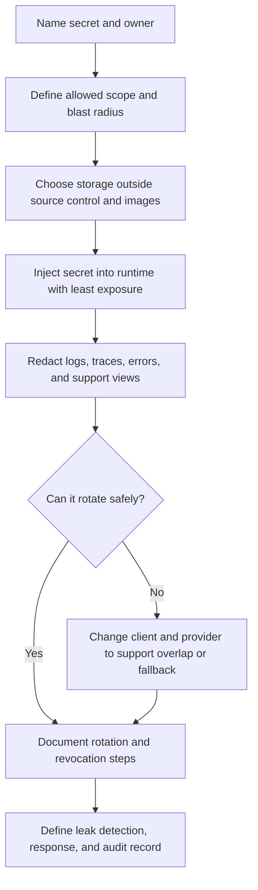

# Secrets Management

Secrets are values that grant access: API keys, service credentials, database
passwords, signing keys, private certificate keys, webhook secrets, and tokens.
If a secret leaks, an attacker may be able to read data, call an API, impersonate
a service, or create cost before the system notices.

Good secrets management is not only "put it in an environment variable." It is
an architecture decision about who owns each secret, where it is stored, how it
is injected, how it is rotated, how it is observed, and what the system does
after a leak.

## Purpose

Use secrets management to answer:

- which API keys, credentials, signing keys, tokens, and webhook secrets exist;
- which service, team, or workflow owns each secret;
- where each secret is stored and where it must never appear;
- how applications receive secrets at runtime;
- how rotation and revocation happen without long outages;
- how leak response, investigation, and recovery work.

The goal is to make secret handling boring, visible, and reversible. A design
should assume secrets eventually need rotation, even when there has not been an
incident.

## When This Matters

Secrets management changes the architecture when:

- services connect to databases, queues, caches, object stores, or providers;
- public APIs, partner clients, workers, or webhooks use API keys or request
  signing;
- CI/CD pipelines deploy code or run migrations;
- logs, metrics, traces, screenshots, queues, and support tools might copy
  request data;
- credentials are shared across environments, services, tenants, or humans;
- a provider key can create cost, send messages, export data, or mutate state;
- a leaked secret requires fast revocation and clear ownership.

For a local prototype, a `.env` file may be enough. For a shared repository or
deployed system, secrets need a controlled storage and rotation plan.

## Questions To Ask

Start with inventory and blast radius:

- What secrets exist in version 1?
- What does each secret allow if stolen?
- Which service or workflow owns it?
- Is the secret scoped to one environment, tenant, provider, service, or action?
- How is the secret created, distributed, and revoked?
- Does the application read it at startup, per request, or from a sidecar or
  mounted file?
- Can the system accept old and new values during rotation?
- Where could the secret accidentally appear: source control, images, logs,
  metrics, traces, queues, error pages, analytics, or support tickets?
- What alert or review would reveal a suspicious use?
- Who runs the leak response steps?

## Secret Handling Flow

## Decision Guidance

### Inventory Secrets

Start with a table. Secret design is hard to review when values are scattered
across local files, deployment settings, CI variables, and provider dashboards.

| Secret | Owner | Scope | Storage And Injection | Emergency Revoke |
| --- | --- | --- | --- | --- |
| Database password | API service team | Production API database read/write | Deployment secret injected at API startup | Disable old database user after replacement connects |
| Email provider API key | Notifications team | Production notification sending | Secret store value injected into worker | Disable key in provider console and pause suspicious sends |
| Webhook signing secret | Integrations team | One inbound webhook endpoint | Versioned secret used by webhook receiver | Stop accepting old signature value |
| Worker service credential | Platform team | Reminder worker to API | Per-worker deployment secret | Revoke credential and pause worker jobs |

For each secret, name:

- owner and backup owner;
- environment: local, test, staging, production;
- consumer services;
- allowed actions;
- expiry or rotation schedule;
- storage location;
- emergency revoke path;
- audit or usage signal.

Avoid one shared secret for many services or environments. It saves setup time
but makes leaks harder to contain because every consumer becomes suspect.

### Scope API Keys And Credentials

An API key or credential should have the smallest useful scope.

Scope decisions:

- one key per environment instead of one global key;
- one credential per service, worker, partner, or tenant when blast radius
  matters;
- read-only, write-only, send-only, or webhook-only permissions when the provider
  supports them;
- rate limits or quotas for keys that can create cost;
- expiry for temporary keys and grants;
- owner metadata so unused keys can be removed.

Do not use a user account password as a service credential. Service credentials
need their own owner, revocation path, rotation process, and audit trail.

### Store Secrets Outside Code

Secrets should not live in source control, container images, public docs, issue
comments, screenshots, or chat logs. A repository history is hard to clean after
a secret is committed.

Better storage patterns:

- a managed or self-hosted secret store;
- encrypted deployment variables with restricted access;
- CI/CD secret variables scoped to the repository, environment, or workflow;
- local development `.env` files that are ignored by source control;
- mounted secret files with restricted permissions when runtime supports it.

The storage choice should answer:

- who can read or update the secret;
- whether access is audited;
- whether different environments are separated;
- how a deployed process receives updates;
- what happens if the secret store or deployment-secret system is unavailable at
  startup, reload, or rotation time;
- how old versions are retired;
- how backups, debug dumps, and support exports avoid exposing the value.

Encryption at rest helps, but access control and operational discipline still
need design. Review broad access, logging, copying, screenshots, and stale
credentials as ordinary exposure paths instead of focusing only on
cryptography.

### Treat Environment Variables As Injection, Not Storage

Environment variables are a common way to inject secrets into a process. They
are not a complete storage or lifecycle strategy.

Use environment variables carefully:

- keep `.env` files out of source control;
- load values from a controlled secret store or deployment system;
- avoid printing full environment dumps in logs or error reports;
- avoid passing secrets in command-line arguments where process listings may
  expose them;
- document whether changing the value requires restart, reload, or redeploy;
- prefer separate variables for separate credentials rather than one packed
  secret blob.

Environment variables are usually acceptable for simple deployment injection.
They are weak as a long-term system of record because they do not automatically
answer ownership, audit, rotation, expiry, or revocation.

### Design Rotation Before You Need It

Rotation replaces a secret with a new value and retires the old value. A system
that cannot rotate secrets safely is one leak away from an outage.

Rotation design should name:

- who can issue the new value;
- where the new value is stored;
- how consumers receive it;
- whether old and new values overlap during a grace window;
- how to verify the new value is in use;
- when the old value is revoked;
- how to roll back if the new value fails;
- what audit record proves the rotation happened.

Common rotation patterns:

| Pattern | Use When | Watch For |
| --- | --- | --- |
| Deploy new value, then revoke old | Consumer can restart or reload quickly | Old value remains valid during rollout |
| Accept two signing secrets temporarily | Webhook or token verification needs overlap | The overlap window must be short and logged |
| Issue per-service credentials | Services rotate independently | More credential inventory and automation |
| Short-lived credentials | Platform can issue fresh credentials automatically | Requires reliable issuance and clock handling |

Database credential rotation usually changes how a service authenticates to a
store and may require connection reloads, pool draining, or a short overlap
between old and new users. Webhook or signing-secret rotation usually changes
verification: the receiver may need to accept signatures from both values for a
short window while the sender switches.

Do not rotate by editing code and hoping every instance restarts. Rotation is a
workflow with verification.

### Prevent Accidental Exposure

Secrets often leak through secondary paths, not the primary secret store.

Protect these paths:

- logs and structured events;
- traces and span attributes;
- metrics labels;
- exception messages and stack traces;
- request and response bodies;
- queue messages and dead-letter queues;
- analytics events;
- screenshots and support attachments;
- test fixtures and copied production data;
- container images and build caches.

Use redaction rules that remove known secret fields and high-risk token shapes.
Still design as if redaction can fail: avoid placing secrets in URLs, message
payloads, or user-visible errors in the first place.

Add focused tests for high-risk fields. For example, a request that includes
`Authorization`, `api_key`, or webhook signature headers should produce logs and
errors that contain only redacted placeholders, credential IDs, or fingerprints.

### Plan Leak Response

Leak response is the runbook for "this secret may be exposed." It should be
specific enough that an on-call engineer can act without debating first steps.

Minimum leak response:

1. Identify the secret, owner, scope, and affected environment.
2. Revoke or disable the leaked value when immediate revocation is safe.
3. Issue and deploy a replacement value.
4. Verify consumers use the new value.
5. Search for where the value appeared and remove or restrict copies where
   possible.
6. Review provider logs, application logs, and audit records for suspicious use,
   using credential IDs or fingerprints instead of raw secret values.
7. Record timeline, impact, follow-up fixes, and remaining uncertainty.

When immediate revocation would break a critical path, use a short overlap only
while deploying the replacement. Record who approved the overlap and when the
old value was finally revoked.

Do not treat deleting one log line or commit as sufficient response. If a secret
was visible to people, systems, or third parties, assume it may have been copied
and rotate it.

### Keep Version 1 Practical

A reasonable version 1 might include:

- one secret inventory table;
- separate secrets for local, staging, and production;
- one credential per service or provider integration;
- secret values outside source control and container images;
- environment-variable injection from a controlled deployment setting;
- log redaction for known secret fields;
- documented rotation for database, provider, webhook, and worker credentials;
- a leak response checklist with owners and emergency revoke paths.

Revisit when the system adds more services, more providers, public APIs,
webhooks, tenant-specific keys, compliance requirements, or higher incident
response expectations.

## Trade-Offs

| Decision | Benefit | Cost Or Risk |
| --- | --- | --- |
| One shared provider key | Simple setup | Large blast radius and unclear ownership |
| Per-service credentials | Clear ownership and revocation | More inventory and rotation work |
| Long-lived secrets | Fewer moving parts | Higher damage if leaked |
| Short-lived credentials | Smaller exposure window | Requires reliable issuance and refresh |
| Environment variables | Simple runtime injection | Weak ownership, audit, and rotation by themselves |
| Secret store | Central access control and audit | Adds dependency and operational setup |
| Immediate revocation | Stops known leaked value quickly | Can cause outage if replacement is not ready |
| Rotation overlap window | Reduces deployment risk | Old and new values both work for a short time |

## Common Mistakes

- Committing secrets and assuming deletion removes the risk.
- Sharing one production key across services, workers, and humans.
- Treating environment variables as the complete secrets strategy.
- Logging request headers, full URLs, environment dumps, or provider responses
  that contain tokens.
- Putting secrets in queue messages, analytics events, screenshots, or support
  tickets.
- Rotating only after incidents and never testing rotation on purpose.
- Forgetting CI/CD, migrations, one-off scripts, and local development secrets.
- Not knowing who owns a credential or where to revoke it.
- Letting old keys remain active after migration.

## Example

A neighborhood equipment library sends reservation reminders, accepts partner
webhooks for donated equipment, and runs a worker that updates pickup status.

Secrets inventory:

| Secret | Scope | Storage And Injection | Rotation | Leak Response |
| --- | --- | --- | --- | --- |
| Database password | Production API to primary database | Stored in deployment secret settings; injected as environment variable | Issue new password, deploy API, verify connections, revoke old password | Revoke old password after replacement is active; review database access logs |
| Email provider API key | Notification worker send-only access | Stored in secret store; worker reads at startup | Create new send-only key, deploy worker, revoke old key | Disable old key, check provider send logs, alert owner if unusual volume appears |
| Webhook signing secret | Inbound donation webhook | Stored as versioned secret; receiver accepts old and new during a short window | Add new secret, accept both briefly, confirm partner sends with new signature | Disable old secret, reject replays, review failed signature attempts |
| Reminder worker credential | Worker to internal API | Per-worker service credential in deployment settings | Rotate worker credential independently from human admin accounts | Revoke credential, pause suspicious jobs, inspect job audit records |

Rejected for version 1:

- one global provider key, because reminder sending and partner webhooks have
  different blast radius and owners;
- storing secrets in the repository for easy setup, because repository history
  and screenshots are hard to contain after a leak;
- fully automated short-lived credentials for every dependency, because version
  1 can use documented rotation while the service count is small.

The design is simple, but every secret has an owner, scope, storage location,
rotation path, and response plan.

## Checklist

Before accepting a secrets design, confirm:

- API keys, credentials, signing keys, webhook secrets, tokens, and database
  passwords are inventoried.
- Each secret has an owner, environment, scope, consumer, and blast radius.
- Secrets are stored outside source control, container images, public docs, and
  support artifacts.
- Runtime injection is defined, including whether restart, reload, or redeploy
  is required.
- Environment variables are treated as injection, not the only storage policy.
- Logs, traces, metrics, queues, analytics, and error reports avoid raw secret
  values.
- API keys and service credentials are scoped to the smallest useful actions.
- Rotation steps include creation, rollout, verification, revocation, and
  rollback.
- Old values are removed after migration.
- Leak response names revoke path, replacement path, investigation signals, and
  owner.
- CI/CD, migrations, scripts, and local development have secret handling rules.
- Version 1 keeps the system small without sharing high-blast-radius secrets.

## Related Pages

- [Security design overview](./)
- [Authentication](authentication.md)
- [Authorization](authorization.md)
- [Access-control models](access-control-models.md)
- [Retries and backoff](../communication/retries-and-backoff.md)
- [Timeouts](../reliability/timeouts.md)
- [Operations](../operations/)
- [Glossary](../glossary.md)
