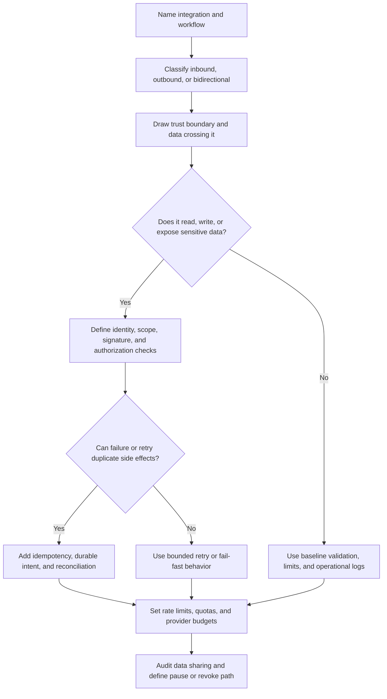

# Third-Party Integrations

Third-party integrations connect your system to providers, partners, customer
systems, and external automation. They can speed up version 1, but they also
move trust, data, availability, and operational control across a boundary you do
not fully own.

Design integrations as explicit boundaries. A safe design names what data is
shared, how callers prove identity, what happens when the provider is slow or
wrong, how retries stay safe, and how operators can disable or repair one
integration without harming the rest of the system.

## Purpose

Use third-party integration design to decide:

- which external systems can call you and which external systems you call;
- where trust boundaries exist for webhooks, APIs, browser redirects, files,
  and background jobs;
- how API keys, partner credentials, webhook secrets, and request signatures are
  created, scoped, rotated, and revoked;
- which data is shared, stored, logged, retained, or copied by the integration;
- how rate limits, quotas, retry budgets, and provider failures affect user
  workflows;
- which audit logs, metrics, and runbooks let operators investigate one partner
  or provider incident.

The goal is to make integrations useful without letting a vendor outage,
leaked key, replayed webhook, or oversized partner response become a full
system incident.

## When This Matters

Third-party integration design changes the architecture when:

- inbound webhooks can create, update, approve, cancel, or delete local state;
- outbound provider calls send email, SMS, payments, files, search updates,
  analytics, notifications, or partner events;
- partner APIs can read tenant data or trigger expensive work;
- browser redirects or callback URLs carry tokens, codes, or state;
- one provider failure can block a user-facing workflow;
- one tenant or partner can consume shared provider quota;
- external systems receive personal, credential, financial, operational, or
  business-sensitive data.

For a prototype, one provider key and a direct API call may be acceptable. For a
shared production system, every integration needs identity, scope, failure
behavior, data-sharing rules, and operational ownership.

## Questions To Ask

Start with the boundary and workflow:

- Is this an inbound webhook, outbound API call, partner API, file exchange,
  redirect callback, or embedded client integration?
- Which local user, tenant, service, or workflow does the integration act for?
- What data crosses the boundary, and is every field required?
- How does the caller prove identity: API key, service credential, signed
  request, webhook secret, token, allowlist, or manual upload?
- Which permission or tenant scope applies to the external actor?
- What rate limit, quota, retry budget, or concurrency limit protects the
  system and the provider?
- What happens when the vendor is slow, unavailable, rate limited, returns a
  partial response, or times out after doing the work?
- Which webhooks or callbacks can be replayed, duplicated, delayed, reordered,
  or forged?
- How can operators pause, revoke, rotate, replay, reconcile, or disable one
  integration?
- What audit event proves what was shared, accepted, rejected, retried, or
  repaired?

## Integration Decision Flow



## Decision Guidance

### Classify The Integration

Different integrations need different controls. Start by naming the direction
and authority of the external system.

| Integration Type | Example | Design Focus |
| --- | --- | --- |
| Inbound webhook | Partner sends `donation.accepted` events | Signature verification, replay protection, idempotent handling |
| Outbound provider API | Notification worker sends reminder messages | Secret scope, retry budget, provider rate limits, delivery state |
| Partner API client | Kiosk client searches available inventory | API key scope, tenant limits, pagination, safe errors |
| Redirect callback | Browser returns from an external approval flow | State validation, token exchange, expiry, replay handling |
| File exchange | Nightly import of partner inventory data | Schema validation, quarantine, row limits, audit, reconciliation |
| Bidirectional sync | External system mirrors status changes | Conflict handling, ordering, source-of-truth rules |

Do not treat all external systems as equally trusted. A partner sending events
to your webhook is not the same as your worker calling a notification provider,
and neither is the same as a customer-managed API client.

### Draw Trust Boundaries

A trust boundary exists wherever your system stops controlling identity, input,
availability, or data handling.

Common integration boundaries:

- partner service to public webhook receiver;
- application worker to provider API;
- browser to external redirect and back to callback URL;
- tenant-controlled API client to public API;
- batch import file to processing worker;
- local database to vendor analytics, search, payment, notification, or support
  system.

At each boundary, decide:

- what identity proof is required;
- what tenant, user, or service scope is allowed;
- which schema and payload validation runs before state changes;
- which data fields may cross and which must be redacted, masked, or omitted;
- which timeout, retry, and backpressure rules apply;
- which audit and metric fields are safe to record.

The boundary is a design object. If it is not visible in the architecture, it
will be easy for later features to bypass.

### Handle API Keys And Partner Credentials

API keys and partner credentials are not just strings. They represent external
authority and should have owners, scopes, rotation paths, and abuse controls.

For each credential, define:

```text
Credential: <name or class>
Owner: <team, tenant, partner, or service>
Allowed actions: <read, write, webhook delivery, export, send>
Scope: <environment, tenant, endpoint, provider, or data class>
Rate limit: <per key, tenant, route, or provider budget>
Rotation: <how old and new values overlap>
Revocation: <how to disable one partner without disabling all>
Logging rule: <fingerprint or credential ID only, never raw value>
```

Prefer per-partner or per-tenant credentials when revocation and attribution
matter. A single shared key is faster to set up, but it makes incidents harder:
operators cannot tell who used it, throttle one partner, or revoke one
compromised integration without disrupting everyone.

### Secure Webhooks

Webhooks are inbound writes from another system. Treat them as untrusted until
the receiver verifies the request and proves the event is safe to apply.
Separate inbound webhook verification from outbound webhook delivery contracts:
one protects your receiver from forged or replayed events, while the other
defines how your system retries, signs, and observes events sent to partners.

Webhook design should cover:

- endpoint authentication, such as a signature or scoped credential;
- timestamp or nonce checks to reduce replay;
- secret rotation with a short overlap window;
- schema validation before processing;
- idempotency by event ID, source object ID, and source version where useful;
- safe response codes so the sender knows whether to retry;
- durable storage of accepted event intent before slow processing;
- dead-letter or review state for permanently invalid events;
- audit records for accepted, rejected, replayed, and failed events.

Do not use the webhook payload as proof of truth by itself. The payload may be
missing fields, delayed, duplicated, or delivered out of order. For critical
state, design a reconciliation path that can compare local state with the
provider or partner source later.

### Limit Data Sharing

Every integration is also a data-sharing decision. The safest field is the one
that never leaves your boundary.

For each shared field, ask:

- Why does the external system need this field?
- Is a stable ID, masked value, aggregate, or event type enough?
- Does the data belong to one user, tenant, branch, region, or account?
- Can the provider store, log, index, train on, export, or retain the data?
- How will deletion, retention, or access-review requirements affect copied
  data?
- What appears in provider dashboards, support tickets, debug logs, queues, and
  dead-letter records?

Keep payloads minimal and purpose-specific. A notification provider may need a
destination and template variables, not the full user profile. A search partner
may need public listing fields, not borrower contact details. A webhook event
may need a resource ID and status transition, not the entire record.

### Design For Vendor Failure

External systems fail in ways your system cannot fully control: slow responses,
timeouts, maintenance windows, changed behavior, rate limits, partial outages,
ambiguous results, bad data, and contract drift.

Classify the dependency in the user workflow:

| Dependency Role | Example | Failure Behavior |
| --- | --- | --- |
| Required before success | Payment authorization before order confirmation | Store pending attempt, use strict timeout, reconcile ambiguous result |
| Important but asynchronous | Reminder notification after reservation approval | Commit source state, queue delivery, retry with backoff |
| Optional enrichment | Address normalization or analytics event | Degrade gracefully, record skipped enrichment |
| Partner fanout | Webhook delivery to a tenant system | Durable delivery record, per-partner retry budget, pause on repeated failure |
| Admin-only dependency | Export destination or support tool sync | Fail closed for sensitive exports, show repair state |

Avoid putting slow or unreliable provider calls inside the critical path unless
the workflow truly cannot succeed without them. When the provider call is a side
effect, record local intent first and let a worker retry safely.

### Use Rate Limits And Quotas

Integrations need limits on both inbound and outbound paths.

Inbound limits protect your system from abusive or buggy external callers:

- per-credential request limits;
- per-tenant and per-route quotas;
- payload size, batch size, and pagination bounds;
- concurrency limits for expensive imports or webhook processing;
- duplicate and replay rejection metrics.

Outbound limits protect provider quotas and user workflows:

- provider-call budgets per tenant, workflow, or worker pool;
- retry budgets with backoff and jitter;
- separate queues for high-priority and low-priority integrations;
- circuit breakers or pause controls when a provider is unhealthy;
- alerts before a provider quota is exhausted.

Limits should produce predictable behavior. A partner client needs a clear
retryable error. A background worker needs a queued, retrying, paused, failed,
or needs-review state. Operators need to know whether one partner is limited or
the whole provider is unhealthy.

### Make Integrations Observable

Operators need to answer: what crossed the boundary, who caused it, what
decision was made, and what is stuck now?

Useful fields:

- integration name and direction;
- tenant, partner, credential ID, or webhook endpoint ID;
- local user, service, job, or request ID;
- external request ID, event ID, delivery ID, or provider response reference;
- action, resource, result, and reason class;
- retry count, next retry time, queue age, and terminal state;
- payload class, not full sensitive payload;
- rate-limit and quota decision.

Audit logs should cover high-risk actions: data exports, partner credential
creation, webhook destination changes, failed signature checks, accepted
webhook writes, replayed events, and provider calls that mutate external state.

### Keep Version 1 Practical

A reasonable version 1 might include:

- one integration inventory table in the design doc;
- per-environment provider credentials stored outside source control;
- signed inbound webhooks with schema validation and idempotent event handling;
- outbound provider calls moved to a worker when they are not required for user
  success;
- rate limits per API key, tenant, and webhook endpoint;
- small payloads that share only fields required by the external workflow;
- audit events for credential changes, webhook writes, exports, and failed
  verification;
- dashboards for provider error rate, quota use, retry exhaustion, queue age,
  and dead-letter count;
- a runbook to pause one integration, rotate one credential, and replay or
  reconcile one partner's events.

Revisit when integrations become tenant-configurable, providers become part of
core user success, data-sharing obligations change, webhook volume grows, or
one provider outage can affect many workflows.

## Trade-Offs

| Decision | Benefit | Cost Or Risk |
| --- | --- | --- |
| Direct provider call in request path | Simple and gives immediate result | Couples user success to provider latency and availability |
| Durable queue for provider calls | Protects user path and enables retries | Adds state, workers, monitoring, and repair paths |
| One global API key | Fast to configure | Large blast radius and weak attribution |
| Per-partner credentials | Easier revocation, limits, and investigation | More inventory and rotation work |
| Minimal shared payload | Reduces exposure and retention work | May require extra local lookup or provider configuration |
| Rich payload to provider | Reduces local follow-up calls | Copies more sensitive data outside your boundary |
| Strict webhook verification | Blocks forged and replayed events | Can reject legitimate events during secret rotation mistakes |
| Generous retry policy | Improves eventual delivery during brief outages | Can create retry storms or exhaust provider quota |
| Per-tenant quotas | Contains noisy tenant or partner behavior | Requires clearer tenant ownership and exception handling |

## Common Mistakes

- Treating a vendor API as reliable because the provider is popular.
- Sharing one API key across environments, tenants, partners, and workers.
- Accepting webhooks without signature verification, replay checks, schema
  validation, or idempotency.
- Logging raw API keys, webhook signatures, provider payloads, or personal data
  while debugging integration failures.
- Sending full user records when the provider only needs one ID and a status.
- Retrying provider calls without a stable operation key or maximum attempt
  budget.
- Letting one partner consume the entire provider quota or integration worker
  pool.
- Blocking a source-of-truth write on an optional analytics, notification, or
  enrichment call.
- Forgetting a revoke, rotate, pause, replay, or reconciliation path.
- Treating provider dashboards as the only audit trail.

## Example

A neighborhood equipment library integrates with three external systems:

- a notification provider for pickup reminders;
- a repair partner that receives webhooks when high-value tools need service;
- a donation kiosk API that sends inbound events when residents donate tools.

Integration design:

| Workflow | Boundary | Design Decision |
| --- | --- | --- |
| Send pickup reminder | Worker to notification provider | Reservation approval commits locally first. A worker sends a minimal message with reservation ID, pickup window, and destination. Retries use a delivery record and provider-call budget. |
| Notify repair partner | Library to partner webhook endpoint | Outbound webhook delivery uses a per-partner endpoint, scoped signing secret, queue, retry budget, and dead-letter state. The partner receives tool ID, branch, and service status, not borrower details. |
| Accept kiosk donation event | Kiosk to public webhook receiver | Receiver verifies signature, checks timestamp, validates schema, dedupes by event ID and kiosk ID, then stores a pending donation for staff review. |
| Rotate kiosk API key | Admin to credential store | Each kiosk has its own credential fingerprint, owner, scope, and revocation path. Rotation accepts old and new keys briefly, then disables the old key. |
| Provider outage | Notification provider unavailable | Reservation approval continues. Reminder jobs move to retrying, queue age alerts fire, and operators can pause reminder delivery without affecting reservations. |

Rejected for version 1:

- sending full borrower profiles to the repair partner, because the partner only
  needs tool service details;
- one shared kiosk credential, because one compromised kiosk should not affect
  every branch;
- blocking reservation approval until reminders are sent, because reminders are
  important but repairable asynchronous work.

The design keeps external systems useful while making identity, scope, data
sharing, retries, and vendor failure visible.

## Checklist

Before accepting a third-party integration design, confirm:

- Inbound, outbound, partner API, callback, file, and sync integrations are
  classified.
- Trust boundaries are drawn for every external call, webhook, callback, file,
  queue, and provider dashboard that touches the workflow.
- API keys, partner credentials, webhook secrets, and signing keys have owners,
  scopes, storage rules, rotation paths, and revocation paths.
- Webhooks verify sender identity, validate schema, reject replay where
  practical, and handle duplicate, delayed, and out-of-order events safely.
- Authorization and tenant scope are checked before external callers read or
  mutate local resources.
- Shared data is minimized, classified, and excluded from logs, queues, metrics,
  support screenshots, and dead-letter records unless needed.
- Provider failure behavior is explicit for required, asynchronous, optional,
  and partner fanout dependencies.
- Retry policies have idempotency keys, maximum attempts, backoff, jitter, and
  terminal states.
- Rate limits and quotas exist for API keys, tenants, webhook endpoints,
  outbound provider calls, and expensive imports or exports.
- Operators can pause one integration, rotate one credential, replay or
  reconcile one partner's events, and inspect stuck work.
- Audit logs record credential changes, data sharing, webhook writes, failed
  verification, exports, and provider calls that mutate external state.
- Version 1 avoids broad shared credentials, oversized payloads, and direct
  critical-path provider calls unless requirements justify them.

## Related Pages

- [Security design overview](./)
- [Authentication](authentication.md)
- [Authorization](authorization.md)
- [Secrets management](secrets-management.md)
- [Encryption](encryption.md)
- [Audit logs](audit-logs.md)
- [Rate limiting and abuse resistance](rate-limiting-and-abuse.md)
- [Idempotency](../communication/idempotency.md)
- [Outbox pattern](../communication/outbox-pattern.md)
- [Retries and backoff](../communication/retries-and-backoff.md)
- [Reliability retries](../reliability/retries.md)
- [Failure-mode analysis](../reliability/failure-mode-analysis.md)
- [Bulkheads](../reliability/bulkheads.md)
- [Operations](../operations/)
