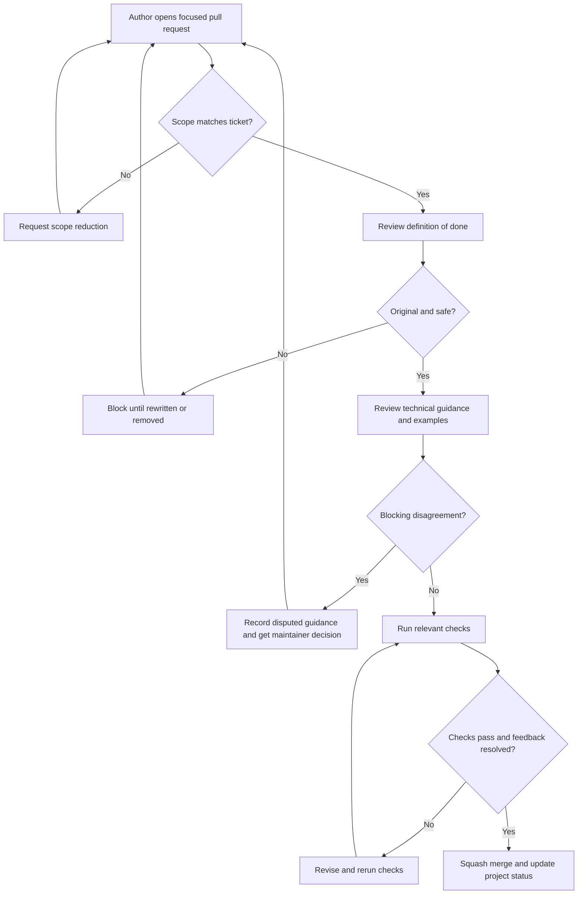

# Content Review Workflow

## Purpose

Use this workflow to review cookbook changes before they merge. It turns the
[definition of done](definition-of-done.md) into a practical sequence of roles,
checks, merge criteria, and escalation rules.

The goal is not to make every pull request slow. The goal is to protect the
learning value of the cookbook: original content, clear trade-offs, useful
examples, working links, and scoped changes that readers can trust.

## When This Matters

Use this workflow when a change adds or edits:

- documentation pages;
- decision trees;
- walkthroughs;
- labs or lab instructions;
- diagrams or visual templates;
- review rubrics, practice prompts, or contributor workflow files.

For tiny typo fixes, use the same merge criteria but keep the review brief. For
changes that affect copyright safety, technical correctness, security guidance,
or project scope, use the full workflow.

## Questions To Ask

Before choosing the review depth, ask:

- What ticket acceptance criteria must this pull request satisfy?
- What could mislead a reader if the change is wrong or incomplete?
- Does the change introduce a new example, diagram, lab behavior, or technical
  recommendation?
- Which reviewer role is most likely to catch the highest-risk issue?
- What local checks can run now, and which project-level checks are unavailable?
- Does any disagreement affect correctness, scope, originality, security, or
  only preference?

## Decision Guidance

Match review depth to risk.

Use a brief maintainer review when the change is narrow, mechanical, and
covered by existing checks. Use content and technical review when a page teaches
new guidance, changes a decision tree, or edits a walkthrough. Use lab review
when runnable behavior, expected output, or run instructions change. Use diagram
review when the visual changes the reader's understanding of a decision, flow,
or failure mode.

Treat unresolved correctness, originality, and scope questions as blockers.
Treat wording preferences, extra examples, and future automation ideas as
non-blocking unless they affect the acceptance criteria or the definition of
done.

## Review Roles

One person can fill more than one role on small changes, but the review should
still cover each concern.

| Role | Primary Question | Typical Review Focus |
| --- | --- | --- |
| Author | Does the change satisfy the ticket? | Scope, acceptance criteria, links, checks, and notes for reviewers |
| Content reviewer | Does this teach the topic clearly and originally? | Purpose, decision guidance, trade-offs, examples, common mistakes, and reader flow |
| Technical reviewer | Is the system design guidance correct enough for the stated scope? | Requirements, component choices, failure modes, security, observability, cost, and simplification |
| Lab reviewer | Can the learner run or inspect the lab behavior? | Run instructions, tests, expected output, observed behavior, and trade-offs |
| Diagram reviewer | Does the diagram clarify a decision or failure mode? | Mermaid validity, labels, originality, visual consistency, and related prose |
| Maintainer | Is the pull request ready to merge? | Scope, checks, unresolved feedback, merge strategy, and project status |

Not every pull request needs every specialist. A docs-only typo fix may need one
maintainer review. A new walkthrough should receive content and technical
review. A lab should receive lab review before merge.

## Review Flow



Use the flow as a guardrail. The review should remain proportional to the risk
and size of the change.

## Author Checklist

Before requesting review, the author should confirm:

- the pull request names the ticket ID and deliverable path;
- the diff stays within the ticket scope and necessary navigation updates;
- acceptance criteria are copied into the pull request and checked off;
- related pages, section indexes, and navigation links are updated;
- examples and diagrams are original;
- external links are used only for specific factual claims when needed;
- relevant local checks are listed with pass, fail, or unavailable status;
- known gaps and follow-up work are visible.

If a required project-level check does not exist yet, say so directly instead of
claiming it passed.

## Reviewer Checklist

Reviewers should start with the [definition of done](definition-of-done.md),
then apply the checks that match the change type.

For every content change, ask:

- Does the page help a reader make or review a system design decision?
- Are requirements, constraints, and trade-offs explicit?
- Is at least one useful original example included when it helps understanding?
- Are common mistakes or failure modes named where relevant?
- Are observability, security, cost, and simplification covered when the topic
  needs them?
- Are related pages linked?
- Is any wording, table, diagram, prompt, or example too close to an external
  source?

For labs, also ask:

- Can the learner run the lab with the documented commands?
- Do tests or demo output show the intended behavior?
- Does the lab explain what to observe and what trade-off the behavior teaches?

For diagrams, also ask:

- Does the diagram clarify a decision, flow, state, architecture relationship,
  or failure mode?
- Are labels specific enough to stand alone in a review?
- Is the Mermaid original and readable?

## Merge Criteria

A pull request can merge when all of these are true:

- acceptance criteria are satisfied;
- blocking review comments are resolved, or a maintainer records why the issue
  is no longer blocking;
- required checks pass, or missing checks are documented when no project-level
  command exists;
- the diff contains no unrelated changes;
- new pages are linked from an existing index or navigation page;
- labs have run instructions and tests or demo output when the lab ticket
  requires them;
- the content follows the content guardrails and style guide;
- the maintainer can explain what learner or contributor problem the change
  solves.

Do not merge while checks fail, copyright or originality concerns remain, or a
scope dispute is unresolved.

## Handling Disputed Technical Guidance

Disagreements are expected. Treat them as design review work, not as personal
preference.

When reviewers disagree:

1. Restate the disputed claim in one sentence.
2. Identify the requirement, assumption, or failure mode that makes the claim
   matter.
3. List the competing options and their trade-offs.
4. Decide whether the page should choose one option, show both options, or
   narrow the scope.
5. Record the decision in the pull request before merging.

Block the pull request when the dispute affects correctness, safety,
copyright/originality, security advice, or project scope. Defer the dispute to a
follow-up ticket only when the current page remains accurate without resolving
the broader topic.

## Review Outcomes

Use clear outcomes so authors know what to do next.

| Outcome | Use When | Next Step |
| --- | --- | --- |
| Approve | The change satisfies scope, quality, and checks | Maintainer can merge |
| Comment | The issue is optional, small, or future-looking | Author may address or record as follow-up |
| Request changes | Acceptance criteria, correctness, originality, links, tests, or scope are not ready | Author revises and reruns checks |
| Escalate | Reviewers disagree on a correctness, scope, or safety question | Maintainer records the decision path before merge |

Blocking feedback should name the file, the concrete problem, and the expected
change. Non-blocking feedback should be clearly optional.

## Trade-Offs

| Choice | Improves | Costs Or Risks |
| --- | --- | --- |
| Lightweight role-based review | Covers content, technical, lab, diagram, and merge concerns without a heavy committee | Small changes still need judgment about which roles matter |
| Blocking disputed correctness guidance | Prevents misleading architecture advice from becoming public | Can slow merge until assumptions are clarified |
| Requiring original examples and diagrams | Protects learning value and copyright safety | Authors may need more time to invent a smaller scenario |
| Merging only after links and checks are addressed | Keeps the cookbook navigable and trustworthy | Requires contributors to record unavailable checks honestly |

## Common Mistakes

- Treating approval as a style preference instead of checking acceptance
  criteria.
- Asking for broad rewrites unrelated to the ticket.
- Letting a technical disagreement merge without stating the assumption behind
  the chosen guidance.
- Marking copied or closely paraphrased material as acceptable because it has a
  citation.
- Forgetting to update navigation when adding a new page.
- Running no checks and failing to explain which checks are unavailable.

## Original Example

A contributor opens a pull request that adds a decision tree for scheduler
selection. The content reviewer approves the structure, but the technical
reviewer objects to a claim that a single cron job is always enough for
recurring billing.

The author restates the disputed claim:

```text
Can version 1 use one cron job for recurring billing?
```

The team narrows the guidance:

- use one cron job only when duplicate runs are harmless or guarded by
  idempotency;
- require run evidence, locking, alerting, and manual repair for money-like
  workflows;
- defer distributed scheduling until missed-run or failover requirements justify
  it.

The pull request merges after the page states those assumptions and the reviewer
confirms the failure mode is visible.

## Checklist

Before merging a content change, confirm:

- review roles matched the change type;
- the [definition of done](definition-of-done.md) was applied;
- blocking feedback is resolved or explicitly declined with reasoning;
- disputed technical guidance has a recorded decision path;
- examples, diagrams, and prompts are original;
- navigation and related links are updated;
- relevant checks ran and results are recorded;
- follow-up work is tracked instead of hidden.

## Related Pages

- [Definition of done](definition-of-done.md)
- [Project management](project-management.md)
- [Project guardrails](project-guardrails.md)
- [How to use this cookbook](how-to-use-this-cookbook.md)
- [Design review checklist](../method/design-review-checklist.md)
- [Contributing](https://github.com/LeonSilva15/system-design/blob/main/CONTRIBUTING.md)
- [Content guardrails](https://github.com/LeonSilva15/system-design/blob/main/CONTENT_GUARDRAILS.md)
- [Style guide](https://github.com/LeonSilva15/system-design/blob/main/STYLE_GUIDE.md)
