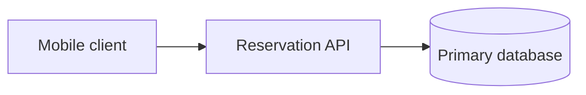
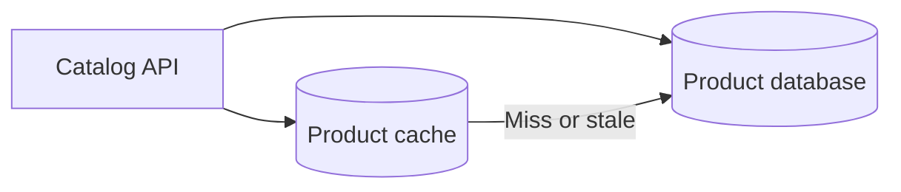
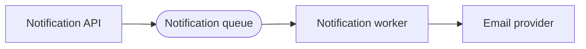
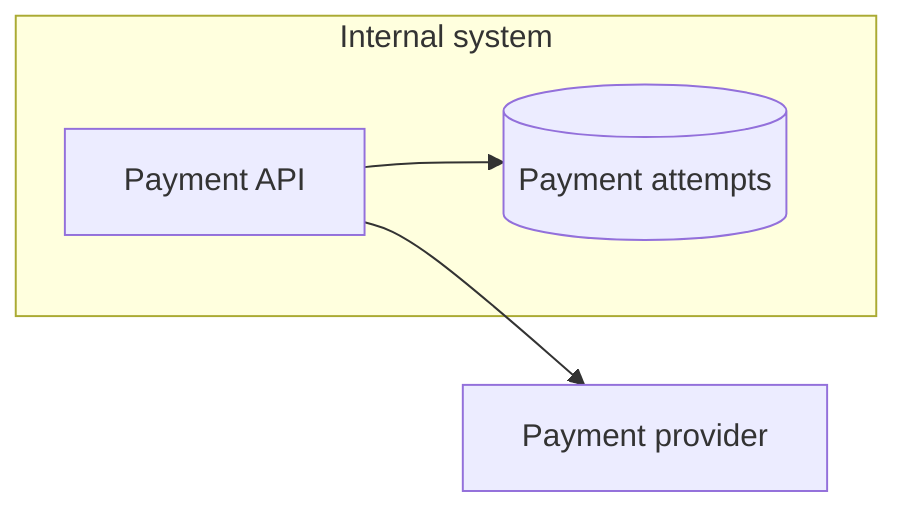
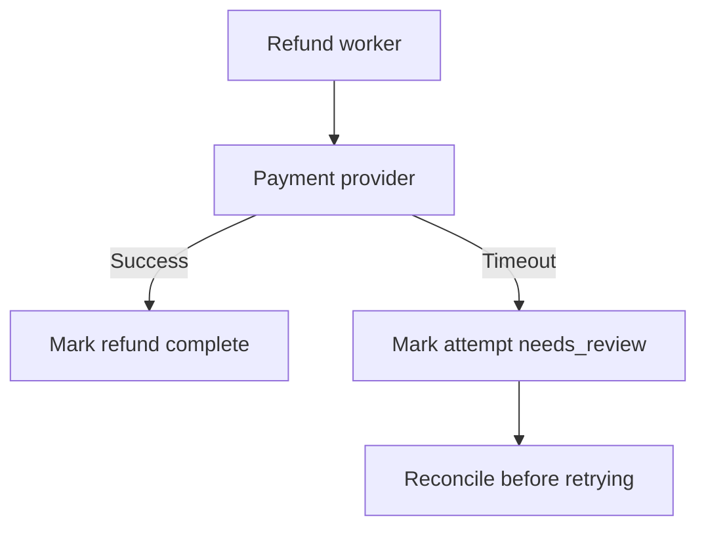

# Diagram Legend

## Purpose

Use this legend when creating Mermaid diagrams for the cookbook. It gives
contributors a small set of consistent symbols and label patterns for common
system design concepts.

The legend is not a decorative icon set. Use it to make diagrams easier to
review, compare, and reuse across docs, walkthroughs, decision trees, and labs.

## When This Matters

Use this page when a diagram includes:

- clients or users;
- services, APIs, or workers;
- databases, caches, queues, or streams;
- external systems or third-party providers;
- async work, retries, degraded behavior, or failure paths.

For general diagram principles, see the [diagram style guide](diagram-style-guide.md).

## Core Symbols

| Concept | Mermaid Shape | Label Pattern | Example |
| --- | --- | --- | --- |
| Client or user | Rectangle | Actor plus action or role | `Client[Mobile client]` |
| Browser or app | Rectangle | Interface plus command | `Browser[Browser submits request]` |
| API or service | Rectangle | Responsibility, not team nickname | `Api[Reservation API]` |
| Worker | Rectangle | Work performed | `Worker[Reminder worker]` |
| Database | Cylinder | Source-of-truth role | `PrimaryDb[(Primary database)]` |
| Cache | Cylinder | Cached data or purpose | `Cache[(Session cache)]` |
| Queue | Stadium | Work buffered | `Queue([Reminder queue])` |
| Stream or log | Stadium | Event stream name | `Stream([Reservation events])` |
| External system | Rectangle | Provider role | `Provider[Payment provider]` |
| Decision | Diamond | Question | `Fresh{Need fresh read?}` |
| Failure or degraded path | Normal node with explicit edge | Failure outcome or recovery action | `Provider -->|Timeout| Retry[Retry later]` |

Use labels that explain the component's job in the example. Avoid labels that
only name a technology unless the technology choice is the point of the page.

## Label Rules

Use labels that are:

- specific enough to understand without narration;
- short enough to scan inside a rendered diagram;
- consistent with names used in the surrounding text;
- stable across edits;
- vendor-neutral unless the page explicitly compares tools.

Prefer:

- `API validates reservation request`
- `Primary database`
- `Read replica may be stale`
- `Payment provider timeout`
- `Retry after backoff`

Avoid:

- `Service A`
- `DB`
- `Cache thing`
- `External`
- unexplained acronyms.

## Common Node Names

Use these node ID patterns in Mermaid source when they fit the diagram. The
rendered label can be more descriptive.

| Role | Preferred Node IDs | Example Label |
| --- | --- | --- |
| Client | `Client`, `Browser`, `MobileApp` | `Mobile client` |
| API | `Api`, `Gateway`, `Ingress` | `Public API` |
| Service | `Service`, `Scheduler`, `Limiter`, `Reconciler` | `Rate limiter service` |
| Worker | `Worker`, `Relay`, `Consumer`, `Indexer` | `Email worker` |
| Database | `PrimaryDb`, `ReplicaDb`, `AuditDb` | `Primary database` |
| Cache | `Cache`, `SessionCache`, `ResultCache` | `Result cache` |
| Queue | `Queue`, `RetryQueue`, `Dlq` | `Retry queue` |
| Stream | `Stream`, `EventLog`, `Topic` | `Reservation events` |
| External | `Provider`, `Partner`, `ThirdParty` | `Payment provider` |
| Failure state | `Timeout`, `Fallback`, `Retry`, `NeedsReview` | `Needs review` |

Node IDs should be readable in diffs. Avoid autogenerated IDs, long sentences
as IDs, and local nicknames that only one author understands.

## Symbol Examples

### Client, API, Store

Use this when the reader needs a minimal request path.

### Cache Beside Source Of Truth

Use this when the page discusses freshness, misses, or source-of-truth reads.

### Queue And Worker

Use this when async work changes latency, retries, isolation, or failure
handling.

### External System Boundary

Use a boundary when ownership, trust, latency, privacy, or failure behavior
changes across the edge.

### Failure Path

Use this when the important design question is what happens after a dependency
failure or ambiguous result.

## Edge Labels

Use edge labels when the arrow needs meaning beyond direction.

Good edge labels:

- `Cache miss`
- `Timeout`
- `Retryable error`
- `Duplicate event`
- `Key found`
- `Stale enough for this view`

Avoid labels that repeat the node names:

- `Calls`
- `Uses`
- `Sends`
- `Goes to`

Unlabeled edges are fine when the flow is obvious and the labels would add
noise.

## Failure Path Conventions

Failure paths should be explicit and boring.

Use:

- edge labels for the failure trigger;
- node labels for the recovery or degraded state;
- `needs_review`, `retry_later`, `fallback`, or `dead_letter` when that state is
  part of the design;
- a short explanation after the diagram when the failure path changes the
  trade-off.

Avoid:

- red-only meaning without text;
- lightning-bolt or warning-symbol decoration;
- failure paths that imply success without repair;
- drawing every possible outage when only one failure motivates the decision.

## Consistency Checklist

Before publishing a diagram, confirm:

- Clients, services, stores, queues, workers, and external systems use the
  legend consistently.
- Labels describe responsibilities or states, not vague component names.
- Failure paths are labeled when they affect the decision.
- External systems and trust boundaries are visible when they change ownership
  or reliability.
- The diagram still reads correctly without color.
- The diagram follows the [diagram style guide](diagram-style-guide.md).
- The diagram is original to this project.

## Related Pages

- [Diagram style guide](diagram-style-guide.md)
- [Visuals overview](./)
- [Definition of done](../start-here/definition-of-done.md)
- [Design review checklist](../method/design-review-checklist.md)
