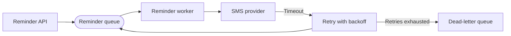

# Diagram Review Checklist

## Purpose

Use this checklist when reviewing a Mermaid diagram before it is merged into the
cookbook. The goal is to verify that the diagram is original, readable,
consistent with the visual language, and tied to a real design decision.

For creation guidance, start with the
[diagram style guide](diagram-style-guide.md). For shapes and label patterns,
use the [diagram legend](diagram-legend.md).

## When This Matters

Review diagrams when a page adds or changes:

- a decision tree;
- a request, event, retry, or failure sequence;
- an architecture or data-flow view;
- a state transition diagram;
- a lab or walkthrough diagram used to explain behavior.

Small diagrams still need review. A three-node diagram can mislead readers if
it implies a component is required, hides a failure mode, or copies a familiar
external layout.

## Questions To Ask

Before approving a diagram, ask:

- What decision, flow, state, or failure path does this diagram clarify?
- Could a reader understand the labels without the author narrating them?
- Does the diagram show the source of truth, async boundary, external system,
  or failure path when that detail changes the design?
- Is the diagram original to this project and this page?
- Does the surrounding text explain how to use the diagram?

## Review Checklist

### Originality

- The Mermaid source is original to this repository.
- The diagram does not copy, trace, or closely follow a book, course, vendor
  doc, article, talk, screenshot, or public architecture diagram.
- The scenario, node sequence, layout, and labels are not a close paraphrase of
  an external teaching example.
- No vendor logos, screenshots, product icons, or proprietary visual assets are
  included.
- Any factual claim near the diagram that depends on a source is cited in prose,
  not hidden inside the diagram.

### Clarity

- The diagram answers one clear question.
- The diagram focuses on one slice of the architecture unless the page is
  explicitly reviewing the whole system.
- The direction of flow is obvious from the Mermaid orientation and edge labels.
- Branches, retries, duplicate paths, stale reads, or failure outcomes are
  labeled when they affect the decision.
- The surrounding text explains what the reader should notice.

### Consistency

- The diagram follows the [diagram style guide](diagram-style-guide.md).
- Shapes and labels are consistent with the [diagram legend](diagram-legend.md).
- Similar concepts use similar names across the same page, such as `Api`,
  `Worker`, `PrimaryDb`, `Cache`, `Queue`, and `Provider`.
- Node labels match terms used in the surrounding prose.
- The diagram remains useful without color, custom styling, or theme-specific
  contrast.

### Labels

- Labels describe responsibilities, states, or outcomes rather than vague boxes
  such as `Service A`, `DB`, or `Thing`.
- Edge labels explain meaningful decisions or transitions, such as `Cache miss`,
  `Timeout`, `Duplicate key`, or `Retry exhausted`.
- Acronyms are avoided unless already defined nearby.
- State names are readable for humans even if the implementation uses values
  such as `needs_review` or `retry_later`.
- Labels are short enough to scan in rendered form and clear enough to review in
  Markdown source.

### Connection To Decisions

- Each major component in the diagram is justified by a requirement, constraint,
  data ownership rule, scale assumption, or failure mode.
- Caches, queues, streams, replicas, schedulers, and workers are not shown as
  default architecture decoration.
- Failure or degraded paths appear when the page discusses retries, timeouts,
  stale data, failover, or repair.
- Security, privacy, trust, tenant, or external-provider boundaries appear when
  they change the design.
- The page states the trade-off the diagram is meant to expose.

## Review Outcomes

Use these outcomes in review comments:

| Outcome | Use When | Reviewer Action |
| --- | --- | --- |
| Approve | The diagram is original, clear, consistent, and decision-focused | Mention any small follow-up as non-blocking |
| Request changes | The diagram can mislead readers or fails an acceptance criterion | Name the concrete line, node, label, or missing path |
| Ask for removal | The diagram decorates the page without adding understanding | Suggest replacing it with prose or a smaller diagram |

Blocking feedback should be concrete. Prefer `The queue is shown but the page
does not name any async latency, retry, or worker-isolation requirement` over
`This diagram is confusing`.

## Original Example

Suppose a page adds this diagram to explain reminder delivery:

A reviewer should check:

- Is async delivery justified by the page's latency or provider-isolation
  requirement?
- Does the text explain what happens after retry exhaustion?
- Are `Retry` and `DeadLetter` described as operational states, not magic
  fixes?
- Does the diagram omit unrelated user, billing, and analytics components that
  do not affect reminder delivery?
- Is the diagram original and consistent with the legend's queue, worker, and
  external-provider patterns?

## Common Mistakes

- Approving a diagram because it looks familiar.
- Reviewing only the rendered image and not the Mermaid source.
- Letting labels stay vague because the prose explains them elsewhere.
- Accepting a cache, queue, stream, or replica without a named requirement.
- Treating a happy path as complete when the page's topic is reliability,
  consistency, or operations.
- Asking for more nodes when the clearer fix is to split or remove the diagram.

## Reviewer Checklist

Before approving, confirm:

- The diagram is original and safe to publish.
- The diagram clarifies a decision, flow, state, data movement, or failure mode.
- The diagram follows the style guide and legend.
- Labels are concrete, stable, and readable.
- Boundaries and failure paths appear when they change the design.
- The diagram is connected to explicit requirements and trade-offs.
- The Mermaid source can be reviewed without rendering.
- The page links related guidance instead of repeating the whole visual style
  guide.

## Related Pages

- [Diagram style guide](diagram-style-guide.md)
- [Diagram legend](diagram-legend.md)
- [Mermaid examples](mermaid-examples.md)
- [Visuals overview](./)
- [Definition of done](../start-here/definition-of-done.md)
