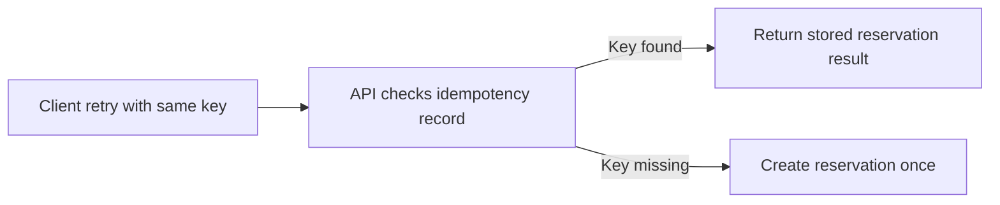
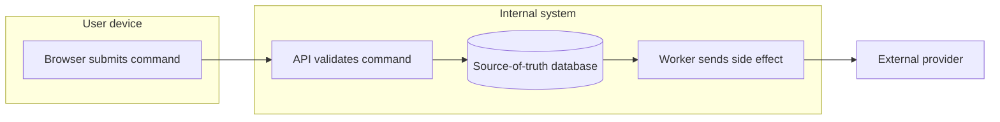
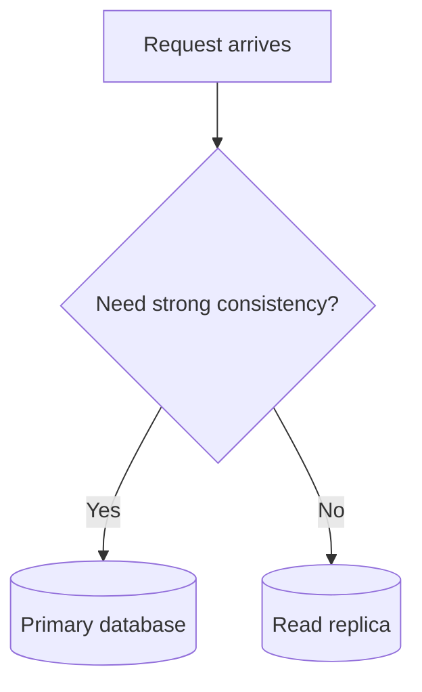
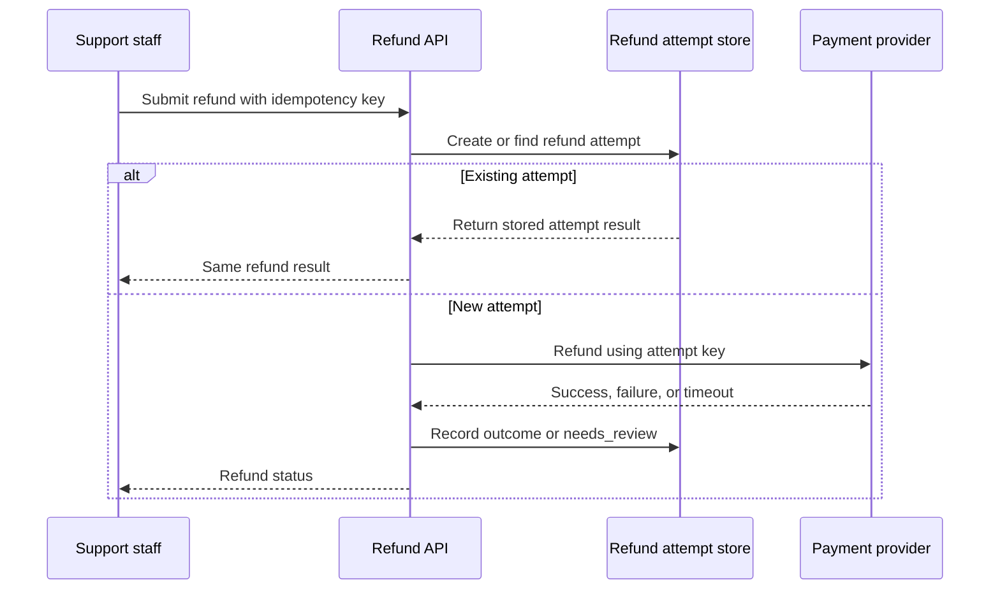

# Diagram Style Guide

## Purpose

Use diagrams to make a design decision, data flow, state transition, sequence,
or failure mode easier to reason about. A diagram should answer a question that
prose alone makes slow to inspect.

Diagrams in this project must be original Mermaid diagrams. Do not copy,
trace, or lightly rearrange diagrams from books, courses, blog posts, vendor
docs, conference talks, or architecture screenshots.

## When This Matters

Create a diagram when the reader needs to see:

- which components participate in a request or event flow;
- where data is stored, derived, cached, queued, or discarded;
- how a decision tree narrows a design choice;
- what happens when a dependency is slow, unavailable, or inconsistent;
- which boundary separates users, internal services, third parties, and
  persistent stores.

Skip the diagram when it would only repeat a short paragraph, list every
implementation detail, or decorate a page without changing the reader's
understanding.

## Questions To Ask

Before adding a diagram, answer:

- What question should the diagram help a reader answer?
- Which parts must be visible for that question?
- Which parts can be omitted without hiding a trade-off?
- Does the diagram show a decision, flow, state, architecture boundary, or
  failure path?
- Is every label understandable without reading the source code?
- Is the structure original to this project and this example?

## Decision Guidance

### Choose The Diagram Type

| Need | Use | Good For |
| --- | --- | --- |
| Choose between options | Flowchart | Requirement discovery, component choice, yes/no trade-offs |
| Show request order | Sequence diagram | API calls, retries, callbacks, provider interactions |
| Show lifecycle | State diagram | Orders, payments, jobs, retries, failover states |
| Show components and data movement | Flowchart as architecture/data-flow | Services, stores, queues, caches, trust boundaries |
| Show degraded behavior | Flowchart or sequence diagram | Timeouts, retries, fallback, repair paths |

Use Mermaid by default. Use another format only if a future ticket explicitly
changes the project architecture.

### Start From The Decision

Name the design question first, then draw only the parts needed to answer it.

Good diagram purpose:

```text
Show why the write path needs an idempotency record before the provider call.
```

Weak diagram purpose:

```text
Show the whole system.
```

Large diagrams are harder to review. Prefer one focused diagram per decision
over one crowded diagram that tries to include every service, metric, cache,
table, team, and deployment detail.

### Use Clear Labels

Labels should describe the role or behavior, not the implementation nickname.

Prefer:

- `API accepts reservation request`
- `Idempotency record`
- `Queue retries failed send`
- `Read replica may be stale`
- `Provider timeout leaves outcome unknown`

Avoid:

- `Service A`
- `DB`
- `Thing`
- `Magic`
- acronyms that are not already defined on the page.

Edges should explain meaningful transitions when the direction is not obvious:



The diagram above is original and intentionally small. It clarifies the retry
decision without pretending to be a full production architecture.

### Use Consistent Shapes

Mermaid shapes should make scanning easier, not create a private icon language.

Recommended defaults:

| Concept | Mermaid Shape | Example |
| --- | --- | --- |
| User or client | Rectangle | `Client[Mobile client]` |
| Service or worker | Rectangle | `Api[Reservation API]` |
| Decision | Diamond | `Fresh{Need fresh read?}` |
| Database or durable store | Cylinder | `Db[(Primary database)]` |
| Queue or stream | Stadium or rectangle with clear label | `Queue([Reminder queue])` |
| External system | Rectangle with label | `Provider[External email provider]` |
| Failure or degraded path | Normal node plus explicit edge label | `Provider -->|Timeout| Retry[Retry later]` |

These are defaults, not a complete symbol language. A future diagram legend can
refine exact symbols while keeping this page focused on readable, original
Mermaid diagrams.

Do not rely on color alone to communicate meaning. Markdown renderers and
themes may change contrast, and diagrams should remain useful in plain review.

### Use Stable Names

Use names that match the surrounding page and stay stable across edits:

- `Client`, `Api`, `Worker`, `Queue`, `PrimaryDb`, `Cache`, `Provider`;
- names with the component's responsibility when several services appear, such
  as `Limiter`, `Scheduler`, `Reconciler`, or `SearchIndexer`;
- event names that describe business facts, such as `ReservationApproved`.

Avoid names that encode transient implementation choices:

- `PythonService`;
- `RedisBox` unless the page is explicitly about that product choice;
- `NewThing`;
- `Step1`, `Step2`, `Step3`.

### Show Boundaries When They Affect The Decision

Include boundaries when they change failure behavior, security, privacy,
latency, ownership, or consistency.

Useful boundaries:

- user device versus server-side system;
- internal service versus external provider;
- source-of-truth store versus cache or projection;
- synchronous request path versus async worker path;
- tenant, region, or trust boundary when relevant.

Keep boundaries lightweight. A label or subgraph is enough when it clarifies
ownership.



### Include Failure Paths Where They Matter

A happy-path-only diagram is incomplete when the page discusses retries,
timeouts, failover, duplicate work, stale reads, or recovery.

Add failure paths that change the design:

- timeout after side effect may have happened;
- queue retry exhaustion;
- stale replica read;
- cache miss or stale cache;
- provider rate limit;
- partial write that needs reconciliation.

Do not add every possible failure. Pick the ones that justify the design
choice.

## Mermaid Usage

Use fenced Mermaid blocks:

````markdown

````

Preferred syntax:

- `flowchart TD` for top-down decisions and lifecycle flows;
- `flowchart LR` for request paths and data movement;
- `sequenceDiagram` for ordered interactions;
- `stateDiagram-v2` for object or job lifecycle;
- short node IDs and descriptive labels;
- edge labels for decisions, retries, errors, and async behavior.

Keep diagrams readable in source form. If the Mermaid source is impossible to
review, the rendered diagram is probably too complex.

Once the docs site build path exists, render or build pages that include new
Mermaid diagrams before merging so syntax and layout problems are caught early.

## Things To Avoid

Avoid:

- copied diagrams, traced layouts, or diagrams that closely follow a source;
- vendor logos, product icons, screenshots, and proprietary shapes;
- decorative diagrams that do not clarify a decision;
- generic boxes named `service`, `database`, and `queue` without role labels;
- every component in the future roadmap;
- color-coded meaning that is not also written in labels;
- multiple unrelated flows in one diagram;
- arrows that cross so much the reader cannot follow direction;
- diagrams that hide failure, retry, consistency, or ownership assumptions;
- Mermaid features that are fragile across renderers unless they are necessary.

## Trade-Offs

- A small diagram is easier to review, but may omit context. Add a short
  explanation after it.
- A detailed diagram can expose operational risk, but can also bury the main
  decision. Split it when two questions are being answered.
- Standard shapes make pages consistent, but strict shape rules can distract
  from learning. Favor clarity over decorative precision.
- Mermaid keeps diagrams versioned with Markdown, but complex styling can make
  source diffs noisy.

## Common Mistakes

- Drawing the final architecture before naming requirements.
- Using a diagram to imply a component is required when prose has not justified
  it.
- Copying a familiar internet diagram structure and changing only labels.
- Showing queues and caches without explaining why they exist.
- Hiding external providers, trust boundaries, or async side effects.
- Leaving out the failure path that motivated the design.
- Creating a diagram that cannot be understood without the author narrating it.

## Example

Scenario: a support portal submits a refund request. The API must avoid
duplicate refunds when a staff member retries after a timeout.



Why this diagram works:

- it shows the idempotency boundary before the external provider call;
- it shows duplicate retries returning the stored attempt;
- it names the ambiguous provider outcome and the need for reconciliation or a
  `needs_review` state after a timeout;
- it omits unrelated services that do not affect the refund decision.

## Checklist

Before publishing a diagram, confirm:

- The diagram is original Mermaid created for this project.
- The diagram clarifies a decision, flow, state, data movement, or failure mode.
- The page explains why the diagram matters.
- Labels are concrete and readable.
- Shapes are consistent enough to scan.
- Queues, stores, external systems, and trust boundaries are shown when they
  affect the decision.
- Failure paths are included when they justify the design.
- The diagram can be reviewed from the Markdown source.
- The diagram does not copy, trace, or closely paraphrase an external source.

## Related Pages

- [Visuals overview](./)
- [Definition of done](../start-here/definition-of-done.md)
- [Project guardrails](../start-here/project-guardrails.md)
- [System design process](../method/system-design-process.md)
- [Design review checklist](../method/design-review-checklist.md)
