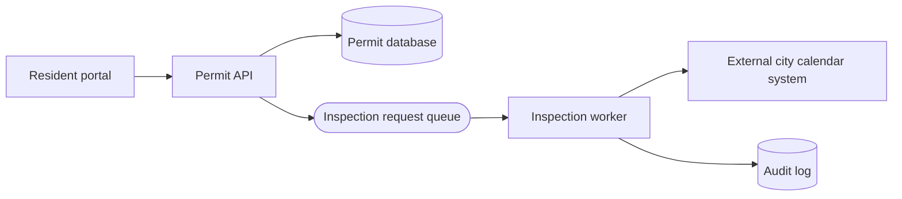
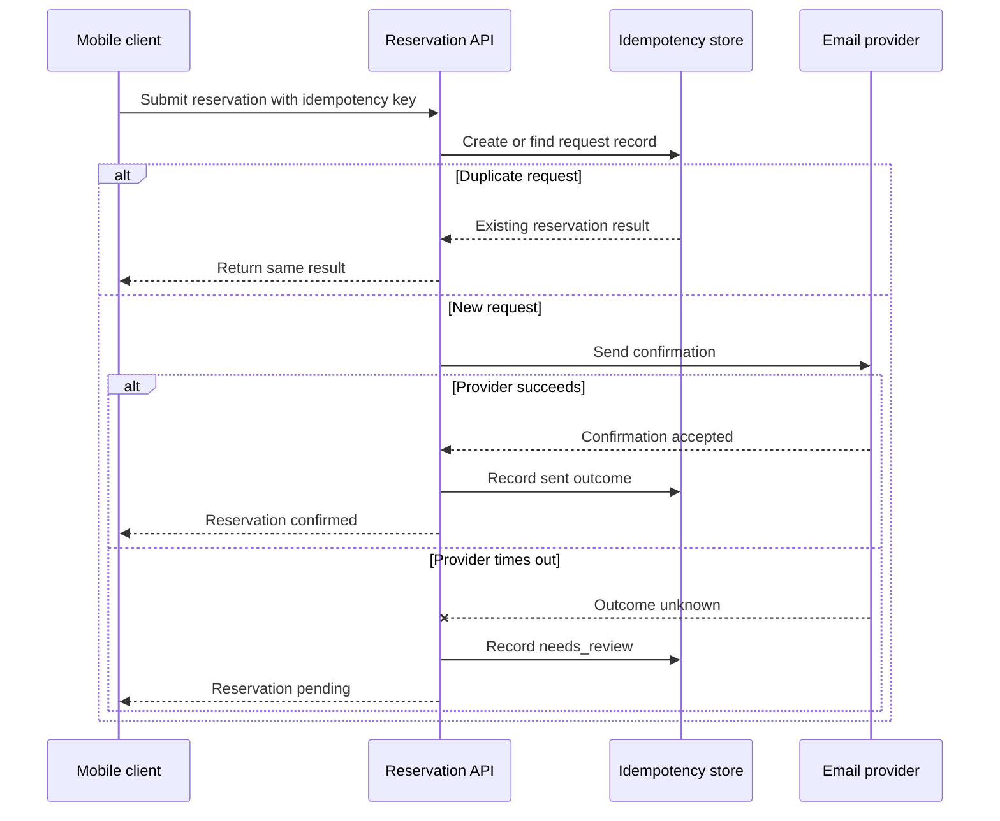
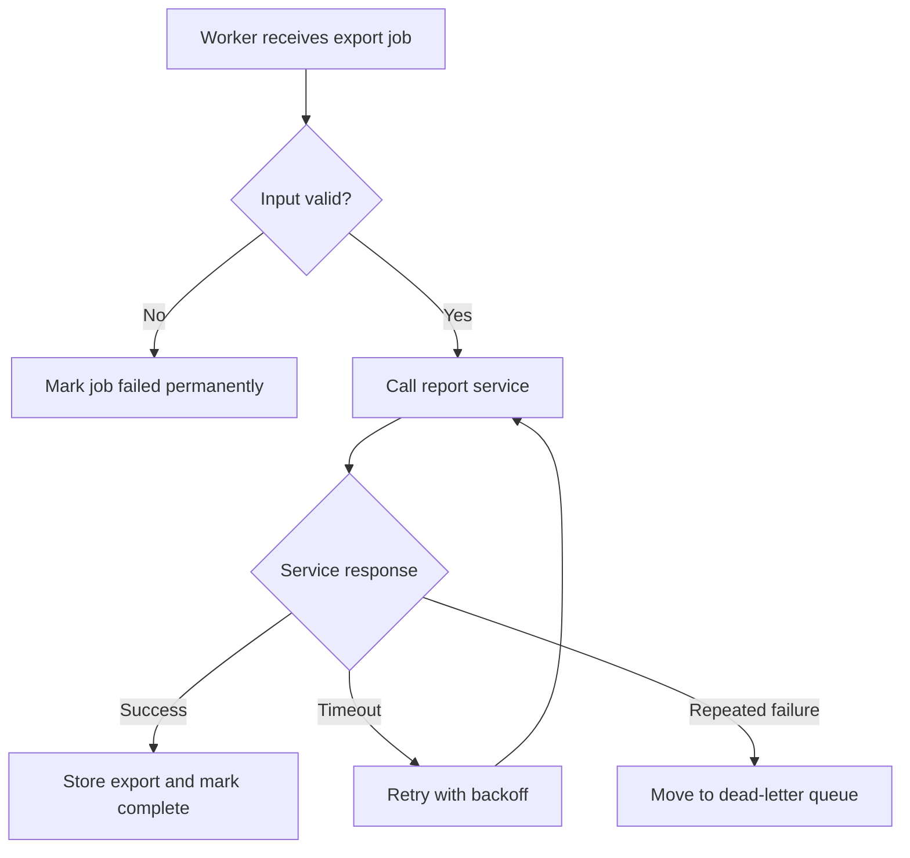
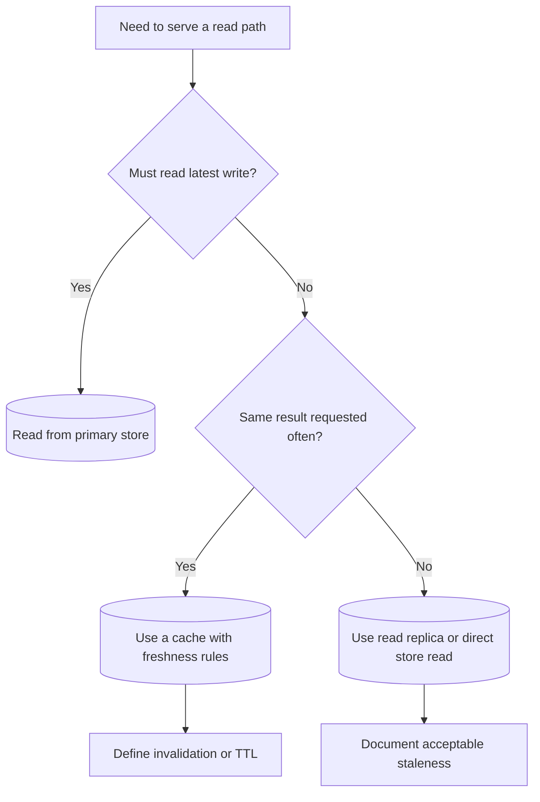

# Mermaid Examples

## Purpose

Use these examples as small starting points for cookbook diagrams. They are
original, minimal, and aligned with the [diagram style guide](diagram-style-guide.md)
and [diagram legend](diagram-legend.md).

Copy the pattern when it matches the design question, then rename nodes and
edges for the specific page. Do not copy external diagrams into this project.

## When This Matters

Use this page when you need a quick Mermaid pattern for:

- an architecture or data-flow diagram;
- an ordered request or event sequence;
- a flowchart for failure handling or operational logic;
- a decision tree for requirement or component selection.

Each example is intentionally small. Add only the extra nodes needed to explain
the page's decision.

## Architecture / Data-Flow Example

Use this when the reader needs to see how data moves across services, stores,
queues, and external systems.

Why it works:

- the API, source-of-truth store, queue, worker, external system, and audit
  store are visible;
- labels describe roles instead of technologies;
- the diagram stays focused on the permit inspection flow.

## Sequence Example

Use this when order matters, especially around retries, provider calls, or
ambiguous outcomes.

Why it works:

- it shows the idempotency check before the side effect;
- the duplicate branch is explicit;
- the provider timeout is named without adding unrelated infrastructure.

## Flowchart Example

Use this when the page explains a process, failure path, or operational
decision.

Why it works:

- decisions are diamonds with question labels;
- failure paths lead to inspectable states;
- edge labels show why the path changes.

## Decision-Tree Example

Use this when a page helps readers choose a requirement, component, or pattern.

Why it works:

- the decision starts from a requirement, not a tool;
- each branch names a trade-off the surrounding page must explain;
- the diagram stays small enough to review in Markdown.

## How To Adapt These Examples

When adapting an example:

- rename nodes for the page's concrete scenario;
- keep the diagram tied to one question;
- remove nodes that do not affect that question;
- label failure and duplicate paths when they matter;
- use human-readable labels even when the underlying state value uses
  `snake_case`;
- explain the diagram immediately after it appears.

## Common Mistakes

- Copying an example without changing it to match the page's actual decision.
- Turning a minimal example into a full production topology.
- Adding queues, caches, or replicas without explaining the requirement they
  satisfy.
- Using a sequence diagram when a flowchart would make the decision easier to
  compare.
- Leaving a failure path unlabeled.

## Checklist

Before publishing an adapted example, confirm:

- The diagram remains original to this project and page.
- The diagram includes only the nodes needed for the decision.
- Labels match the diagram legend.
- Failure, retry, duplicate, or stale-data paths are explicit when relevant.
- The surrounding text explains why the diagram matters.
- The Mermaid source is readable in code review.

## Related Pages

- [Diagram style guide](diagram-style-guide.md)
- [Diagram legend](diagram-legend.md)
- [Visuals overview](./)
- [Definition of done](../start-here/definition-of-done.md)
