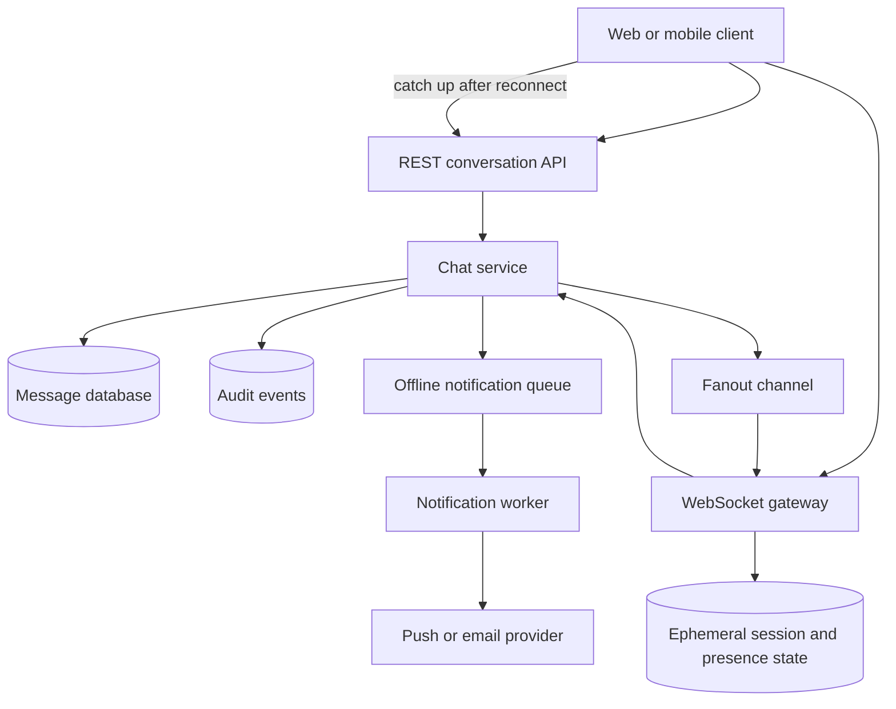

# Chat System Walkthrough

This walkthrough designs a chat system for a community services platform.
Residents, staff, volunteers, and support agents use conversations to
coordinate reservations, appointments, pickups, workshops, and support cases.

The design focuses on conversations, durable messages, delivery expectations,
WebSockets, ordering, offline users, read receipts, and scaling. The goal is a
small production-shaped version 1, not a global consumer messaging network.

## Problem Statement

The platform needs low-latency conversation between known participants while
preserving a durable message history. Users should be able to send a message,
see whether the server accepted it, receive live updates while connected, and
catch up after being offline.

Original scenario: A resident reserves a community tool but needs pickup
instructions. The resident messages the volunteer coordinator. The coordinator
is online and sees the message immediately. Another staff member is offline and
should see the message when they reopen the conversation. If the resident's
browser reconnects after a subway dead zone, it should not create a duplicate
message or miss replies.

Version 1 scope:

- one-to-one and small group conversations tied to a product context;
- durable text messages with server-assigned IDs and per-conversation order;
- WebSocket sessions for live send, delivery acknowledgements, typing, and
  presence hints;
- REST-style reads for conversation list and message history;
- offline catch-up from the message store after reconnect;
- read receipts represented as the highest message sequence read by each
  participant;
- basic unread counts, rate limits, audit, and operator repair visibility.

Out of scope:

- public broadcast channels with thousands of participants;
- end-to-end encryption;
- message search, rich moderation, and spam classification;
- file attachments and media processing;
- cross-region active-active message writes;
- social graph discovery or open user-to-user messaging.

## Functional Requirements

Version 1 must support:

- Authorized users can create or join a conversation tied to an allowed source
  record.
- Participants can list their conversations and see unread counts.
- Participants can fetch a page of messages before or after a known sequence.
- Connected participants can send text messages over a WebSocket session.
- The system can durably store a message before acknowledging it as accepted.
- The system can fan out accepted messages to other connected participants in
  the conversation.
- Clients can reconnect and request messages after their last seen sequence.
- The system can update read receipts by participant and conversation.
- The system can show best-effort typing and presence hints without treating
  them as durable history.
- Operators can inspect stuck delivery, duplicate-send, hot conversation, or
  unread-count repair cases.

Later versions may support:

- large rooms or broadcast channels;
- message edits and deletes;
- attachments and previews;
- full-text search;
- richer moderation workflows;
- regional WebSocket edge routing;
- stronger notification preferences and push delivery analytics.

## Non-Functional Requirements

Assumptions for the first useful production version:

- A message should be acknowledged as accepted only after it is durable.
- Most live message fanout should reach connected recipients within a few
  seconds.
- Offline users should see missed messages after reconnect or page refresh.
- Message ordering is required within one conversation, not globally across the
  product.
- Duplicate sends are possible after reconnects and ambiguous timeouts, so
  clients need stable client message IDs.
- Read receipts must be monotonic for one participant and conversation; a
  delayed client should not move a receipt backward.
- Typing and presence are ephemeral hints and can be dropped under load.
- WebSocket servers should be horizontally scalable and drain connections
  during deploys.
- Slow clients should not force unbounded server-side buffers.
- The system should expose delivery lag, reconnects, fanout drops, and unread
  drift before users report missing messages.

## Core Entities

| Entity | Purpose | Key Relationships |
| --- | --- | --- |
| Conversation | Product-scoped message thread | Belongs to tenant, source record, type, and participants |
| Participant | User, staff member, volunteer, or service identity in a conversation | Has role, membership state, notification preference, and last read sequence |
| Message | Durable text record in one conversation | Has sender, server message ID, client message ID, sequence, body, and state |
| Conversation sequence | Monotonic number assigned within a conversation | Orders messages and read receipts for that conversation |
| WebSocket session | Live connection from one device or browser tab | Authenticates user and subscribes to authorized conversations |
| Delivery attempt | Best-effort fanout of a stored message to a connected session | References message, session, attempt result, and lag |
| Read receipt | Participant's highest read message sequence in a conversation | Drives read markers and unread counts |
| Presence hint | Ephemeral status such as online, away, or typing | Derived from active sessions and short TTLs |
| Notification job | Optional offline push or email reminder | References message, recipient, preference, and dedupe key |

The message store is the source of truth for conversation history. WebSockets
are the live transport, not the durable message log.

## API Sketch

Create conversation:

```text
POST /conversations
Actor: authorized resident, staff user, or internal service
Request:
  source_entity_type
  source_entity_id
  participant_ids
  conversation_type
Response:
  conversation_id
  participant_count
  created_at
Important errors:
  forbidden
  invalid_participant
  source_entity_not_found
  duplicate_conversation
```

List conversations:

```text
GET /conversations?status=active&limit={k}
Actor: authenticated user
Response:
  conversations:
    conversation_id
    source_entity_type
    source_entity_id
    latest_message_preview
    latest_sequence
    read_through_sequence
    unread_count
    updated_at
Important errors:
  unauthorized
  invalid_cursor
```

Fetch message history:

```text
GET /conversations/{conversation_id}/messages?after_sequence={n}&limit={k}
Actor: conversation participant
Response:
  conversation_id
  messages:
    message_id
    sequence
    sender_id
    body
    created_at
    state
  has_more
  latest_sequence
Important errors:
  forbidden
  conversation_not_found
  invalid_cursor
```

WebSocket connect:

```text
GET /realtime
Actor: authenticated client
Client sends:
  subscribe conversation_id, last_seen_sequence
Server sends:
  subscription_ack conversation_id, latest_sequence
  message_created event
  receipt_updated event
  typing_hint event
Important errors:
  unauthorized
  subscription_forbidden
  too_many_connections
```

Send message over WebSocket:

```text
client -> server
{
  "type": "send_message",
  "conversation_id": "conv_123",
  "client_message_id": "local_789",
  "body": "I can pick up the ladder at 9."
}

server -> client
{
  "type": "message_accepted",
  "client_message_id": "local_789",
  "message_id": "msg_456",
  "sequence": 42,
  "created_at": "..."
}
```

Update read receipt:

```text
POST /conversations/{conversation_id}/read-receipts
Actor: conversation participant
Request:
  read_through_sequence
Response:
  participant_id
  read_through_sequence
  updated_at
Important errors:
  forbidden
  invalid_sequence
  stale_receipt
```

The same message-send command can be exposed as a REST endpoint for clients
that cannot hold WebSocket connections, but the success rule stays the same:
the message is accepted only after it is stored.

Use delivery vocabulary carefully:

- **Accepted** means the server durably stored the message and assigned its
  sequence.
- **Delivered to connected session** means a live event reached one device or
  browser tab.
- **Offline notified** means a push or email reminder was queued or sent for a
  participant who was not actively viewing the conversation.
- **Read** means the recipient advanced their read receipt through that message
  sequence.

## Read Path

There are two important read paths: opening a conversation and receiving live
updates.

Opening a conversation:

1. Client requests a conversation page or opens a WebSocket subscription.
2. API checks that the actor is an active participant or has an allowed support
   role.
3. API reads conversation metadata, participant state, latest sequence, unread
   count, and a page of messages from the message store.
4. API returns messages ordered by conversation sequence.
5. Client renders the page and records the latest sequence it has displayed.

Receiving live updates:

1. Client establishes a WebSocket session and subscribes to authorized
   conversations with `last_seen_sequence`.
2. Server acknowledges the subscription and may tell the client to fetch missed
   messages if `last_seen_sequence` is behind the stored latest sequence.
3. When a new message is committed, live fanout sends a `message_created` event
   to connected sessions for participants in that conversation.
4. The client applies events only if the sequence is newer than what it has
   already rendered. Gaps trigger a fetch from the history endpoint.

The live channel improves latency but does not replace history reads. If the
WebSocket path is degraded, users can still refresh and read durable messages.
Typing and presence may disappear during degradation; message history must not.

## Write Path

The critical write path is sending a message.

1. Client sends `send_message` with conversation ID, client message ID, and
   body.
2. WebSocket gateway authenticates the session and forwards the command to the
   chat service with a request ID.
3. Chat service authorizes the sender as an active participant and validates
   body size, content shape, rate limits, and conversation state.
4. Chat service checks for an existing message with the same sender,
   conversation, and client message ID.
5. In one transaction, the service assigns the next conversation sequence,
   inserts the message, updates conversation summary fields, updates the
   sender's read-through sequence when appropriate, and records any reliable
   event intent needed for fanout or offline notifications.
6. Service returns `message_accepted` with server message ID and sequence.
7. Fanout publishes a small message event to connected sessions subscribed to
   the conversation.
8. Offline notification work is queued or skipped based on participant
   preferences and recent activity.
9. Clients that miss the live event fetch from the message history endpoint
   using their last seen sequence.

The durable write comes before the live acknowledgement. A gateway crash after
the database commit but before the client receives `message_accepted` can cause
the client to retry. The client message ID makes that retry return the existing
message instead of creating a duplicate.

## Data Model

| Data | Source Of Truth? | Notes |
| --- | --- | --- |
| Conversation | Yes | Tenant, source entity, type, status, created_by, participant policy, latest sequence |
| Participant membership | Yes | User ID, role, join/leave state, notification preference, permissions |
| Message | Yes | Conversation ID, sequence, message ID, sender, client message ID, body, state, timestamps |
| Conversation sequence counter | Yes | Allocates order within one conversation; protected by transaction, lock, or conditional write |
| Read receipt | Yes | Highest read sequence per participant and conversation; monotonic updates only |
| Unread count | Derived | Can be computed from latest sequence and read receipt or maintained as a repairable projection |
| WebSocket session | No | Ephemeral connection state, user ID, device ID, subscribed conversations, heartbeat timestamp |
| Presence and typing hints | No | Short-TTL ephemeral state; safe to drop under load |
| Delivery attempt | No | Operational record for fanout lag, drops, and connected-device delivery |
| Notification job | Yes for job state | Durable only if the product promises offline push or email reminders |
| Audit event | Yes | Membership changes, operator access, message deletes, moderation, and support actions |

Recommended indexes:

- `conversation_id, sequence` for message history pagination;
- `conversation_id, sender_id, client_message_id` unique for dedupe;
- `participant_id, updated_at` for conversation list;
- `conversation_id, participant_id` for authorization and membership;
- `participant_id, conversation_id, read_through_sequence` for unread counts;
- `session_id` and `user_id` for WebSocket session inspection;
- `notification_job.state, next_attempt_at` for offline delivery workers.

Retention:

- active conversation messages stay online while the source workflow is active;
- archived source records can move older messages to lower-cost storage or
  narrower indexes if support access remains defined;
- deleted or legally restricted conversations keep only approved audit evidence;
- ephemeral presence and typing state expire quickly;
- delivery attempt logs are aggregated or sampled after operational usefulness
  ends.

## Component Choices

| Component | Requirement It Serves | Alternative Considered | Trade-Off |
| --- | --- | --- | --- |
| Message database | Durable conversation history and per-conversation ordering | Keep messages only in memory or broker | Stronger recovery and catch-up, but write hot spots need design |
| WebSocket gateway | Low-latency bidirectional send, receipt, typing, and presence | Polling for all updates | Better chat experience, but adds stateful connection operations |
| REST history API | Opening conversations and recovering missed messages | Depend on WebSocket replay only | Simpler recovery and debugging, but clients use two paths |
| Fanout channel | Deliver committed messages to connected sessions | Directly call every gateway from the writer | Decouples writers from sessions, but fanout lag and drops need metrics |
| Client message ID | Retry and duplicate-send protection | Trust clients not to retry | Handles reconnects and ambiguous timeouts, but clients must persist IDs |
| Read receipt store | Durable read state and unread counts | Per-device local markers only | Cross-device consistency, but receipt updates can become noisy |
| Notification queue | Offline push or email reminder when justified | Send notifications inside message write | Protects message latency, but duplicates and preferences need handling |
| Presence TTL store | Online and typing hints | Store presence as durable history | Cheap live hints, but only best-effort accuracy |

The WebSocket layer is justified because chat needs low-latency bidirectional
interaction. It should not be asked to provide durable message history by
itself.

## Architecture Diagram



The message database owns history, ordering, membership, and read receipts. The
WebSocket gateway owns live connections and session backpressure. Fanout and
notification paths can fail or lag without losing the authoritative message
because clients can recover from stored history.

## Consistency Decisions

- Message acceptance requires a durable message row and assigned sequence.
- Ordering is scoped to one conversation. Global order across conversations is
  not required.
- The conversation sequence should be assigned atomically with the message
  insert. Options include a transaction, compare-and-set counter, or single
  writer per hot conversation.
- Client retries use `conversation_id + sender_id + client_message_id` to avoid
  duplicate messages after reconnect or timeout.
- Message history reads should provide read-your-writes for the sender after
  acceptance. Returning the accepted message in the acknowledgement is the
  simplest version 1 path.
- Live fanout is at-least-current, not exactly-once. Clients use sequence
  numbers to ignore duplicates and fetch gaps.
- Read receipts are monotonic per participant and conversation. A stale device
  can update only if its sequence is greater than the stored receipt.
- Unread counts can be eventually consistent if the conversation detail view
  reads authoritative messages and receipts.
- Presence and typing hints are best effort. They should expire instead of
  requiring repair.

The central consistency choice is narrow: make message persistence and
per-conversation order strong, then let live delivery and derived views recover
from the source of truth.

## Scaling Strategy

Version 1 assumptions:

- conversations are small: usually 2 to 20 participants;
- most messages are short text payloads;
- live fanout is usually one message to a handful of connected sessions;
- users may have multiple devices or tabs;
- offline catch-up is common on mobile networks;
- read traffic is conversation lists and recent message pages, not full archive
  scans.

Start with a horizontally scalable WebSocket gateway, stateless chat service
instances, one message database, one fanout channel, one ephemeral session
store, and optional notification workers. The first expected bottlenecks are
WebSocket connection count, fanout to many sessions, message write hot spots in
busy conversations, receipt update volume, and reconnect storms after deploys
or network failures.

Scaling triggers:

- active WebSocket connections per gateway approach tested limits;
- send p95 or acknowledgement latency exceeds the product promise;
- fanout lag or dropped live events increases;
- one conversation or tenant creates a hot partition;
- read receipt writes become a meaningful share of database load;
- reconnect storms create authentication, subscription, or history-read spikes;
- message storage growth increases backup, index, and retention cost.

Likely next steps are gateway autoscaling, deploy draining, partitioned fanout
by conversation ID, batching read receipts, sharding or partitioning messages
by conversation and time, separate read replicas for history, and explicit
large-room designs for high-fanout conversations.

## Failure Modes

| Failure | User Impact | System Response | Repair Or Follow-Up |
| --- | --- | --- | --- |
| WebSocket disconnects before send reaches server | Message may remain local pending | Client reconnects and retries with same client message ID | Show pending state until accepted or failed |
| Database commits but acknowledgement is lost | Client may retry | Dedupe by sender, conversation, and client message ID | Return existing message and sequence |
| Fanout event is dropped | Connected recipient misses live update | Client detects sequence gap or refreshes history | Alert on fanout drops and delivery lag |
| Recipient is offline | Recipient does not see live update | Store message and update unread state; optional notification job | Catch up from history after reconnect |
| Messages arrive out of order on client | Conversation view appears scrambled | Client orders by sequence and fetches missing gaps | Track order-gap and duplicate-event metrics |
| Slow client cannot drain send buffer | Memory grows or latency spreads | Apply per-session buffer limits and disconnect or degrade | Client reconnects and fetches missed messages |
| Read receipt updates arrive from stale device | Receipt could move backward | Reject or ignore lower sequence updates | Keep monotonic receipt invariant |
| Hot conversation creates write or fanout bottleneck | Message send and delivery lag rise | Partition by conversation, cap room size, or use large-room path | Add hot-conversation alerts and limits |
| Push provider fails | Offline users miss reminder, but history remains | Retry notification jobs with dedupe and backoff | Dead-letter exhausted jobs for operator review |
| Gateway deploy drops sessions | Users reconnect and may see pending sends | Drain connections, use resume tokens, and fetch missed messages | Monitor reconnect spike and send retry rate |
| Membership changes while user is connected | User may receive unauthorized events | Reauthorize subscriptions on membership version changes | Force unsubscribe or reconnect; audit the change |

The severe failure is losing or duplicating durable messages. Losing a live
hint, typing indicator, or connected-device delivery event is acceptable when
history catch-up is reliable and visible.

## Security Concerns

- Every conversation read, send, subscribe, receipt, and membership change must
  check participant membership or an explicit support/admin permission.
- WebSocket connection authentication is not enough; each subscription and
  command should be authorized against the target conversation.
- Membership changes should revoke or refresh existing subscriptions so removed
  participants do not keep receiving live events.
- Message bodies can contain personal data. Logs, metrics, traces, fanout
  events, and notification jobs should avoid copying full bodies unless the
  workflow requires it.
- Validate body size, encoding, allowed content shape, and message rate at the
  boundary.
- Rate limits should protect users, conversations, tenants, and WebSocket
  connection attempts.
- Presence and typing hints should be shared only with authorized
  participants. They should not become public online-status tracking.
- Operator access to conversations should create audit events with reason,
  actor, conversation, and safe summary.
- Push notifications for offline users should avoid sensitive text by default
  unless the product explicitly accepts that exposure.
- Abuse controls should handle repeated reconnects, message floods, unread
  count amplification, and attempts to subscribe to conversations the actor
  cannot access.

## Observability

Useful metrics:

- active WebSocket connections by gateway, tenant, and client type;
- connection open, close, heartbeat timeout, and reconnect rates;
- subscription authorization failures and forbidden command counts;
- message send rate, accepted rate, duplicate-send rate, and rejected rate;
- p50/p95/p99 time from send command to durable acknowledgement;
- fanout lag, dropped live events, per-session buffer size, and slow-client
  disconnects;
- history fetch rate, sequence gap fetches, and catch-up message count;
- read receipt update rate, stale receipt rejection rate, and unread-count
  repair count;
- offline notification queue age, retry rate, and dead-letter count;
- hot conversation fanout size, write latency, and participant count;
- message storage growth, retention job age, and backup duration.

Useful logs and traces:

- request ID, connection ID, user ID, conversation ID, message ID, client
  message ID, and sequence;
- safe result classes for accepted, duplicate, forbidden, rate limited,
  disconnected, fanout dropped, and catch-up required;
- gateway ID and session lease for connection-level debugging;
- membership version for subscription and delivery decisions;
- notification job ID and provider result class for offline delivery.

Alerts should be tied to user-visible symptoms: send acknowledgement latency,
message database errors, fanout lag, reconnect storms, dropped live events,
old notification jobs, hot conversation saturation, and unread-count drift.

## Cost Considerations

Main cost drivers:

- WebSocket connection memory, heartbeats, and gateway instances;
- message writes, indexes, backups, and long-term retention;
- fanout bandwidth for live delivery;
- history reads after reconnect, especially during reconnect storms;
- read receipt write volume and unread-count projection maintenance;
- offline push or email provider calls;
- observability volume from per-message and per-connection logs;
- operator time for abuse, support access, and repair workflows.

Cost-aware choices:

- keep message payloads small in fanout events and let clients fetch history
  when needed;
- batch or coalesce read receipts instead of writing every viewport change;
- expire presence and typing state quickly;
- avoid public large-room features until fanout requirements are explicit;
- archive old conversations according to the source record retention policy;
- sample high-volume delivery attempt logs after baseline operations are
  understood;
- set per-user, per-conversation, and per-tenant rate limits before traffic
  spikes.

Cost controls should not weaken the durable message invariant. It is better to
drop typing hints or delay read receipts than to acknowledge messages before
they are stored.

## Version 1 Simplification

Start with:

- text-only conversations tied to existing product records;
- one home region for message writes;
- REST APIs for conversation list and message history;
- WebSockets for live send, delivery acknowledgement, typing, and presence;
- one message database with per-conversation sequence assignment;
- one fanout path for connected sessions;
- offline catch-up through history reads, with push notifications optional and
  queued;
- read receipts as highest read sequence per participant, not per-device event
  history;
- limits on participants, message size, send rate, and open connections;
- clear operator views for duplicate sends, failed notifications, hot
  conversations, and membership changes.

Defer large public rooms, attachments, full-text search, end-to-end encryption,
message edits/deletes, and cross-region writes until product requirements
force those choices. Measure send acknowledgement latency, fanout lag,
reconnects, sequence gaps, unread drift, and storage growth from day one.

## What Changes At 10x Scale

At 10x traffic or connection count:

- WebSocket gateways need autoscaling, connection draining, overload signals,
  and tested reconnect-storm behavior.
- Session and subscription state need partitioning by user, tenant, or
  conversation so fanout can find connected recipients efficiently.
- Message storage needs partitioning or sharding by conversation ID and time,
  plus retention and archive jobs that do not block hot reads.
- Hot conversations need a different fanout strategy, such as partitioned room
  workers, hierarchical fanout, coalesced events, or product-level room limits.
- Read receipts need batching, debouncing, and derived unread repair jobs.
- Offline notifications need stronger preferences, provider isolation, retry
  budgets, and dead-letter operations.
- History reads may need replicas, caching of recent pages, or conversation
  summary projections.
- Multi-region users may justify regional WebSocket edges, but message writes
  still need a clear home region or conflict-resolution model.
- Security review must cover subscription revocation, operator access, and
  notification payload privacy at larger blast radius.

The design should grow around measured pressure. A chat system usually fails
first through connection operations, hot fanout, write hot spots, or reconnect
storms, not through a lack of advanced protocols.

## Related Pages

- [Polling vs WebSockets vs SSE](../communication/polling-vs-websockets-vs-sse.md)
- [API layer](../components/api-layer.md)
- [Queues](../communication/queues.md)
- [Streams](../communication/streams.md)
- [Pub/sub](../communication/pub-sub.md)
- [Outbox pattern](../communication/outbox-pattern.md)
- [Idempotency](../communication/idempotency.md)
- [Consistency models](../data/consistency-models.md)
- [Read and write patterns](../data/read-write-patterns.md)
- [Load balancing](../scalability/load-balancing.md)
- [Capacity estimation](../scalability/capacity-estimation.md)
- [Bottleneck analysis](../scalability/bottleneck-analysis.md)
- [Failure mode analysis](../reliability/failure-mode-analysis.md)
- [Metrics](../operations/metrics.md)
