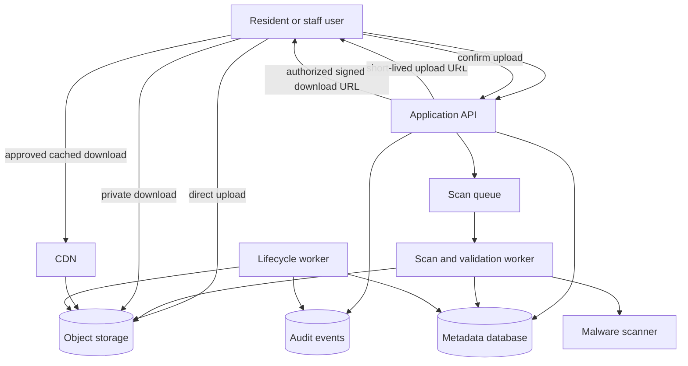

# File Storage System Walkthrough

This walkthrough designs a file storage system for a community services
platform. Residents upload documents and photos for permits, reservations, and
support cases; staff review those files; approved files may later be downloaded
by residents, staff, or trusted partner systems.

The design focuses on upload flow, metadata ownership, object storage, signed
URLs, CDN delivery, permissions, virus scanning, lifecycle rules, and a small
version 1 that avoids turning the file service into a general document
management product.

## Problem Statement

The platform needs a safe way to accept and serve user-provided files without
putting large binary payloads in the primary application database or letting
object storage keys become the authorization model.

Original scenario: A resident applies for a street event permit and uploads a
site plan PDF plus three photos. The upload may happen from a mobile network.
Staff should see that the files are pending until upload completion and virus
scanning finish. If a file is unsafe, unavailable, too large, or no longer
permitted, the system should fail closed instead of serving it through a stale
link.

Version 1 scope:

- residents and staff upload files attached to an existing product record;
- the application creates metadata and short-lived signed upload URLs;
- object storage holds bytes, while the metadata database remains authoritative;
- workers validate, scan, and mark files ready or quarantined;
- authorized users receive short-lived signed download URLs;
- public or widely shared approved files can later use CDN delivery;
- lifecycle jobs clean up abandoned uploads, expired temporary files, archived
  files, derivatives, and deleted objects.

Out of scope:

- collaborative document editing;
- full-text search over file contents;
- arbitrary folder sync clients;
- customer-managed encryption keys;
- global active-active object replication;
- rich media transformation beyond small previews or thumbnails.

## Functional Requirements

Version 1 must support:

- Residents can request an upload slot for an allowed file type and size.
- Staff can upload files on behalf of a resident when their role allows it.
- The system can create a metadata record before bytes are uploaded.
- The system can issue a short-lived signed URL for one upload operation.
- Clients can confirm upload completion so the system can validate the object.
- Workers can run virus scanning and simple file validation before a file is
  downloadable.
- The system can mark files as `pending_upload`, `uploaded`, `scanning`,
  `ready`, `quarantined`, `failed`, `archived`, or `deleted`.
- Authorized users can request a short-lived signed download URL for a ready
  file.
- Operators can inspect failed, quarantined, abandoned, or orphaned file work.
- Lifecycle jobs can expire abandoned upload sessions and remove objects that
  are no longer retained.

Later versions may support:

- multipart or resumable upload for large files;
- CDN delivery for high-volume public or partner downloads;
- preview generation, image resizing, or document text extraction;
- per-tenant retention policies;
- legal holds and export packages;
- regional storage placement.

## Non-Functional Requirements

Assumptions for the first useful production version:

- Metadata writes should complete within normal API latency because they are
  part of the user workflow.
- Large byte transfer should bypass the application tier when possible, so app
  servers do not become bandwidth proxies.
- Files must not become visible until upload completion, validation, and virus
  scanning are recorded.
- Object bytes should be highly durable once accepted, but the metadata record
  defines ownership, status, permissions, and lifecycle.
- Signed URLs should be scoped to one object, one operation, and a short
  expiry.
- Permission changes should take effect before issuing new download URLs.
  Already-issued URLs are bounded by expiry and, for high-risk content, may
  require object movement, key rotation, or origin policy invalidation.
- Private file downloads should fail closed when metadata, permissions, object
  storage, scanning, or CDN authorization is unavailable.
- Logs, metrics, traces, and dead-letter records should avoid storing file
  contents or sensitive file names when a safe identifier is enough.
- Lifecycle behavior should be observable because storage leaks and mistaken
  deletion usually appear as slow operational drift.

## Core Entities

| Entity | Purpose | Key Relationships |
| --- | --- | --- |
| File record | Source-of-truth metadata for one original uploaded file | Belongs to tenant, owner, source entity, object key, policy, and status |
| Upload session | Short-lived intent to upload bytes for one file record | References file record, signed upload URL scope, expiry, client constraints |
| Object | Bytes stored in object storage | Addressed by opaque object key from the file record |
| Scan job | Asynchronous work that validates and scans an uploaded object | References file record, object version, attempts, result, and quarantine state |
| Permission grant | Rule that says who may read, write, replace, delete, or review a file | References actor, role, tenant, source entity, and file record |
| Download request | Authorized request for direct file access | Produces short-lived signed origin or CDN URL |
| Lifecycle policy | Rule for abandoned uploads, active files, archives, deletion, and legal holds | Applied to file records, objects, derivatives, and audit evidence |
| Audit event | Evidence of upload, scan, access, permission, lifecycle, or repair action | References actor, file record, correlation ID, and safe result summary |

The file record is the design center. Object storage holds bytes, but it does
not decide who owns the file, whether it is ready, or whether it should still
exist.

## API Sketch

Create upload session:

```text
POST /files/upload-sessions
Actor: resident, staff user, or trusted internal service
Request:
  source_entity_type
  source_entity_id
  filename
  content_type
  declared_size_bytes
  checksum_optional
  purpose
Response:
  file_id
  upload_session_id
  status: pending_upload
  signed_upload_url
  expires_at
  required_headers
Important errors:
  forbidden
  unsupported_type
  size_limit_exceeded
  source_entity_not_found
  upload_quota_exceeded
```

Confirm upload:

```text
POST /files/{file_id}/upload-complete
Actor: upload owner or authorized client
Request:
  upload_session_id
  observed_size_bytes
  checksum_optional
Response:
  file_id
  status: uploaded | scanning
  scan_job_id
Important errors:
  forbidden
  session_expired
  object_missing
  checksum_mismatch
  already_completed
```

Request download:

```text
POST /files/{file_id}/download-url
Actor: resident, staff user, trusted partner, or internal service
Request:
  reason
  preferred_delivery: origin | cdn
Response:
  file_id
  status: ready
  signed_download_url
  expires_at
  content_type
  size_bytes
Important errors:
  forbidden
  not_ready
  quarantined
  deleted
  object_unavailable
```

Operator lifecycle decision:

```text
POST /operator/files/{file_id}/lifecycle-decision
Actor: authorized operator
Request:
  action: archive | restore | delete | hold | release_hold | retry_scan
  reason
Response:
  file_id
  new_status
  lifecycle_job_id
Important errors:
  forbidden
  invalid_transition
  legal_hold_active
  repair_not_safe
```

Public file bytes are still reached through a delivery URL. The API remains
the place where authentication, authorization, status, audit, and URL scope are
decided.

## Read Path

The main read path is downloading a ready file.

1. User opens the source record, such as a permit application.
2. API checks authentication and reads the source record plus attached file
   metadata.
3. API filters files by tenant, source entity, status, and the actor's
   permissions.
4. For a download action, API rechecks that the file is `ready`, not expired,
   not deleted, not quarantined, and not blocked by a legal or security hold.
5. API creates a download request and audit event.
6. API returns a short-lived signed origin URL or signed CDN URL scoped to that
   file, operation, and expiry.
7. Client downloads bytes directly from object storage or CDN.

Metadata reads should be fresh enough to reflect recent permission and status
changes before new URLs are issued. The byte download path can be direct and
fast, but it should not bypass the metadata authorization decision.

If the CDN or object store is degraded, private downloads should return a clear
temporary failure rather than falling back to a public bucket URL. Public
approved files may tolerate bounded stale delivery only if deletion,
permission, and safety changes are handled by short TTLs, versioned URLs, or
explicit invalidation.

## Write Path

The main write path is uploading a new file.

1. Client asks the application for an upload session with source entity,
   content type, declared size, and purpose.
2. API validates the actor's write permission on the source entity and checks
   file type, size, quota, and rate limits.
3. API creates a file record in `pending_upload` with an opaque object key,
   lifecycle deadline, and audit event.
4. API creates an upload session and returns a short-lived signed upload URL.
5. Client uploads bytes directly to object storage using the required method,
   headers, size, and content constraints.
6. Client confirms upload completion.
7. API reads object metadata from object storage, validates size, content type,
   checksum when provided, and upload session expiry.
8. API transitions the file to `uploaded` or `scanning` and enqueues a scan
   job with the object version.
9. Scan worker claims the job, downloads or streams the object through the
   scanner, records a safe result summary, and transitions the file to `ready`,
   `quarantined`, or `failed`.
10. Operators repair failed jobs through bounded retry, quarantine review, or
    deletion.

The transaction boundary is metadata creation and upload-session creation. The
byte transfer happens outside the database transaction, so every later step
must handle partial completion. Repeated upload-complete calls should be
idempotent for the same session and object version.

## Data Model

| Data | Source Of Truth? | Notes |
| --- | --- | --- |
| File record | Yes | Owner, tenant, source entity, opaque object key, content metadata, status, permission policy, lifecycle timestamps |
| Upload session | Yes | Expiry, signed URL scope, expected constraints, completion state, client correlation ID |
| Object bytes | Yes, for bytes only | Object storage is authoritative for the payload after acceptance; the file record remains authoritative for ownership, status, permissions, lifecycle, and object version |
| Object metadata snapshot | Yes | Size, content type, checksum, object version, and observed upload timestamp recorded after completion |
| Scan job and result | Yes | Attempts, scanner version, safe result class, quarantine reason, retry state |
| Permission grants | Yes | Actor, role, source entity, tenant, action, and policy version |
| Download audit event | Yes | Actor, file ID, source entity, reason, result, correlation ID, and expiry; not the file contents |
| Derivatives | Yes for derivative metadata, No for bytes | Preview or thumbnail records reference original file and processing version |
| Lifecycle job | Yes | Action, deadline, status, hold state, retry state, and deletion evidence |
| Metrics and traces | No | Aggregated operational signals and sampled request paths |

Important file states:

| State | Entered When | Download Behavior | Common Next Transitions |
| --- | --- | --- | --- |
| `pending_upload` | Metadata and upload session exist, but bytes are not confirmed | Blocked | `uploaded`, `failed`, `deleted` after expiry |
| `uploaded` | Bytes exist and basic object metadata matches expectations | Blocked | `scanning`, `failed`, `deleted` |
| `scanning` | Scanner or validator has accepted work for the object version | Blocked | `ready`, `quarantined`, `failed` |
| `ready` | Validation and virus scanning passed | Allowed after permission check and signed URL issuance | `archived`, `deleted`, `quarantined` if later risk appears |
| `quarantined` | Scanner, policy, or operator review found a safety issue | Blocked except restricted operator review | `deleted`, `failed`, `ready` only after approved release |
| `failed` | Upload, validation, scan, or repair exhausted safe retries | Blocked | retry-specific state, `deleted`, or operator repair |
| `archived` | File is retained but removed from the normal hot path | Blocked or delayed restore, depending on policy | `ready` after restore, `deleted`, hold state |
| `deleted` | Metadata is non-downloadable and byte deletion is complete or pending | Blocked | retained-minimal audit evidence only |

Recommended indexes:

- lookup by `source_entity_type, source_entity_id, status`;
- lookup by `tenant_id, owner_id, created_at`;
- unique or guarded lookup on `upload_session_id, file_id`;
- lookup by `status, lifecycle_deadline_at` for cleanup workers;
- lookup by `scan_job.state, next_retry_at`;
- lookup by `object_key` for orphan reconciliation and repair;
- audit lookup by `file_id, created_at` and `actor_id, created_at`.

Retention:

- abandoned upload sessions expire quickly and their partial objects are
  cleaned up;
- active ready files follow the source entity's retention policy;
- archived files move to lower-cost storage only after access expectations are
  clear;
- deleted files keep minimal audit evidence while normal object bytes and
  rebuildable derivatives are removed;
- backup restores must reconcile metadata against object storage so purged
  files do not silently reappear.

## Component Choices

| Component | Requirement It Serves | Alternative Considered | Trade-Off |
| --- | --- | --- | --- |
| Metadata database | Ownership, permissions, status, lifecycle, audit | Store metadata only in object tags | Stronger queries and transactions, but requires reconciliation with object storage |
| Object storage | Durable large byte storage outside the app database | Store blobs in primary database | Better durability and bandwidth shape, but needs signed access and lifecycle design |
| Signed upload URL | Direct upload without app bandwidth proxying | Upload through application servers | Reduces app load, but partial upload and URL scope must be controlled |
| Signed download URL | Direct private download after authorization | Permanent private object URL | Efficient and bounded, but expiry and revocation behavior must be explicit |
| Scan queue and workers | Virus scanning and validation outside user request latency | Scan synchronously before API response | Keeps upload flow responsive, but introduces visible pending states and retries |
| CDN | Low-latency repeated delivery for public or approved large downloads | Always download from object origin | Lowers origin load when justified, but adds invalidation and private-cache risk |
| Lifecycle worker | Expire abandoned, archived, deleted, or derivative objects | Manual cleanup | Reduces leaks and cost, but mistaken policy can delete valuable files |
| Audit log | Explain access, safety, and lifecycle decisions | Rely on application logs only | Better support and security review, but must avoid storing sensitive content |

Version 1 should not add a CDN or multipart upload just because object storage
exists. Add each component when size, distance, traffic, recovery, or user
experience creates a real requirement.

## Architecture Diagram



The application owns metadata, authorization, signed URL scope, and audit
events. Object storage owns the bytes. Workers are responsible for safety and
lifecycle transitions that do not belong in the user request path.

## Consistency Decisions

- File metadata creation and upload-session creation should be atomic; a client
  should not receive a signed upload URL for a file record that does not exist.
- Upload completion is a state transition from `pending_upload` to `uploaded`
  or `scanning` after object metadata is verified.
- Scan workers should use leases or compare-and-set transitions so two workers
  do not publish conflicting scan results for the same object version.
- A file is not downloadable until metadata says it is `ready`.
- Permission changes are strongly checked before issuing new download URLs.
  Existing signed URLs are limited by expiry and should be short for private
  content.
- Delete and archive operations should create a lifecycle job and move the file
  into a non-downloadable state before deleting bytes.
- Duplicate upload-complete calls and scan retries should be idempotent for the
  same file ID, session ID, object version, and scanner version.
- Object storage and metadata can drift, so reconciliation jobs need to detect
  missing objects, orphaned objects, and metadata restored from backups without
  matching bytes.

The key consistency choice is to treat metadata as authoritative and object
storage as an external durable store that must be verified, reconciled, and
cleaned up.

## Scaling Strategy

Version 1 assumptions:

- file uploads are smaller than 100 MB for most product workflows;
- uploads are less frequent than metadata reads;
- most downloads are private and attached to recent source records;
- staff review creates bursty reads during business hours;
- storage grows with retained source records, not with every page view.

Start with one metadata database, one object bucket or logical bucket group,
one scan queue, and horizontally scalable stateless API instances. The first
expected bottlenecks are bandwidth through the wrong tier, scan worker backlog,
object storage cost, and lifecycle drift.

Scaling triggers:

- p95 time from upload completion to `ready` exceeds the user promise;
- scan queue age grows during normal traffic;
- object storage or CDN bandwidth dominates cost;
- abandoned upload objects grow faster than completed files;
- staff or partner downloads create repeated origin traffic;
- metadata queries for a source record or tenant become slow.

At that point, consider multipart upload, more scan workers, queue partitioning
by tenant or file class, CDN delivery for approved reusable content, stronger
object lifecycle automation, and read replicas or narrower indexes for
metadata-heavy support views.

## Failure Modes

| Failure | User Impact | System Response | Repair Or Follow-Up |
| --- | --- | --- | --- |
| Signed upload URL expires before upload finishes | User must retry upload | Keep file `pending_upload` until deadline, then expire session | User requests a new session; cleanup removes partial objects |
| Client uploads bytes but never confirms | File appears pending | Lifecycle job expires abandoned session | Reconciliation checks object age and deletes unclaimed bytes |
| Metadata says ready but object is missing | Download fails | Return `object_unavailable` and alert | Reconcile metadata with object store, restore object if possible, or mark failed |
| Scanner is down or slow | Files stay unavailable longer | Keep files in `scanning`, backoff retries, alert on queue age | Repair scanner, replay jobs, communicate delay |
| Scanner marks file unsafe | User cannot download file | Transition to `quarantined`, block URL issuance | Operator reviews safe summary and deletes, releases, or escalates |
| Signed URL scope is too broad or long-lived | Private data may leak | Fail security review; shorten TTL and scope to object and operation | Rotate keys or move objects when risk is high |
| CDN serves stale private or deleted content | User sees content they should not access | Avoid public caching for private files; use signed CDN URLs and short TTLs | Invalidate, move object, revoke policy, audit affected URLs |
| Lifecycle job deletes too early | File is unavailable or data is lost | Move metadata to non-downloadable pending-delete first and respect holds | Restore from backup when allowed, fix policy, add tests and approval |
| Lifecycle job never deletes | Cost and privacy risk grow | Alert on overdue lifecycle age and orphan counts | Run cleanup, reconcile stores, fix stuck jobs |
| Duplicate worker processes same scan job | Conflicting states or repeated work | Lease jobs and compare object version before publishing | Keep latest valid state and audit duplicate attempt |

The unsafe failure is serving a file that has not passed authorization and
scanning. The acceptable failure for private files is a temporary denial or
retryable error.

## Security Concerns

- Object keys are not secrets. Authorization should come from metadata,
  permissions, source-entity ownership, tenant boundaries, and actor role.
- Signed URLs should be short-lived, scoped to one operation, and generated
  only after a fresh authorization and status check.
- Upload validation should enforce content type allowlists, size limits,
  filename normalization, quota, rate limits, and checksum checks when used.
- Virus scanning should run before a file becomes downloadable or shareable.
  Scanner failures should block readiness, not silently pass.
- Quarantined files should have stricter access, separate operator workflow,
  and safe summaries instead of raw content exposure.
- Logs and audit events should store file IDs, object versions, actor IDs,
  result classes, and correlation IDs, not full file contents.
- CDN rules must not cache personalized or private content as public responses.
- Staff and partner access should use least privilege and should produce audit
  events that name the reason or source workflow.
- Abuse controls should limit large uploads, repeated failed uploads, hotlinking
  of public files, and cost-amplifying download loops.
- Lifecycle and delete operations should respect legal holds and permission
  boundaries.

## Observability

Useful metrics:

- upload-session creation rate, failure rate, and quota rejections;
- upload-complete success rate and object-missing rate;
- time from session creation to upload completion;
- time from upload completion to `ready`;
- scan queue age, attempt count, failure class, and quarantine rate;
- download URL issuance count, forbidden count, and not-ready count;
- object storage 4xx and 5xx responses by operation;
- CDN hit rate, origin fetch rate, signed URL denials, and invalidation errors;
- abandoned upload count, orphan object count, overdue lifecycle jobs, and
  storage bytes by status;
- cost per tenant, product workflow, and file class when attribution is
  available.

Useful logs and traces:

- one correlation ID from upload-session creation through upload completion,
  scanning, readiness, and download request;
- safe object version and file ID, not sensitive object names or contents;
- worker lease ID, scanner version, lifecycle job ID, and policy version;
- audit events for download, permission denial, quarantine, archive, restore,
  delete, and operator repair.

Alerts should be tied to symptoms: rising download failures for ready files,
scan queue age beyond the promise, object-missing errors, lifecycle jobs
overdue, quarantine spikes, CDN private-content denials, and storage growth
outside forecast.

## Cost Considerations

Main cost drivers:

- object storage bytes for active, archived, derivative, temporary, and orphaned
  files;
- object storage operations for upload, scan, download, lifecycle, and
  reconciliation;
- bandwidth from object storage or CDN;
- virus scanning compute and external scanner fees if a provider is used;
- metadata indexes, audit retention, and backup size;
- observability volume for high-traffic download paths;
- operator time spent on quarantine, failed scans, and restore requests.

Cost-aware choices:

- store bytes in object storage, not in primary database rows;
- avoid proxying large bytes through app servers unless inspection is required;
- add CDN only for cacheable public or approved high-volume content;
- expire abandoned upload sessions and temporary exports quickly;
- keep rebuildable derivatives cheaper to delete and regenerate;
- move rarely read retained files to archive storage only when restore
  expectations are documented;
- track lifecycle policy outcomes so cost controls do not hide deletion bugs.

Cost should not override permission, safety, legal hold, or deletion
requirements. Resolve the policy first, then choose the cheapest compliant
storage class and delivery path.

## Version 1 Simplification

Start with:

- one file service module in the existing application boundary;
- one metadata table family and one object storage bucket or logical bucket
  group;
- simple direct upload with signed URLs for files under a defined size limit;
- one scan queue and one worker pool;
- short-lived signed origin download URLs for private files;
- CDN deferred until repeated public or partner downloads justify it;
- no full-text extraction or rich preview pipeline unless a product workflow
  requires it;
- explicit lifecycle jobs for abandoned uploads, deleted files, and expired
  temporary files;
- operator tooling for failed scans, quarantines, and object mismatch repair.

The first version should measure upload completion, scan latency, download
failures, object mismatch, storage growth, and lifecycle backlog from day one.
Those signals decide whether the next change is multipart upload, more worker
capacity, CDN delivery, lifecycle automation, or metadata query optimization.

## What Changes At 10x Scale

At 10x traffic or storage volume:

- Large uploads need multipart or resumable upload, client progress tracking,
  stricter part cleanup, and checksum validation.
- Scan work needs partitioned queues, autoscaled workers, scanner capacity
  limits, and clearer dead-letter repair.
- Repeated public or approved partner downloads need CDN delivery, origin
  protection, hot-object alerts, and invalidation playbooks.
- Metadata reads may need read replicas, narrower indexes, partitioning by
  tenant or time, and separate support views.
- Lifecycle moves from best-effort cleanup to policy-driven automation with
  dashboards, dry-run reports, approval gates, and restore reconciliation.
- Object storage cost needs attribution by tenant, source workflow, status,
  storage class, and bandwidth path.
- Permission and signed URL behavior need more formal policy testing because a
  small cache or expiry mistake affects many more files.
- Regional users may justify regional buckets, CDN routing, or replicated
  derivatives, but only after the team defines consistency and deletion
  behavior across regions.

The design should evolve by measuring the bottleneck. Adding every advanced
component at version 1 would make safety, lifecycle, and recovery harder to
reason about before the workload proves the need.

## Related Pages

- [Object storage](../components/object-storage.md)
- [CDN](../components/cdn.md)
- [Queue](../components/queue.md)
- [Background workers](../components/background-workers.md)
- [API layer](../components/api-layer.md)
- [Authorization](../security/authorization.md)
- [Data privacy](../security/data-privacy.md)
- [Data retention and deletion](../security/data-retention-and-deletion.md)
- [Encryption](../security/encryption.md)
- [Data retention](../data/data-retention.md)
- [Backups and restore](../data/backups-and-restore.md)
- [Metrics](../operations/metrics.md)
- [Cost analysis](../operations/cost-analysis.md)
