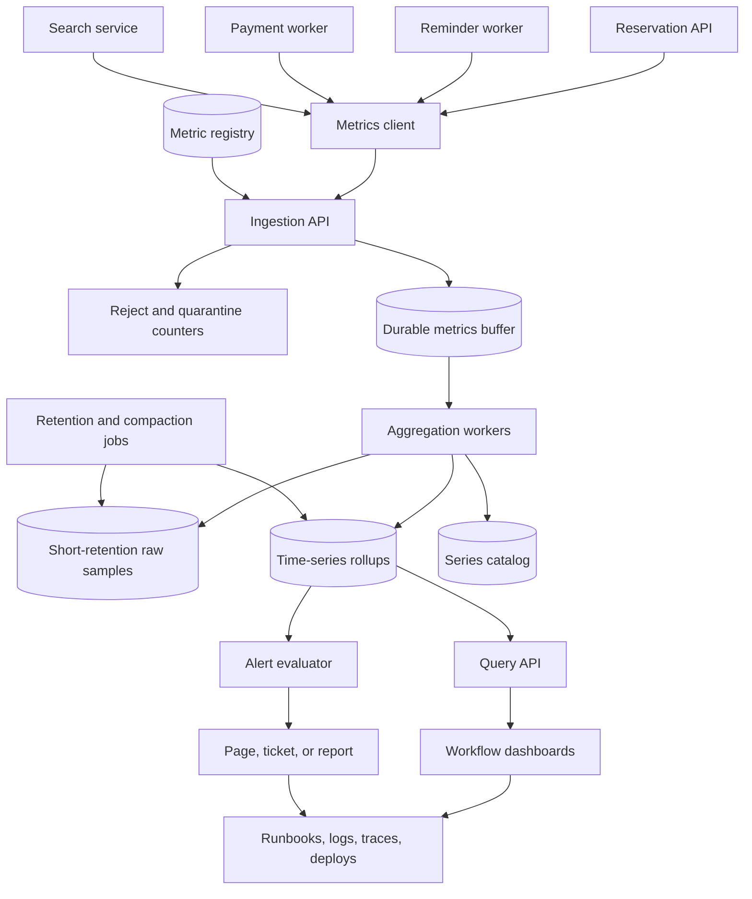

# Metrics Platform Walkthrough

This walkthrough designs a small internal metrics platform for the community
workshop system used in other walkthroughs. Product services emit operational
metrics about reservations, payments, reminders, search, queues, caches, and
workers. Operators use those metrics to see whether residents can complete
important workflows and whether the system is approaching a capacity,
reliability, or cost limit.

Version 1 is not a general analytics warehouse or a commercial observability
product. It is a focused time-series pipeline for operational metrics: ingest,
validate, buffer, aggregate, store, query, dashboard, alert, and retain.

## Problem Statement

The workshop platform now has several services and background workers. A
resident may search for a workshop, reserve seats, pay, receive reminders, and
later request support. The team needs a shared metrics platform that can answer
questions such as:

- Are checkout requests succeeding right now?
- Is the reminder queue falling behind?
- Did cache misses increase database load after a deploy?
- Which provider or worker is causing elevated latency?
- Are high-cardinality labels increasing cost or breaking dashboard queries?
- Which alert should page a human, and which signal belongs on a dashboard?

Original example scenario: during spring enrollment, branch coordinators report
that residents are seeing slow reservation confirmations. The metrics platform
should show reservation traffic, error class, latency, database saturation,
queue age, payment provider timeouts, and completed reservation count without
requiring operators to search raw logs for every request.

Out of scope for version 1:

- product analytics, funnel analysis, attribution, or experimentation;
- raw log storage, distributed trace storage, or audit-log storage;
- billing-grade financial reporting;
- arbitrary user-defined metrics from untrusted public clients;
- long-term data science feature stores;
- multi-region active-active observability infrastructure;
- self-service customer-facing dashboards.

## Functional Requirements

Version 1 must support:

- Services and workers can submit counter, gauge, and histogram samples through
  a bounded ingestion API.
- The ingestion path can validate metric names, types, units, timestamps, and
  allowed labels against a metric registry.
- The ingestion path can reject, sample, or quarantine unsafe high-cardinality
  label sets before they reach storage.
- The platform can buffer accepted samples so short storage or aggregator
  slowdowns do not immediately drop all metrics.
- The aggregation path can build one-minute rollups for common queries,
  including rate, error count, latency percentiles, queue age, cache hit rate,
  and business workflow counts.
- Latency percentile rollups should be derived from histogram buckets or
  sketches, not from averaging already-computed p95 values.
- The storage path can keep recent raw samples briefly and retain rollups for
  longer windows.
- Operators can query metrics for dashboards and incident investigation.
- Dashboards can show workflow health, component causes, capacity trends, and
  alert context.
- The alert evaluator can check symptom-oriented rules, suppress noisy alerts,
  and include dashboard and runbook context.
- Operators can manage metric definitions, retention classes, alert rules, and
  temporary silences through reviewed configuration.

Later versions may support:

- remote ingestion from additional regions;
- recording rules for expensive derived metrics;
- tenant-facing summary dashboards;
- more advanced anomaly detection;
- longer-term warehouse export for non-operational analysis;
- separate storage tiers for compliance or business reporting if policy
  requires it.

## Non-Functional Requirements

Assumptions for the first useful production version:

- Ingestion acknowledges accepted samples within 100 ms p95 under normal load.
- Normal load is 20,000 samples per second, with bursts to 80,000 samples per
  second during deploys, enrollment launches, and incidents.
- The platform can lose a small amount of non-critical metrics during a severe
  incident, but it must surface ingestion loss, buffer drops, and alert
  evaluation gaps.
- Alert evaluation should run at least once per minute for page-worthy rules.
- Dashboard queries for the last 6 hours of one workflow should usually return
  within 2 seconds.
- Metrics are not the source of truth for reservations, payments, audit
  decisions, or support actions.
- The platform must protect itself from unbounded labels such as user IDs,
  request IDs, raw URLs, search queries, object keys, and error strings.
- Retention must balance incident value, capacity planning, cost, and privacy
  risk.
- The design should be vendor-neutral and express requirements rather than
  depending on one storage product.

## Core Entities

| Entity | Purpose | Key Relationships |
| --- | --- | --- |
| Metric definition | Names metric, type, unit, owner, allowed labels, and retention class | Registered before services emit production samples |
| Metric sample | One observed value at a point in time | Belongs to a metric definition and label set |
| Label set | Bounded dimensions used to group samples | Validated against allowed keys and values |
| Series | Unique metric name plus normalized label values | Stored in time-series storage and watched for cardinality |
| Ingestion batch | Group of samples submitted by one service | Authenticated, validated, and written to the buffer |
| Buffer partition | Durable queue segment for accepted samples | Drained by aggregation workers |
| Rollup | Aggregated value for a metric, label set, and time bucket | Used by dashboards, alerts, and capacity views |
| Dashboard | Curated query view for a workflow or component | Reads rollups and links alerts, logs, traces, and runbooks |
| Alert rule | Condition that creates a page, ticket, or report | Evaluates rollups and includes owner and runbook context |
| Retention policy | Defines raw and rollup storage windows | Applied by compaction and deletion jobs |

The series is the critical cost and performance unit. A single metric with
unsafe labels can create millions of series, slow queries, increase storage,
and make alerts unreliable.

## API Sketch

Metric ingestion:

```text
POST /internal/metrics/v1/samples
Actor: authenticated service or worker
Request:
  service
  environment
  emitted_at
  samples:
    - name
      type: counter | gauge | histogram
      value or histogram_bucket
      unit
      labels
      trace_id_or_correlation_id optional
Response:
  accepted_count
  rejected_count
  sampled_count
  next_allowed_batch_size
Important errors:
  metric_not_registered
  invalid_metric_type
  unsafe_label_key
  unsafe_label_value
  timestamp_out_of_window
  batch_too_large
  ingestion_rate_limited
```

Example registered metric:

```text
name: reservation_submit_latency_ms
type: histogram
unit: milliseconds
owner: reservations
allowed_labels:
  service: reservation-api
  workflow: reservation_submit
  result_class: success | validation_error | dependency_error | system_error
  tenant_tier: standard | priority
retention_class: critical_workflow
forbidden_labels:
  user_id
  request_id
  raw_url
  error_message
  search_query
```

Dashboard query:

```text
GET /internal/metrics/v1/query
Actor: authorized operator, service owner, or dashboard renderer
Request:
  expression_id or saved_query_id
  time_range
  filters
  resolution
Response:
  series
  points
  warnings:
    partial_data
    downsampled
    retention_window_exceeded
Important errors:
  forbidden
  query_too_expensive
  unknown_metric
  unsafe_filter
```

Alert rule configuration:

```text
PUT /internal/metrics/v1/alert-rules/{rule_id}
Actor: authorized service owner
Request:
  metric_expression_id
  threshold
  duration
  severity: page | ticket | report
  owner
  dashboard_id
  runbook_url
  silence_policy
Response:
  rule_id
  validation_result
  next_evaluation_at
Important errors:
  forbidden
  expression_not_allowed
  missing_owner
  missing_runbook_for_page
```

Metric registry changes should go through reviewed configuration or an
authorized admin path. Services should not create arbitrary production metrics
with unbounded labels at runtime.

## Read Path

The primary read path is an operator loading the reservation workflow dashboard.

1. Operator opens the dashboard during an enrollment incident.
2. Dashboard service authenticates the operator and loads saved panel
   definitions.
3. Query API validates the time range, resolution, saved expression, and filter
   dimensions.
4. Query planner chooses rollup tables for the requested range. Recent views use
   one-minute rollups; longer views use coarser rollups.
5. Storage returns series for reservation request rate, error class, p95
   latency, database saturation, queue age, cache hit rate, payment provider
   timeout rate, and completed reservation count.
6. Query API marks partial data if ingestion lag, buffer drops, or retention
   boundaries affect the result.
7. Dashboard renders overview panels first, then component drill-downs and links
   to logs, traces, alerts, and runbooks.

The dashboard does not scan raw samples by default. It reads pre-aggregated
rollups because incident views must stay fast when the platform is under load.

## Write Path

The critical write path is service metric ingestion.

1. Reservation API records metrics for request count, result class, latency
   histogram, and database dependency behavior.
2. Metrics client batches samples with service name, environment, timestamp,
   metric name, type, unit, and bounded labels.
3. Ingestion API authenticates the service credential and enforces per-service
   rate and batch-size limits.
4. Ingestion API validates each sample against the metric registry:
   - metric name exists;
   - type and unit match the definition;
   - timestamp is within the allowed skew window;
   - label keys are allowed for that metric;
   - label values are bounded, normalized, and safe.
5. Accepted samples are appended to a durable buffer partition by metric family
   or service owner.
6. Rejected samples are counted by reason. Unsafe labels are not written to the
   normal metrics store.
7. Aggregation workers consume buffer partitions, update one-minute rollups,
   and record ingestion lag and drop metrics for the platform itself.
8. Storage writers persist raw short-retention samples where useful and rollups
   for dashboard and alert windows.
9. Alert evaluator reads rollups on a schedule, evaluates rules, and routes
   page, ticket, or report notifications with dashboard and runbook context.
10. Retention jobs compact old rollups and delete expired raw samples according
    to the retention policy.

Backpressure behavior:

- If storage is slow, aggregation lag rises and dashboards show partial or stale
  data warnings.
- If the buffer is near capacity, ingestion starts rejecting low-priority
  metric classes before accepting unbounded growth.
- If one service emits unsafe labels, the platform quarantines or rejects that
  service's offending series without taking down unrelated metrics.

## Data Model

| Data | Source Of Truth? | Notes |
| --- | --- | --- |
| Metric registry | Yes | Defines metric names, types, units, owners, allowed labels, and retention class |
| Ingestion batch record | No | Short-lived debugging record for batch outcome and rejected counts |
| Buffer entry | Temporary | Durable enough to survive worker restarts before aggregation |
| Raw metric sample | No | Kept briefly for debugging high-resolution recent behavior |
| Rollup table | No | Derived from accepted samples; source for dashboards and alerts |
| Series catalog | Yes for control plane | Tracks active series count, owner, last seen time, and cardinality status |
| Dashboard definition | Yes | Reviewed view configuration with saved expressions and filters |
| Alert rule | Yes | Owner, threshold, duration, route, dashboard, and runbook |
| Alert event | Yes for operations | Records evaluation result, notification, acknowledgment, and resolution |
| Retention policy | Yes | Defines storage windows, compaction, and deletion behavior |

Storage shape:

| Storage Area | Version 1 Window | Purpose |
| --- | --- | --- |
| Raw samples | 24 to 72 hours | Debug recent incidents and verify rollup behavior |
| 1-minute rollups | 30 days | Dashboards, alerts, SLO reviews, and incident analysis |
| 15-minute rollups | 13 months | Capacity planning, seasonal comparisons, and cost trends |
| Alert events | 13 months | Incident review, alert fatigue analysis, and ownership history |
| Registry and dashboards | Until replaced | Configuration history and ownership |

Rollup keys should use bounded dimensions:

```text
metric_name
time_bucket
service
environment
region
workflow
result_class
dependency
job_type
tenant_tier
```

Avoid raw labels such as user ID, request ID, email address, full URL, search
query, cache key, object key, stack trace, or free-form error message.

## Component Choices

| Component | Requirement It Serves | Alternative Considered | Trade-Off |
| --- | --- | --- | --- |
| Metrics client library | Keeps metric format consistent at emitters | Every service formats payloads manually | Adds shared client maintenance, but reduces schema drift and unsafe labels |
| Ingestion API | Authenticates emitters and validates samples | Write directly to storage | Adds a hop, but protects storage and gives one control point |
| Metric registry | Defines allowed metric shape and owner | Allow arbitrary runtime metric creation | Slower setup, but prevents cardinality and privacy incidents |
| Durable buffer | Absorbs bursts and storage slowdowns | Drop immediately when storage is slow | More moving parts, but protects short incidents and shows lag |
| Aggregation workers | Build rollups for fast dashboards and alerts | Query raw samples for every panel | More write work, but stable incident-time reads |
| Time-series storage | Stores rollups by metric, labels, and time | General relational table only | Specialized access pattern improves range queries, but needs retention discipline |
| Series catalog | Tracks active series and cardinality growth | Discover cardinality only from storage cost | Extra metadata, but catches unsafe label explosions early |
| Dashboard service | Serves curated workflow and component views | Let every user write arbitrary queries | Less flexible, but faster and safer for incidents |
| Alert evaluator | Turns symptom rules into pages, tickets, or reports | Manual dashboard watching | Adds ownership burden, but reduces time to notice |
| Retention and compaction jobs | Control cost and query performance | Keep all samples forever | Less raw history, but predictable cost and faster queries |

The main design choice is to make ingestion permissive enough that services can
emit useful operational evidence, but strict enough that one bad label does not
damage the whole platform.

## Architecture Diagram



The ingestion path accepts and protects the platform. The aggregation path turns
many samples into stable rollups. The read path favors dashboards and alerts
that answer operational questions quickly.

## Consistency Decisions

Metrics consistency is different from source-of-truth data consistency.

| Decision | Choice | Reason |
| --- | --- | --- |
| Ingestion acknowledgment | Acknowledge after durable buffer append | Accepted samples should survive aggregator restarts |
| Metric registry update | Apply reviewed versioned definitions | Prevents accidental type or label changes |
| Rollup freshness | Allow short lag and expose it | Dashboards need honesty more than fake precision |
| Raw versus rollup | Rollups are derived and rebuildable within raw retention | Keeps storage manageable |
| Alert evaluation | Evaluate on rollups plus data-lag checks | Avoids paging from missing or stale data without context |
| Duplicate samples | Prefer idempotent batch/sample identity when available | Retries should not double count critical counters |
| Late samples | Accept within a bounded lateness window | Handles clock skew and buffer lag without rewriting old history indefinitely |

Duplicate and retry behavior:

- Ingestion clients include batch IDs so retried batches can be deduplicated
  within a short window.
- Counters and histograms should not be emitted with user-specific labels.
- Aggregators should make replay from the buffer safe by tracking partition
  offsets or idempotent rollup updates.
- If rollup rebuild is needed, operators rebuild only the affected metric,
  time range, and label scope when raw data still exists.

Freshness behavior:

- Dashboards show ingestion lag and rollup lag.
- Alerts suppress or downgrade rules when the underlying data is too stale to
  evaluate honestly, and they create a platform-health alert for the stale data
  condition itself.
- Capacity and monthly trend views use coarser rollups and tolerate more lag
  than incident dashboards.

## Scaling Strategy

Version 1 estimate:

- 15 services and worker pools emit metrics.
- Normal load: 20,000 samples per second.
- Burst load: 80,000 samples per second for 15 minutes.
- Active series target: under 500,000 across production.
- Dashboard workload: 200 active viewers during incidents.
- Alert rules: 200 rules evaluated every minute.
- Raw sample retention: 24 to 72 hours.
- One-minute rollup retention: 30 days.

Expected early bottlenecks:

- high-cardinality labels creating too many active series;
- dashboard queries over broad time ranges and unbounded filters;
- aggregator lag during deploys or incidents;
- storage write amplification from raw plus rollup writes;
- alert evaluator overload when too many rules query expensive expressions;
- observability cost growing faster than product traffic.

Initial scaling choices:

- partition the buffer by metric family, service owner, or hash of metric name;
- scale aggregation workers horizontally by partition;
- precompute common rollups instead of letting dashboards scan raw samples;
- cap query time range and resolution for interactive dashboards;
- keep expensive ad hoc analysis out of the incident read path;
- enforce per-service sample budgets and cardinality budgets;
- add storage tiers before keeping raw samples for long windows;
- use dashboards and alerts for the metrics platform itself: ingest rate,
  rejected samples, buffer age, rollup lag, query latency, active series, and
  alert evaluation delay.

The most important scaling trigger is active series growth. Sample volume can
usually be partitioned and buffered. Unbounded series growth can make storage,
queries, alerts, and cost fail at the same time.

## Failure Modes

| Failure | User Impact | System Response | Repair Or Follow-Up |
| --- | --- | --- | --- |
| Ingestion API unavailable | Services cannot submit metrics; product may still function | Clients buffer briefly and drop low-priority metrics after local limit | Alert on missing metrics and ingestion availability |
| Buffer lag grows | Dashboards and alerts become stale | Show data freshness warnings and alert on platform lag | Scale aggregators, pause noisy emitters, or inspect storage latency |
| Storage writer slows | Rollups fall behind and buffer fills | Backpressure aggregation and reject lower-priority samples before buffer exhaustion | Check storage saturation and retention jobs |
| Service emits user IDs as labels | Series count spikes and privacy risk appears | Reject or quarantine unsafe label set and count rejected samples by service | Fix emitter, review logs, and audit whether unsafe values reached storage |
| One dashboard query is too expensive | Dashboard loads slowly or harms shared storage | Query API rejects or down-samples unsafe query | Add saved rollup or narrow dashboard scope |
| Aggregator crashes after partial work | Rollup may be incomplete or duplicated | Replay from buffer with idempotent rollup update or offset tracking | Compare rollup counts with ingestion counts |
| Alert evaluator misses a cycle | Page may be delayed | Record evaluator lag and evaluate next cycle with stale-data context | Alert on repeated missed cycles |
| Retention job deletes too much | Historical views lose expected data | Protect retention config with review and dry-run summaries | Restore from backup only if policy and value justify it |
| Metric registry change breaks emitters | Valid metrics become rejected | Version registry changes and show rejection spikes by metric owner | Roll back definition or update emitters |
| Cardinality budget is exhausted | New useful series are rejected or sampled | Enforce owner budget and alert service owner | Remove unsafe labels or create a bounded replacement metric |
| Alert rule is noisy | Responders lose trust | Route to ticket/report or tune threshold and duration | Review alert event history and runbook usefulness |
| Metrics platform is healthy but logs/traces are missing | Operators see symptoms but cannot debug one case | Dashboard links show missing evidence warnings | Add log/trace instrumentation for the affected workflow |

Metrics platform failures should be visible as first-class platform health, not
only as missing charts.

## Security Concerns

The metrics platform handles operational evidence from many systems. It should
not become a side channel for sensitive data.

Security and privacy decisions:

- Authenticate every emitter with service credentials scoped to environment and
  metric namespace.
- Authorize dashboard and query access by role, environment, and service owner.
- Reject, drop, normalize, or classify unsafe labels into bounded classes before
  storage; do not store raw or hashed user IDs, emails, session IDs, request
  IDs, search queries, full URLs, object keys, tokens, or error messages as
  metric labels.
- Keep metric names, labels, dashboard titles, and alert names free of secrets
  and personal data.
- Separate production metrics from development and test metrics.
- Audit sensitive control-plane changes: registry updates, retention changes,
  alert route changes, silence creation, and dashboard permission changes.
- Rate limit ingestion by service so one broken emitter cannot starve the
  platform.
- Avoid exposing tenant-specific business health to users who should only see
  aggregate operational views.
- Keep alert notifications free of private payloads because they may be copied
  into chat, ticket, email, or incident documents.

Metrics are aggregated, but aggregation does not automatically make data safe.
A unique label value can still identify a person, request, object, or private
event.

## Observability

The metrics platform must observe itself.

Platform health metrics:

- ingestion request rate, accepted samples, rejected samples, sampled samples,
  and rejection reasons;
- per-service sample rate and cardinality budget use;
- active series count, new series rate, and top series owners;
- buffer depth, oldest buffer age, enqueue rate, and dequeue rate;
- aggregator processing rate, rollup lag, failed partitions, and replay count;
- storage write latency, query latency, compaction duration, and retention job
  success;
- dashboard query count, slow queries, rejected expensive queries, and partial
  data responses;
- alert rule evaluation duration, missed cycles, stale-data suppressions, pages,
  tickets, and resolved alerts;
- platform cost signals: stored bytes, samples per second, rollup count, and
  query volume.

Logs:

- structured ingestion rejection logs with service, metric name, reason code,
  and safe label key, not raw unsafe value;
- registry change logs with actor, owner, diff summary, and reason;
- alert evaluation logs for pages, suppressions, and routing decisions;
- retention job logs with dry-run counts, deleted ranges, and failures.

Traces:

- trace ingestion API, buffer append, aggregation worker, storage write, query
  API, dashboard render, and alert evaluation paths;
- keep span names stable and avoid metric label values in span names;
- sample successful high-volume ingestion traces, but retain error, slow, and
  rejected-batch traces.

Dashboards:

- platform overview: ingest rate, rejected samples, active series, buffer age,
  rollup lag, query latency, and alert evaluator lag;
- cardinality review: series by service owner, new series rate, rejected labels,
  and budget use;
- storage and retention: stored bytes, write latency, compaction, deletion, and
  projected capacity;
- alert quality: pages by service, false-positive candidates, noisy rules, and
  rules missing runbooks.

Runbooks should cover ingestion unavailable, cardinality spike, buffer lag,
storage saturation, stale dashboards, and noisy alert rules.

## Cost Considerations

Main cost drivers:

- sample volume and active series count;
- raw sample retention window;
- rollup count and number of dimensions;
- storage replication, backups, and compaction work;
- dashboard query volume and broad time ranges;
- alert expression complexity and evaluation frequency;
- log and trace volume from the metrics platform itself;
- engineering time spent maintaining metric definitions and dashboards.

Cost-aware choices:

- require a metric owner and purpose before production registration;
- prefer bounded labels and saved expressions over arbitrary query dimensions;
- keep raw samples short-lived and retain coarser rollups for trend analysis;
- reject or sample unsafe series at ingestion instead of paying to store them;
- use retention classes so critical workflow metrics live longer than noisy
  debug metrics;
- review unused dashboards and alert rules regularly;
- track cost by service owner so teams can see the effect of new metrics.

The cheapest platform is not one that drops evidence blindly. It is one that
keeps the metrics needed for incidents, SLOs, capacity, and business health
while refusing high-cost dimensions that do not support action.

## Version 1 Simplification

Version 1 intentionally keeps the platform narrow:

- one production region;
- internal service emitters only;
- counters, gauges, and histograms only;
- one ingestion API and one durable buffer;
- one-minute and 15-minute rollups;
- curated dashboards and saved queries instead of arbitrary query access for
  every user;
- reviewed metric registry and alert-rule configuration;
- short raw retention and longer rollup retention;
- manual cardinality review for unusual metrics;
- no product analytics, trace storage, log search, or customer-facing
  dashboard product.

Measurements required from day one:

- accepted and rejected sample rate;
- active series count and new series rate;
- buffer age and aggregation lag;
- dashboard query latency and partial-data responses;
- alert evaluation delay and missed cycles;
- storage growth and retention job success;
- page count, noisy alert candidates, and rules without runbooks.

This version is useful because it makes critical workflows observable while
keeping the platform small enough to operate.

## Review Checklist

- Does every production metric have an owner, type, unit, purpose, and retention
  class?
- Are labels bounded, safe, and useful for dashboards or alerts?
- Can the ingestion path reject unsafe high-cardinality data before storage?
- Can the buffer absorb short storage or aggregation slowdowns without hiding
  lag?
- Do rollups support the required dashboards and alerts without scanning raw
  samples?
- Are retention windows explicit for raw samples, rollups, alert events, and
  configuration?
- Are alert rules symptom-oriented, owned, and linked to a runbook?
- Can operators see when the metrics platform itself is stale, dropping data, or
  too expensive?

## What Changes At 10x Scale

At 10x scale, active series count, query cost, and alert ownership become more
important than raw ingestion throughput alone.

Likely changes:

- split ingestion and aggregation by service owner, region, or metric family;
- add separate high-priority and low-priority buffers so debug metrics cannot
  delay critical workflow metrics;
- move expensive long-range analysis to a lower-cost analytical store while
  keeping incident dashboards on precomputed rollups;
- add stricter metric review, automated cardinality previews, and per-owner
  budgets;
- add recording rules for expensive dashboard expressions;
- isolate alert evaluation from dashboard queries;
- add multi-region ingestion if product regions require local observability;
- introduce per-tenant SLO views only after label safety and cost controls are
  proven;
- automate dashboard and alert cleanup based on use, ownership, and incident
  value;
- add stronger disaster recovery for registry, alert rules, dashboards, and
  recent rollups if operations depends on them during incidents.

Triggers for the next design step:

- active series growth exceeds budget for two consecutive review periods;
- buffer age or rollup lag repeatedly violates dashboard freshness needs;
- storage cost grows faster than product traffic;
- dashboard p95 query latency exceeds the incident-response target;
- alert evaluator misses cycles or creates duplicate pages during incidents;
- teams avoid adding useful metrics because the registry or review flow is too
  slow.

## Related Pages

- [Metrics](../operations/metrics.md)
- [Component metrics catalog](../operations/component-metrics-catalog.md)
- [Dashboards](../operations/dashboards.md)
- [Alerting](../operations/alerting.md)
- [SLOs](../operations/slos.md)
- [Logs](../operations/logs.md)
- [Tracing](../operations/tracing.md)
- [Runbooks](../operations/runbooks.md)
- [Capacity planning](../operations/capacity-planning.md)
- [Bottleneck analysis](../scalability/bottleneck-analysis.md)
- [Capacity estimation](../scalability/capacity-estimation.md)
- [Retries](../reliability/retries.md)
- [Graceful degradation](../reliability/graceful-degradation.md)

Return to the [walkthroughs index](index.md).
