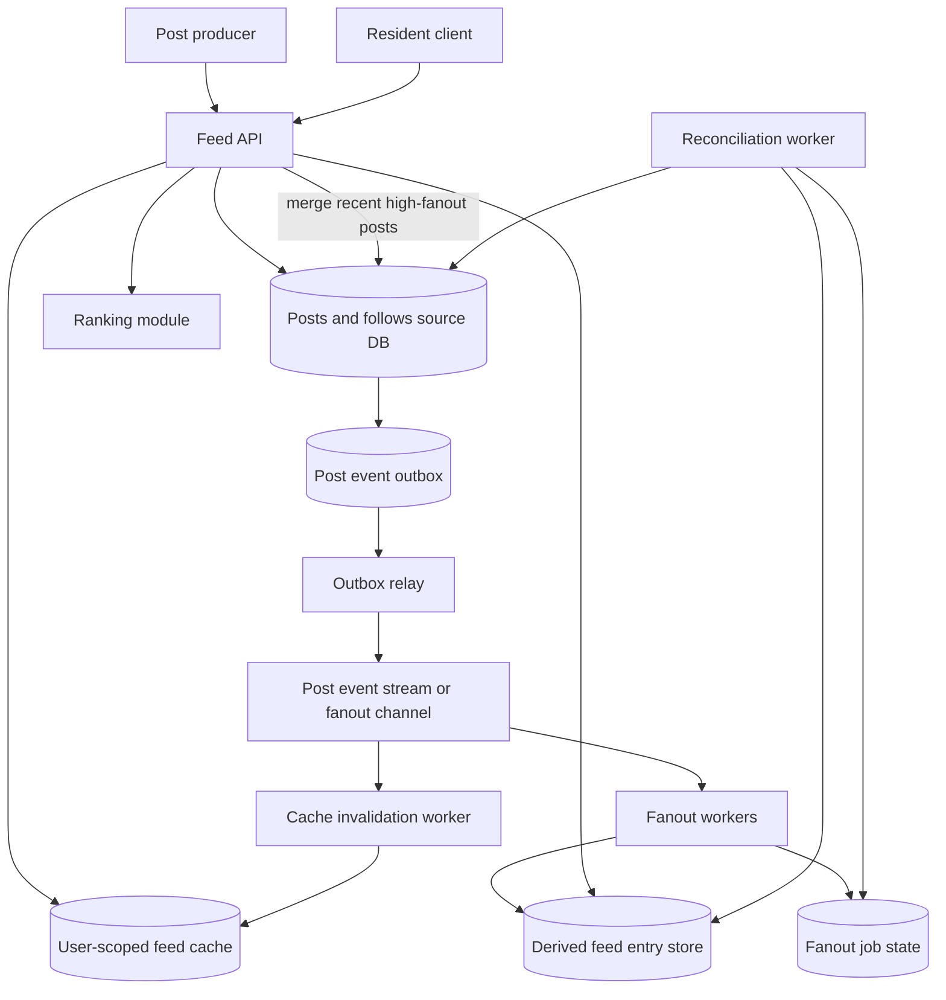

# News Feed Walkthrough

This walkthrough designs a news feed system for a community services platform.
Residents follow neighborhoods, service topics, organizations, and staff
accounts to see updates about workshops, pickup changes, safety notices,
volunteer opportunities, and local events.

The design focuses on fanout, feed generation, ranking, caching, celebrity
users, freshness, eventual consistency, and a version 1 that stays practical
without pretending to be a global social network.

## Problem Statement

The platform needs a personalized feed that helps residents see relevant
updates without making every post write synchronously update every follower's
view. Users should see newly published posts soon, but the feed can tolerate
short delays as long as source-of-truth post detail remains correct and the
system exposes freshness.

Original scenario: A parks coordinator posts a notice that Saturday's community
garden workshop moved indoors. Most ordinary organizers have hundreds of
followers, so the system can precompute feed entries for those followers after
the post commits. A city-wide emergency account may have hundreds of thousands
of followers; writing one row per follower synchronously would delay publish
and starve ordinary feed work. That account needs a celebrity-user path.

Version 1 scope:

- users can follow topics, organizations, neighborhoods, and staff accounts;
- authorized producers can publish, update, hide, or delete feedable posts;
- the system creates feed entries for ordinary follow relationships
  asynchronously;
- celebrity users and high-fanout publishers use a hybrid fanout strategy;
- feed reads combine precomputed entries with recent celebrity posts when
  needed;
- ranking starts simple and explainable;
- caches protect repeated feed and post reads with clear freshness rules;
- stale feeds are acceptable within a named window, while post detail and
  permission checks remain authoritative.

Out of scope:

- machine-learning ranking models;
- open-ended public social graph discovery;
- paid content promotion or ad auctions;
- global active-active feed writes;
- full-text search over posts;
- moderation classifier pipelines beyond hide/delete state.

## Functional Requirements

Version 1 must support:

- Residents can follow and unfollow allowed feed sources.
- Authorized staff or organizations can publish a post to a source.
- The system can create feed entries for followers of ordinary sources.
- The system can serve a resident's feed ordered by a stable ranking policy.
- The system can show recent posts from celebrity users without synchronously
  writing to every follower's feed.
- The system can hide, delete, or expire posts so future feed reads stop
  showing them.
- Residents can refresh the feed and eventually see new eligible posts.
- The system can show a freshness timestamp or update hint when the feed
  projection lags.
- Operators can inspect stuck fanout, hot publishers, ranking fallback, cache
  skew, and stale feed projections.

Later versions may support:

- richer ranking signals;
- recommendation sources outside explicit follows;
- per-user mute and priority controls;
- large media attachments;
- full-text search and topic classification;
- regional feed generation;
- experiments with strict guardrails.

## Non-Functional Requirements

Assumptions for the first useful production version:

- Publishing a post should commit quickly and should not wait for all followers
  to receive feed entries.
- Most ordinary posts should appear in follower feeds within a few minutes.
- Users should see their own newly published post immediately on the producer
  view or post detail page, even if feed projections lag.
- Feed ordering only needs to be stable within one user's returned page. Global
  ordering across all users is not required.
- Feed entries are derived data and can be rebuilt from posts, follows, and
  post events.
- Ranking must be deterministic and explainable for version 1.
- A stale feed is acceptable for browse, but actions such as viewing a hidden
  post, changing a follow, or opening post detail should recheck source state.
- Celebrity-user fanout must not consume all worker capacity or cache refresh
  work.
- Cache behavior must name freshness, invalidation, and origin fallback so a
  hot feed or post does not overload the source.

## Core Entities

| Entity | Purpose | Key Relationships |
| --- | --- | --- |
| User | Resident, staff member, or organization actor | Owns follows, feed reads, and post authoring permissions |
| Feed source | Topic, neighborhood, organization, or staff account that can publish posts | Has followers, source type, visibility, and celebrity path flag |
| Follow | User subscription to a feed source | Connects user, source, notification preference, and follow state |
| Post | Source-of-truth published item | Belongs to author/source, status, content summary, timestamps, and visibility |
| Post event | Committed fact such as `post.published`, `post.hidden`, or `post.deleted` | Drives fanout, cache invalidation, analytics, and repair |
| Feed entry | Derived row that places a post into one user's feed | References user, post, source, rank fields, and entry state |
| Ranking score | Sort key or bucket used to order feed entries | Derived from recency, source priority, pinned status, and safety state |
| Feed cache entry | Reusable page or fragment for a user's recent feed | Has freshness timestamp, source version, and TTL |
| Fanout job | Asynchronous work to create, update, or remove feed entries | Tracks source, post, follower segment, attempts, and lag |

The post and follow tables are authoritative. Feed entries, ranking snapshots,
and feed caches are derived views that can lag and be repaired.

## API Sketch

Publish post:

```text
POST /feed-sources/{source_id}/posts
Actor: authorized staff user, organization manager, or internal service
Request:
  client_request_id
  title
  body
  visibility
  publish_at_optional
  expires_at_optional
  pinned_until_optional
Response:
  post_id
  status: published | scheduled
  source_id
  created_at
Important errors:
  forbidden
  invalid_source
  content_too_large
  rate_limited
  idempotency_conflict
```

Follow source:

```text
POST /feed-sources/{source_id}/followers
Actor: resident
Request:
  notification_preference
Response:
  source_id
  follow_state: active
  followed_at
Important errors:
  forbidden
  source_not_found
  already_following
```

Read personalized feed:

```text
GET /users/{user_id}/feed?cursor={cursor}&limit={k}
Actor: same user or authorized support role
Response:
  items:
    post_id
    source_id
    title
    summary
    rank_reason
    published_at
    feed_entry_version
  next_cursor
  generated_at
  projection_lag_seconds
Important errors:
  forbidden
  invalid_cursor
  projection_unavailable
```

Repair or inspect fanout:

```text
POST /operator/feed-fanout/{fanout_job_id}/decision
Actor: authorized operator
Request:
  action: retry | skip | pause_source | mark_rebuild_needed
  reason
Response:
  fanout_job_id
  new_state
  next_attempt_at
Important errors:
  forbidden
  job_not_found
  unsafe_replay
```

Post detail is a separate source-of-truth read:

```text
GET /posts/{post_id}
Actor: user with visibility permission
Response:
  post_id
  source_id
  title
  body
  status
  published_at
Important errors:
  forbidden
  hidden
  deleted
```

The feed API can return a stale projection. The post detail API should verify
current post status and visibility before showing full content.

## Read Path

The main read path is loading a user's feed.

1. Client requests the first feed page with user identity and cursor.
2. API checks the actor can read that user's feed.
3. API reads recent precomputed feed entries for the user from the feed store.
4. API may merge in recent celebrity-user posts from followed celebrity sources
   using a bounded lookback window.
5. API filters out hidden, deleted, expired, or no-longer-visible posts using
   status fields or a source-of-truth recheck when the cached entry is risky.
6. API applies the version 1 rank order: pinned safety notices first, then
   followed-source priority, then recency with stable tie breakers.
7. API returns items, a cursor, `generated_at`, and projection lag metadata.
8. Client can open a post detail page, which rechecks the authoritative post.

Caching can help repeated first-page reads, but the cache key must include the
user, feed version or freshness window, and permission scope. A stale feed page
can be acceptable for browse when it includes age, but stale authorization or
hidden-post state is not acceptable for full post detail.

If the derived feed store is degraded, version 1 can show a clear stale feed or
fallback to a small "latest from followed sources" query only when the origin
can handle it. It should not scan all follows and all posts for every request
without an overload limit.

## Write Path

The critical write path is publishing a post.

1. Producer sends a publish command with source ID, content, visibility, and
   optional pin or expiry fields.
2. API authenticates the producer and authorizes publish permission on the
   source.
3. API validates content size, status transition, source state, rate limits,
   client request ID, and abuse controls.
4. In one transaction, API inserts the post, records the source version, and
   stores an outbox post event such as `post.published`.
5. API returns publish success after the post is durable, not after follower
   fanout finishes.
6. Outbox relay publishes the post event for fanout, cache invalidation,
   notifications, and analytics consumers.
7. Fanout workers read follower segments for ordinary sources and create feed
   entries idempotently for each follower.
8. For celebrity users or sources above the fanout threshold, workers may skip
   per-follower entry creation and mark the source for fanout-on-read merge.
9. Cache invalidation, short TTLs, source versions, or coalesced refresh ensure
   hot feed pages and post summaries refresh within the product freshness
   window. High-fanout celebrity publishes should avoid invalidating every
   follower cache key one by one.
10. Repair workers reconcile missed feed entries by comparing posts, follows,
    source versions, and fanout job state.

Post updates, hides, deletes, and expiry transitions follow the same pattern:
source-of-truth change first, durable event intent, then derived feed repair.
Feed generation is intentionally eventually consistent.

## Data Model

| Data | Source Of Truth? | Notes |
| --- | --- | --- |
| User | Yes | Identity, tenant, profile visibility, and account state |
| Feed source | Yes | Source type, owner, status, visibility policy, follower count, celebrity path flag |
| Follow | Yes | User-source subscription, state, created_at, notification preference |
| Post | Yes | Author/source, content summary, status, visibility, published_at, updated_at, expires_at |
| Post event or outbox | Yes | Durable event intent with post ID, source ID, source version, event type, status |
| Feed entry | No | Derived user-post entry with rank fields, entry state, and source version |
| Ranking score | No | Derived from simple version 1 rules; can be recomputed |
| Feed page cache | No | Short-lived user-scoped page or fragment with generated_at and freshness metadata |
| Fanout job | Yes for job state | Tracks follower segment, attempts, lag, replay eligibility, and dead-letter state |
| Analytics facts | No | Aggregated reads, clicks, hides, and lag metrics derived from events |

Recommended indexes:

- `follow.source_id, follow.state, follow.user_id` for fanout follower scans;
- `follow.user_id, follow.state, follow.source_id` for user's followed sources;
- `post.source_id, post.published_at, post.status` for source timeline reads;
- `feed_entry.user_id, rank_bucket, published_at, post_id` for feed pages;
- `feed_entry.user_id, post_id` unique for idempotent fanout;
- `fanout_job.state, next_attempt_at` for workers;
- `post_event.status, created_at` for outbox relay and repair.

Idempotency:

- producer retries use `source_id + client_request_id` to return the existing
  post instead of creating a duplicate after an ambiguous timeout;
- fanout workers use `user_id + post_id` to make feed-entry creation
  idempotent;
- cache invalidation and repair jobs carry the post event ID so repeated
  processing refreshes the same derived state.

Retention:

- posts follow the source policy for active, expired, hidden, deleted, and
  archived states;
- feed entries can be kept for a recent window and rebuilt for older history
  from posts and follows if the product needs it;
- cache entries expire quickly and are never the only copy of a feed;
- fanout jobs and outbox records are retained long enough for repair and audit;
- analytics aggregates should not keep private content that post retention
  would otherwise remove.

## Component Choices

| Component | Requirement It Serves | Alternative Considered | Trade-Off |
| --- | --- | --- | --- |
| Source database | Authoritative posts, follows, permissions, and events | Store only generated feed rows | Keeps correctness clear, but feed reads need derived views |
| Outbox and event relay | Publish post facts after source commit | Publish directly inside request after commit | Repairable event intent, but duplicate events and relay lag must be handled |
| Fanout workers | Build follower feed entries outside publish latency | Synchronously write every follower feed on publish | Protects publish latency, but feed projections become eventually consistent |
| Feed entry store | Fast personalized feed pages | Query all followed sources on every read | Faster reads for ordinary users, but write fanout and rebuild work increase |
| Hybrid celebrity fanout | Handle high-fanout sources without starving workers | Fanout-on-write for every source | Protects shared capacity, but read path must merge celebrity posts |
| Ranking service or module | Stable, explainable ordering | Complex ML ranking from day one | Simple to debug, but less personalized |
| User-scoped cache | Reduce repeated first-page feed load | No cache | Lower latency, but needs freshness and permission-safe keys |
| Repair and reconciliation worker | Rebuild missed or stale derived entries | Manual database fixes | Safer operations, but adds dashboards and runbooks |

Version 1 should choose a hybrid approach: fanout-on-write for ordinary
sources, fanout-on-read for celebrity users, and source-of-truth rechecks for
actions where stale feed data would be unsafe.

Example threshold: route a source to the celebrity path when it has more than
50,000 active followers or when a publish would create more than 100,000
projected feed-entry writes for five consecutive minutes. Move it back only
after sustained lower traffic, so the routing decision does not flap.

## Architecture Diagram



The source database owns posts, follows, permissions, and post events. Feed
entries and caches are derived. Workers can lag or replay without changing the
fact that a post was published.

## Consistency Decisions

- Publish success means the post and outbox event intent are durable.
- Feed entries are eventually consistent. Users may see a post detail page
  before every follower feed includes the post.
- Ordinary source fanout is idempotent by `user_id + post_id`.
- Celebrity users do not require per-follower feed-entry writes for every post.
  The read path merges recent celebrity posts from followed sources.
- Feed reads can be stale within a named freshness window, but post detail,
  hide/delete state, and permission-sensitive actions must check the source.
- Ranking is deterministic for one generated feed page. Cursor pagination uses
  stable rank keys and post IDs so repeated reads do not skip or duplicate
  items when new posts arrive.
- User follow changes affect future feed generation. Version 1 uses
  future-only follows: a new follow shows posts published after `followed_at`;
  explicit backfill is deferred until the product asks for it.
- Cache entries expire or invalidate after post publish, hide, delete, follow
  change, or ranking-policy version change. For high-fanout celebrity posts,
  prefer short TTLs, source-version checks, and coalesced refresh over
  invalidating every follower's cached feed page individually.
- Repair workers can rebuild derived feed entries from authoritative posts,
  follows, and events.

The main consistency trade-off is deliberate: keep publish and post detail
correct, while allowing personalized feed projections to lag and repair.

## Scaling Strategy

Version 1 assumptions:

- most sources have small to moderate follower counts;
- most feed reads request the first page;
- post writes are much less frequent than feed reads;
- a small number of celebrity users or city-wide sources dominate fanout;
- users tolerate a feed freshness window measured in minutes for ordinary
  updates;
- safety notices may need pinned ranking and a tighter freshness target.

Start with one source database, one outbox relay, one fanout worker pool, one
derived feed entry store, one cache layer for recent user feed pages, and a
simple ranking module. The first expected bottlenecks are follower fanout for
large sources, first-page feed reads, cache skew on celebrity posts, feed-entry
write amplification, and repair backlog after worker failures.

Scaling triggers:

- oldest fanout job age exceeds the feed freshness promise;
- one source creates a large share of fanout jobs or worker time;
- first-page feed p95 rises because every read merges too many sources;
- cache miss storms overload the feed store or post source;
- a celebrity user's post causes ordinary source fanout to lag;
- feed-entry storage grows faster than retention assumptions;
- ranking changes require expensive rebuilds.

At that point, add follower segmentation, per-source fanout caps, queue
fairness, separate celebrity fanout lanes, precomputed celebrity source
fragments, feed-store partitioning by user ID, read replicas for feed pages,
or stricter retention windows for old feed entries.

## Failure Modes

| Failure | User Impact | System Response | Repair Or Follow-Up |
| --- | --- | --- | --- |
| Post commits but fanout event is delayed | Followers do not see it immediately | Show post detail from source; fanout lag alert fires | Relay retries from outbox |
| Fanout worker creates duplicate entries | Feed may show duplicate post | Unique `user_id + post_id` and idempotent upsert | Track duplicate suppression |
| Fanout backlog grows for celebrity source | Ordinary posts become stale | Route celebrity source to hybrid path and cap worker share | Queue fairness and source threshold review |
| Cache serves hidden or deleted post | User sees unsafe stale content | Short TTL, invalidation, and source recheck on post detail | Invalidate, audit, and repair affected keys |
| Feed page cursor becomes unstable | User sees skipped or repeated items | Use stable rank keys and post IDs | Add cursor metrics and tests |
| Ranking module fails | Feed ordering degrades | Fall back to recency plus pinned safety notices | Alert and compare degraded feed rate |
| Feed store is unavailable | Feed read fails or shows stale data | Serve bounded stale cache if safe; otherwise clear error | Protect source from broad fallback scans |
| Follow change not reflected | User sees old source or misses new source | Apply rule for follow-time backfill or future-only posts | Reconcile follows and feed entries |
| Repair replay repeats side effects | Notifications or analytics duplicate | Keep fanout rebuild separate from side effects | Dedupe by event ID and consumer action |
| Viral post creates cache miss storm | Latency and origin load spike | Coalesce refresh, serve stale-if-safe, cap origin fallback | Prewarm or replicate hot summaries |

The unacceptable failure is treating a stale feed projection as authoritative
for visibility, deletion, or permissions. A temporary stale browse view is
acceptable only when bounded and observable.

## Security Concerns

- Feed reads must be scoped by authenticated user and support/admin permission.
- Cache keys for personalized feeds must include user identity, permission
  scope, ranking version, and freshness metadata.
- Post detail must recheck source visibility so hidden, deleted, expired, or
  private posts do not leak through stale feed entries.
- Follow and publish actions need authorization on source, tenant, and role.
- Fanout events should carry minimal post identity and version, not full
  sensitive body content unless consumers need it.
- Operator tools for fanout repair and ranking inspection should audit actor,
  reason, source, post, and affected user segment.
- Celebrity-user paths should not bypass normal visibility and tenant
  boundaries.
- Abuse controls should limit post floods, follow churn, scraping of feed
  pages, and artificial engagement signals.
- Ranking signals should be explainable enough to debug bias, suppression, and
  user complaints.

## Observability

Useful metrics:

- publish success rate, publish latency, and publish rejection rate;
- outbox pending count, oldest outbox age, and relay failure rate;
- fanout job enqueue rate, completion rate, oldest age, retry count, and
  dead-letter count;
- fanout lag by source, source type, follower count bucket, and celebrity path;
- feed read p50/p95/p99 latency, error rate, and first-page cache hit rate;
- feed projection lag returned to clients;
- cache hit rate, stale age, miss storms, and top hot keys;
- ranking fallback rate and ranking-policy version distribution;
- hide/delete invalidation lag and stale-hidden-post detection;
- feed-entry storage growth, rebuild rate, and repair backlog;
- per-source worker share so one celebrity or viral source does not starve
  ordinary sources.

Useful logs and traces:

- request ID, user ID, source ID, post ID, post event ID, fanout job ID, and
  ranking-policy version;
- safe result class for publish, fanout, cache, ranking, read, hide/delete, and
  repair decisions;
- cursor, generated_at, projection lag, and cache age for feed reads;
- source follower-count bucket and celebrity-path flag for fanout decisions.

Alerts should be tied to symptoms: feed lag beyond promise, outbox age, fanout
dead letters, feed read errors, cache miss storms, stale hidden posts, hot
source worker share, and feed-entry storage growth.

## Cost Considerations

Main cost drivers:

- feed-entry write amplification for ordinary fanout-on-write;
- feed-entry storage and indexes by user and rank;
- first-page feed reads and cache memory;
- fanout worker CPU and queue storage;
- ranking computation and ranking-feature reads;
- repair and rebuild jobs;
- observability volume for high-cardinality user, source, and post metrics;
- analytics storage for impressions and engagement events.

Cost-aware choices:

- use fanout-on-write only where follower counts are small enough;
- use hybrid fanout for celebrity users and high-fanout sources;
- keep ranking simple before adding expensive features;
- cache first pages only with clear TTL and invalidation rules;
- retain only a recent feed-entry window if older history can be rebuilt or
  read from source timelines;
- batch fanout and read-receipt-like impression analytics when exact live
  counts are not required;
- isolate celebrity and viral work so ordinary feed freshness remains healthy.

Do not save cost by skipping source-of-truth checks for visibility or
permissions. It is better to show a slightly stale feed than to leak a hidden
post.

## Version 1 Simplification

Start with:

- explicit follows to topics, neighborhoods, organizations, and staff sources;
- text and small summary posts without rich media processing;
- one home region for source writes;
- source database for posts, follows, and outbox records;
- fanout-on-write for ordinary sources;
- fanout-on-read merge for celebrity users above a follower or fanout
  threshold;
- deterministic ranking: pinned safety notices, source priority, recency, and
  stable tie breakers;
- cache-aside for the first feed page with short TTL and user-scoped keys;
- repair jobs that can rebuild feed entries from posts and follows;
- dashboards for fanout lag, cache skew, hot sources, and stale projection
  reports.

Defer machine-learning ranking, open social discovery, global multi-region
writes, full-text search, and large media until the product proves the need.
The first version should measure feed lag, fanout age, feed read latency,
cache hit rate, cache stale age, hot-source worker share, and storage growth.

## What Changes At 10x Scale

At 10x traffic or follower count:

- Follower lists need segmentation so fanout jobs can split work and retry
  safely.
- Celebrity users need a formal hybrid path with thresholds, hysteresis, and
  separate worker pools.
- Feed-entry storage needs partitioning by user ID and time, plus retention and
  rebuild policies.
- First-page reads may need precomputed feed fragments, read replicas, or
  replicated hot source summaries.
- Ranking may need a dedicated feature pipeline, but features must have
  freshness and fallback rules.
- Cache hot keys need coalescing, jitter, prewarming, and per-key fallback
  limits.
- Hide/delete invalidation needs stronger monitoring because stale unsafe
  content affects more users.
- Analytics and impression events need batching or streams so they do not
  compete with publish and feed reads.
- Regional users may justify regional read caches or feed edges, but source
  writes and celebrity fanout still need a clear home and consistency model.

The design should evolve around observed pressure: fanout age, hot publishers,
feed read p95, cache miss storms, ranking cost, and stale unsafe content. A
more complex ranking or streaming stack is only justified when those signals
show the simple version 1 is no longer enough.

## Related Pages

- [Hot-key mitigation](../scalability/hot-key-mitigation.md)
- [Caching strategies](../scalability/caching-strategies.md)
- [Cache](../components/cache.md)
- [Database read scaling](../scalability/database-read-scaling.md)
- [Read and write patterns](../data/read-write-patterns.md)
- [Consistency models](../data/consistency-models.md)
- [Pub/sub](../communication/pub-sub.md)
- [Streams](../communication/streams.md)
- [Outbox pattern](../communication/outbox-pattern.md)
- [Queues](../communication/queues.md)
- [Bottleneck analysis](../scalability/bottleneck-analysis.md)
- [Capacity estimation](../scalability/capacity-estimation.md)
- [Metrics](../operations/metrics.md)
- [Graceful degradation](../reliability/graceful-degradation.md)
