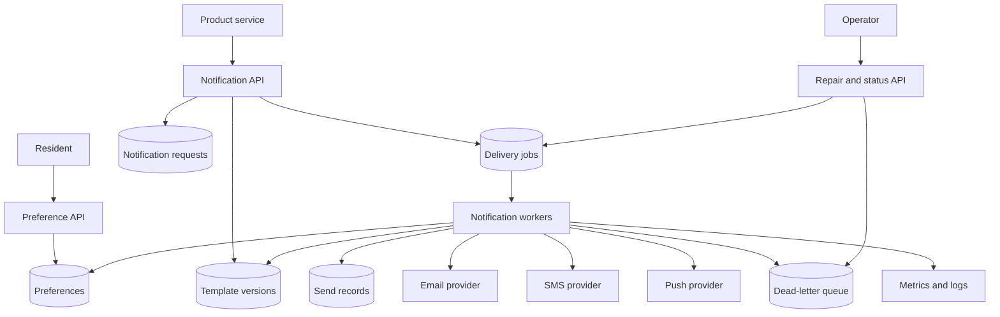
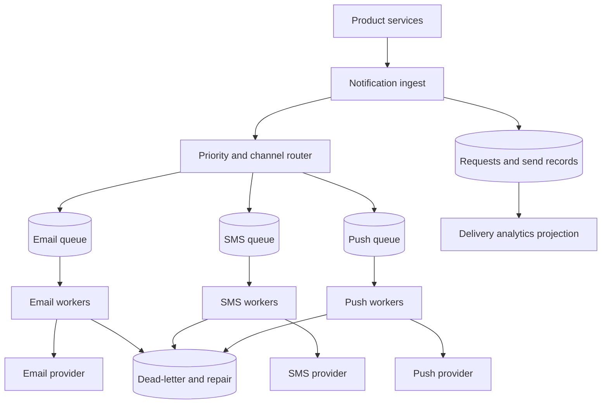

# Notification System Walkthrough

This walkthrough designs a notification system for a community services
platform. The system sends email, SMS, and push notifications for account
events, appointment reminders, pickup updates, and operator announcements while
respecting user preferences and provider limits.

The design focuses on queue-backed delivery, templates, preferences,
idempotency, retries, provider failure, dead-letter queues, observability, and a
small version 1 that avoids becoming a marketing automation platform.

## Problem Statement

Residents use the platform to reserve tools, schedule pickups, join workshops,
and receive service updates. Staff need the system to send timely notifications
without making the primary workflow wait on slow or unreliable providers.

Original scenario: A resident reserves a ladder for Saturday morning. The
reservation write should commit even if the SMS provider is slow. The resident
should receive one confirmation, one reminder, and any cancellation notice that
applies to that reservation. If the provider times out, workers should retry
without sending duplicates.

Version 1 scope:

- product services enqueue transactional notification requests;
- workers send email, SMS, or push through provider adapters;
- users have channel preferences and quiet-hour rules;
- operators can inspect failed notification work and replay safe failures;
- delivery analytics are operational, not a full marketing attribution system.

Out of scope:

- promotional campaign builder;
- machine-learning send-time optimization;
- multi-provider cost routing;
- inbox product with read receipts;
- two-way SMS conversations;
- global active-active notification delivery.

## Functional Requirements

Version 1 must support:

- Product services can request a notification after a source-of-truth workflow
  commits.
- Residents can configure basic preferences for email, SMS, and push by
  notification type.
- The system can render a versioned template with approved variables.
- Workers can send email, SMS, and push notifications through provider
  adapters.
- Workers can retry temporary provider failures with bounded backoff and jitter.
- The system can deduplicate repeated notification requests for the same
  business event and recipient.
- The system can mark permanent failures, retry exhaustion, and poison messages
  as dead-lettered or needing review.
- Operators can inspect, replay, cancel, or skip dead-lettered notification
  jobs when safe.

Later versions may support:

- tenant-specific templates and branding;
- multiple providers per channel;
- richer preference categories and localization;
- delivery webhooks and bounce management;
- scheduled campaigns and experiments;
- provider cost optimization.

## Non-Functional Requirements

Assumptions for the first useful production version:

- Source-of-truth product writes must not wait for provider delivery.
- Confirmation notifications should usually be sent within 1 minute.
- Reminder notifications should be sent before their deadline, not necessarily
  immediately after scheduling.
- Duplicate notification sends are worse than a short delay for transactional
  messages.
- Provider calls must use timeouts, retry budgets, and provider idempotency
  keys when available.
- Preferences and suppressions must be checked close to send time, because users
  can change preferences after a job is queued.
- Notification payloads can include personal data, so logs, metrics, traces, and
  dead-letter records should store safe summaries, not full rendered content.
- Operators need enough status to repair failed accepted work.
- Version 1 should favor one durable queue and clear worker behavior before
  adding multiple providers or campaign tooling.

## Core Entities

| Entity | Purpose | Key Relationships |
| --- | --- | --- |
| Notification request | Product intent to notify a recipient about one event | References source entity, recipient, type, and idempotency key |
| Recipient | User or contact endpoint that may receive notifications | Owns channel addresses, device tokens, and preferences |
| Preference | User or tenant rule for channel, type, quiet hours, and suppression | Checked before enqueue and again before send |
| Template | Versioned message shape with allowed variables | Rendered for a channel and notification type |
| Delivery job | Durable unit of work claimed by workers | References request, channel, provider, attempts, and state |
| Send record | Idempotency and audit record for one intended provider send | Prevents duplicate sends for one business event |
| Provider adapter | Channel-specific integration boundary | Sends email, SMS, or push and records provider references |
| Dead-letter record | Failed work that needs inspection, replay, skip, or cancellation | References delivery job, safe error class, owner, and replay eligibility |

The notification request captures product intent. The delivery job captures
work. The send record protects side effects from duplicate queue delivery,
worker crashes, and manual replay.

## API Sketch

Create notification request:

```text
POST /internal/notifications
Actor: product service
Request:
  source_event_id
  source_entity_type
  source_entity_id
  recipient_id
  notification_type
  idempotency_key
  template_variables
  priority
Response:
  notification_request_id
  state: accepted | suppressed | duplicate
Important errors:
  invalid_type
  invalid_variables
  recipient_not_found
  idempotency_key_conflict
```

Update preferences:

```text
PATCH /users/{user_id}/notification-preferences
Actor: signed-in user or authorized support user
Request:
  channel
  notification_type
  enabled
  quiet_hours
Response:
  preference_version
Important errors:
  forbidden
  invalid_channel
  invalid_quiet_hours
```

Worker send attempt:

```text
POST /internal/notification-jobs/{job_id}/attempt
Actor: notification worker
Request:
  worker_id
  lease_id
Response:
  result: sent | suppressed | retry_scheduled | dead_lettered
  next_retry_at
  provider_reference
Important errors:
  lease_expired
  job_not_found
  already_terminal
```

Dead-letter repair:

```text
POST /operator/notification-dead-letters/{dead_letter_id}/decision
Actor: notification operator
Request:
  action: replay | skip | cancel | quarantine
  reason
Response:
  dead_letter_id
  new_state
  replay_job_id
Important errors:
  forbidden
  replay_not_safe
  already_closed
```

The public user API only manages preferences. Product services create
notifications through an internal contract so templates, dedupe, and provider
rules stay centralized.

## Read Path

The most important read path is operator inspection of notification status.

1. Operator opens a user, reservation, or delivery-job view.
2. API checks support or operations permission.
3. API reads notification request, delivery jobs, send records, provider
   references, attempt summaries, and safe dead-letter state.
4. API does not show full rendered message bodies by default.
5. API returns current state: accepted, suppressed, queued, retrying, sent,
   failed, dead-lettered, skipped, or cancelled.

The user-facing path is simpler: users read and update preferences. Preference
reads should be strongly consistent enough that a user sees their latest saved
settings. Delivery workers still recheck preferences at send time so queued
work does not ignore a recent opt-out.

## Write Path

The main write path is product service enqueueing a transactional notification.

1. Reservation service commits the reservation state in its source-of-truth
   store.
2. For required transactional notifications, it writes an outbox event in the
   same transaction with a stable source event ID. A direct post-commit API call
   is acceptable only for lower-risk notifications that can be detected and
   repaired if the producer crashes after commit.
3. Notification service validates notification type and template variables.
4. It checks recipient existence and coarse preferences.
5. It inserts or finds a notification request using the idempotency key.
6. It creates one or more delivery jobs by channel, based on preferences and
   required notification type.
7. It returns `accepted`, `suppressed`, or `duplicate`.
8. Workers claim jobs from the queue, recheck current preferences, render the
   template, create or read the send record, and call the provider with a stable
   provider idempotency key when supported.
9. Workers record sent, retry, permanent failure, or dead-letter state.

The business transaction and notification delivery are intentionally separated.
The source workflow should not roll back because an email provider is slow.
The outbox boundary keeps the request from being lost after the source workflow
commits.

## Data Model

| Data | Source Of Truth? | Notes |
| --- | --- | --- |
| Notification request | Yes | Durable product intent keyed by source event, recipient, type, and idempotency key |
| Delivery job | Yes | Durable queued work with channel, priority, state, lease, attempts, and next retry time |
| Send record | Yes | Idempotency boundary for one side effect; stores provider reference and final status |
| User preference | Yes | Channel/type enablement, quiet hours, suppression version, and audit metadata |
| Template version | Yes | Approved subject/body shape and allowed variables per channel |
| Provider response summary | Yes | Safe provider ID, result class, response code class, and timestamps |
| Dead-letter record | Yes | Safe failure context, replay eligibility, owner, and retention deadline |
| Delivery metrics | No | Aggregated counts, latency, retry, and failure signals |

Recommended indexes:

- unique key on `(recipient_id, notification_type, source_event_id)` or another
  explicit idempotency scope;
- lookup by `delivery_job.state, next_retry_at, priority`;
- lookup by `recipient_id, created_at` for support views;
- lookup by `dead_letter.state, owner, oldest_age`;
- template lookup by `notification_type, channel, version`.

Retention:

- request and send records are retained long enough for support and duplicate
  protection;
- dead-letter records have review and retention deadlines;
- rendered bodies are not stored by default;
- provider response summaries keep safe evidence without tokens or full message
  content.

## Component Choices

| Component | Requirement It Serves | Alternative Considered | Trade-Off |
| --- | --- | --- | --- |
| Notification API | Centralizes request validation, templates, preferences, and dedupe | Each product service calls providers directly | Central service adds a dependency, but prevents inconsistent sends |
| Durable queue or job table | Sends can finish after source workflow commits | Synchronous provider call in user path | Queue adds backlog and repair work, but protects latency and retries |
| Worker pool | Executes provider calls with rate limits and retries | In-process background task | Workers are operationally heavier, but durable accepted work survives process failure |
| Template store | Versioned channel-specific rendering | Hard-coded messages in services | Template management adds review, but avoids drift and unsafe variables |
| Preference store | User control over channel/type delivery | Only global unsubscribe flag | More checks, but fewer unwanted messages and policy violations |
| Send records | Idempotency for provider side effects | Rely on provider dedupe only | More storage, but protects duplicate sends even when provider behavior differs |
| Provider adapters | Isolate email, SMS, and push behavior | One generic HTTP caller | Slight abstraction cost, but provider errors, rate limits, and references differ |
| Dead-letter queue | Owned repair path after retry exhaustion | Drop failed jobs after max attempts | Operational work, but accepted notifications do not vanish silently |

The queue is justified because provider delivery can happen later and providers
are slower, rate limited, and less reliable than the source workflow. The send
record is justified because queue redelivery and worker crashes can otherwise
send duplicate notifications.

## Architecture Diagram



The source product service records its own authoritative state before
requesting a notification. The notification system owns delivery state and
provider side effects, while preferences and templates are checked close to the
send attempt.

## Consistency Decisions

The source workflow is authoritative for whether a notification should exist.
The notification system is authoritative for whether delivery was accepted,
suppressed, sent, failed, or needs review.

Important consistency choices:

- notification requests use an idempotency key so duplicate source events do not
  create duplicate delivery jobs;
- workers recheck current preferences before sending because queued work can be
  stale;
- provider sends use a send record and provider idempotency key when available;
- delivery status is eventually consistent with provider outcome when callbacks
  or polling are involved;
- dead-letter replay reuses the same send record when the business action is
  the same notification.

Ordering is per recipient and notification type only when the product promise
requires it. A cancellation notice may need priority over a reminder. Most
ordinary confirmations can be processed concurrently if each job checks current
source state before sending.

## Scaling Strategy

Version 1 assumptions:

- product services create notification requests at modest but bursty volume;
- reminders and announcements can create scheduled spikes;
- email volume is higher than SMS and push;
- providers have per-channel quotas and rate limits;
- most analytics can aggregate by hour.

First expected bottlenecks:

- provider quota or latency;
- worker concurrency during reminder bursts;
- retry storms after provider outage;
- template rendering or preference lookups if workers do not cache safely;
- dead-letter review load after a bad template deploy.

Scaling triggers:

| Trigger | Next Move |
| --- | --- |
| Oldest high-priority job age exceeds send promise | Add workers, reduce low-priority work, or split priority queues |
| Provider rate-limit errors rise | Reduce concurrency, add per-provider token bucket, or schedule work |
| Duplicate send attempts appear | Review send-record key and provider idempotency behavior |
| Dead-letter count spikes after a deploy | Roll back template or worker, pause replay, and inspect error category |
| Preference reads overload store | Cache preference snapshots with version checks and short TTL |

Do not start with one queue per provider and tenant unless measured volume needs
it. Version 1 can use priority and channel fields in one durable job model, then
split queues when backlog isolation becomes necessary.

## Failure Modes

| Failure | User Impact | System Response | Repair Or Follow-Up |
| --- | --- | --- | --- |
| Provider timeout | Notification may arrive late | Retry with bounded backoff, jitter, and provider idempotency key | Watch retry age and provider error rate |
| Provider accepts but response times out | Duplicate send risk | Treat as ambiguous; retry through same send record and provider key | Reconcile provider reference if available |
| Worker crashes after sending | Queue redelivers job | Send record prevents second provider send or returns stored result | Alert if duplicate-prevention conflicts rise |
| Preference changed after enqueue | User could receive unwanted message | Recheck preferences before send and mark suppressed if disabled | Audit suppression and confirm preference version |
| Template variable missing | Job cannot render | Fail fast or dead-letter with safe error category | Fix producer/template contract and replay safe jobs |
| SMS provider rate limits | Backlog grows, reminders late | Reduce concurrency, retry after hint, prioritize critical messages | Split or throttle SMS queue if repeated |
| Poison message repeats | Worker capacity wasted | Stop after max attempts and dead-letter with inspection context | Patch handler or cancel obsolete work |
| Dead-letter review ignored | Accepted work disappears from operations | Alert on oldest dead-letter age and owner SLA | Assign owner, replay, skip, cancel, or compensate |

## Security Concerns

Actors and permissions:

- product services can create requests only for approved notification types;
- residents can manage their own preferences;
- support users can inspect safe status, not provider secrets or full payloads;
- operators can replay or cancel dead letters with audited reasons;
- workers can read templates, preferences, jobs, and provider credentials.

Security and privacy decisions:

- do not let arbitrary services send arbitrary template variables;
- validate templates and variables before enqueue;
- keep provider credentials in secrets management, not job payloads;
- avoid storing full rendered message bodies by default;
- redact email addresses, phone numbers, device tokens, and provider response
  bodies in logs and dead-letter records;
- rate-limit notification requests by source service, tenant, and recipient;
- audit preference changes, template changes, replay decisions, and provider
  configuration changes;
- prevent notification enumeration by not exposing delivery status to unrelated
  users.

Abuse risk: a buggy or compromised producer can create notification spam and
provider cost. Admission limits, template allowlists, source-service identity,
and per-recipient caps protect users and cost.

## Observability

Metrics:

- notification request rate by type, source service, channel, and result;
- queue depth and oldest job age by priority and channel;
- worker attempts, successes, retries, permanent failures, and dead letters;
- provider latency, timeout rate, rate-limit count, and accepted/rejected count;
- duplicate request rate, idempotency key conflicts, and duplicate-send
  prevention hits;
- preference suppression count and quiet-hour delayed count;
- template render failures and missing-variable errors.

Logs:

- request ID, notification request ID, job ID, recipient ID hash, channel,
  template version, result class, and safe error category;
- no raw provider credentials, full message bodies, phone numbers, tokens, or
  private template variables in broad logs.

Traces:

- trace request creation through validation, dedupe, job creation, and enqueue;
- trace send attempts through preference check, template render, send record,
  provider call, and result recording.

Alerts and dashboards:

- page on high-priority oldest job age exceeding promise;
- page on provider-wide outage when retries threaten deadlines;
- alert on dead-letter age for user-visible notification types;
- dashboard request rate, delivery latency, retry rate, provider health,
  suppression, dead-letter counts, and cost-driving volume.

Runbooks:

- pause low-priority notification type;
- rotate provider credentials;
- replay safe dead letters after template fix;
- drain backlog after provider recovery;
- cancel obsolete reminder jobs after source workflow cancellation.

## Cost Considerations

Main cost drivers:

- provider calls for SMS, email, and push;
- worker compute and idle headroom for bursts;
- queue storage and retry retention;
- logs, traces, metrics, and dead-letter records;
- support labor for failed deliveries and dead-letter review;
- template and preference complexity as notification types grow.

Cost-aware choices:

- use preferences and suppression before provider calls;
- dedupe notification requests before creating channel jobs;
- batch low-priority work where freshness allows it;
- cap retries and use jitter to avoid provider-cost storms;
- keep high-cardinality analytics out of version 1;
- retain dead-letter payload references only as long as repair needs require.

Cost trade-off: SMS may be more reliable for urgent reminders but costs more
and exposes phone-number handling risk. Version 1 should reserve SMS for
notifications where timeliness justifies the provider cost and privacy review.

## Version 1 Simplification

Version 1 keeps the system small:

- one notification service for request validation, preferences, templates, and
  delivery state;
- one durable job table or queue with priority and channel fields;
- one provider adapter per channel;
- static versioned templates reviewed in code or a small admin workflow;
- basic preferences by channel and notification type;
- request-level idempotency key per source event, recipient, and notification
  type;
- send-record idempotency per request, channel, recipient endpoint, and template
  version;
- bounded retries with dead-letter handling;
- operational dashboards before product analytics.

Deferred:

- provider marketplace and routing;
- tenant-specific template editor;
- real-time delivery webhooks for every provider;
- marketing campaigns and experiments;
- global regional delivery;
- two-way messaging.

Measurements required from day one:

- oldest job age by priority and channel;
- provider calls per successful notification;
- duplicate prevention hits;
- dead-letter count and oldest age;
- preference suppression rate;
- cost per delivered SMS/email/push class.

## What Changes At 10x Scale

At 10x notification volume, the design changes around isolation, provider
limits, and repair load.

Likely changes:

- split queues by priority or channel so SMS provider issues do not block email;
- add per-provider and per-tenant rate shaping;
- shard or partition delivery jobs by recipient or tenant when worker scans
  become expensive;
- add a provider callback ingestion path for richer delivery outcomes;
- move historical delivery analytics to an analytical store while keeping
  operational state small;
- cache preference snapshots with version checks;
- add replay tooling with dry-run previews and batch limits;
- add provider failover only for notification types that justify the cost and
  user-risk trade-off.

Possible later architecture:



Triggers for 10x changes:

- high-priority queue age misses target while low-priority work is draining;
- provider quotas require per-channel shaping;
- dead-letter review cannot keep up with failures;
- duplicate-send prevention conflicts appear across worker partitions;
- delivery analytics queries slow down operational status reads;
- SMS or email spend grows faster than confirmed user value.

Do not start with provider failover and multi-region routing. They create
template compatibility, provider-specific state, duplicate prevention, and
support complexity. Start with one reliable path per channel and add routing
only after measurements show a real provider or volume constraint.

## Related Pages

- [Walkthroughs](./)
- [Queue](../components/queue.md)
- [Queues](../communication/queues.md)
- [Idempotency](../communication/idempotency.md)
- [Dead-letter queues](../communication/dead-letter-queues.md)
- [Retries](../reliability/retries.md)
- [Backoff and jitter](../communication/retries-and-backoff.md)
- [Background workers](../components/background-workers.md)
- [API layer](../components/api-layer.md)
- [Secrets management](../security/secrets-management.md)
- [Data privacy](../security/data-privacy.md)
- [Metrics](../operations/metrics.md)
- [Alerting](../operations/alerting.md)
- [Cost analysis](../operations/cost-analysis.md)
