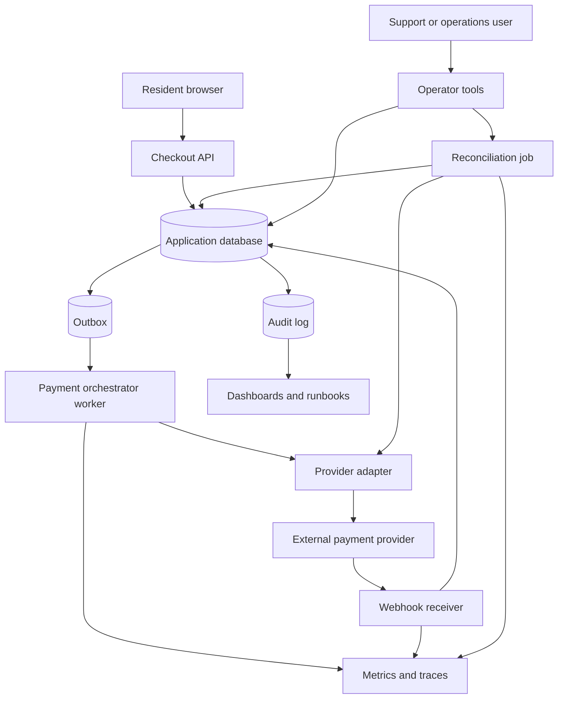
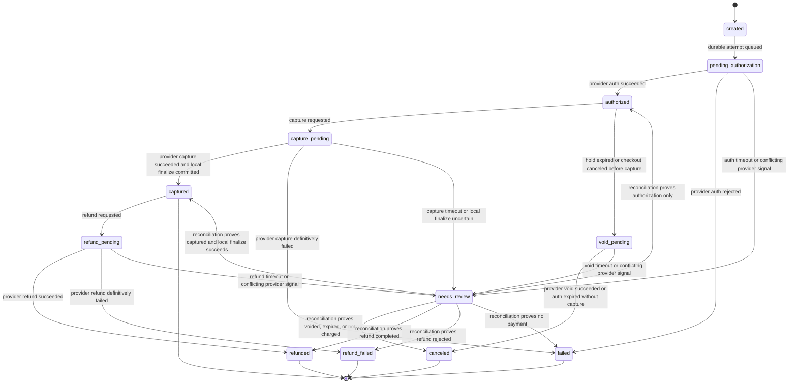

# Payment Workflow Walkthrough

This walkthrough designs a payment workflow for a community workshop platform.
The platform lets residents reserve seats in paid classes, such as a weekend
bicycle repair workshop or a pottery studio session. Version 1 collects a
workshop fee through an external payment provider and confirms the enrollment
only when the payment workflow reaches a safe local state.

The design focuses on correctness around duplicate submits, provider timeouts,
webhook delays, refunds, auditability, and repair. It intentionally avoids
building a full billing platform.

## Problem Statement

Residents browse workshops, choose a seat count, and pay before their
enrollment is final. The platform must avoid duplicate charges when a resident
refreshes, retries after a timeout, or submits the checkout form twice. It also
must avoid losing money or confirming seats incorrectly when the external
payment provider is slow, sends duplicate webhooks, or returns an ambiguous
result.

The version 1 boundary is the checkout-to-confirmed-enrollment workflow for one
paid workshop. Out of scope:

- subscriptions, installments, stored balances, and marketplace payouts;
- tax calculation, invoice generation, and accounting ledger exports;
- multi-provider routing;
- chargeback evidence automation;
- full self-service finance admin tooling.

Original example scenario: Mia reserves two seats in a bicycle repair workshop.
Her phone loses connectivity after she taps pay. The platform must let her
retry with the same checkout intent without creating a second provider charge
or confirming two separate enrollments.

## Functional Requirements

Version 1 must support:

- A signed-in resident can start checkout for an available workshop seat.
- A resident can retry the same checkout request with the same idempotency key.
- The system can create one internal payment attempt before calling the
  external provider.
- The system can authorize, capture, void an unused authorization, and refund a
  captured payment through a provider adapter.
- The provider can send webhooks for authorization, capture, failure, refund,
  and dispute-like status changes.
- Operators can view payment state, provider references, audit history, and
  reconciliation status for one checkout.
- Operators can manually reconcile or mark a payment attempt as needing review
  when automation cannot safely decide the outcome.
- The system can refund a captured payment and record the refund outcome.

Later versions may support:

- multiple payment methods and providers;
- partial refunds;
- automated dispute workflows;
- finance exports;
- regional payment rules and provider routing;
- more complete customer receipts and invoice documents.

## Non-Functional Requirements

Assumptions for the first useful production version:

- Interactive checkout should usually return a created checkout or final
  payment state within 2 seconds, but it may return `pending` when the provider
  outcome is unknown.
- The system should prefer a visible pending state over guessing after a
  provider timeout.
- A resident should not be charged twice for one checkout intent.
- A workshop seat should not be confirmed until local state has a captured
  payment and durable enrollment record.
- Payment attempts, provider references, state transitions, and manual repair
  actions must be durable and auditable.
- Provider calls must have bounded timeouts, retry budgets, and rate limits.
- Webhook handling must be idempotent because provider events can be duplicated,
  delayed, or delivered out of order.
- Sensitive payment details should stay outside the platform. The platform uses
  provider tokens and stores only safe references.
- Metrics, logs, traces, alerts, dashboards, and runbooks must make stuck or
  ambiguous payments visible before support tickets become the first signal.

## Core Entities

| Entity | Purpose | Key Relationships |
| --- | --- | --- |
| Workshop | Paid class that can accept enrollments | Owns seat capacity and price |
| Seat hold | Temporary claim on capacity during checkout | Belongs to a checkout and expires if payment does not finish |
| Checkout | Resident's intent to pay for a workshop enrollment | Owns one active payment attempt in version 1 |
| Payment attempt | Durable lifecycle for one provider payment action | Has provider calls, audit events, state, and reconciliation status |
| Provider call | One outbound authorization, capture, void, or refund request | Uses a stable provider idempotency key |
| Provider event | Accepted webhook or reconciliation observation | Maps provider state back to a payment attempt |
| Enrollment | Confirmed resident seat reservation | Created only after captured payment is durable locally |
| Refund | Workflow that reverses a captured payment | References the captured payment attempt and provider refund ID |
| Audit event | Append-only explanation of important state changes | Tied to checkout, attempt, actor, provider reference, and correlation ID |

The payment attempt is the central workflow entity. It is not just a log of API
calls. It is the durable state machine that protects the resident from duplicate
charges and tells operators what recovery action is safe.

## API Sketch

Checkout create:

```text
POST /workshops/{workshop_id}/checkout
Actor: signed-in resident
Headers:
  Idempotency-Key: opaque client key for one checkout intent
Request:
  seat_count
  provider_payment_method_token
  expected_price
Response:
  checkout_id
  payment_attempt_id
  payment_state: created | pending_authorization | authorized |
                 capture_pending | captured | failed | needs_review
  enrollment_state: held | confirmed | released
  next_action: wait | retry_status | contact_support | none
Important errors:
  idempotency_key_missing
  idempotency_key_conflict
  workshop_not_available
  price_changed
  payment_method_rejected
```

Checkout status:

```text
GET /checkouts/{checkout_id}
Actor: signed-in resident or support operator
Response:
  checkout_id
  workshop_id
  enrollment_state
  payment_state
  user_message
  last_updated_at
  receipt_reference_when_available
Important errors:
  not_found
  forbidden
```

Provider webhook:

```text
POST /integrations/payment-provider/webhook
Actor: payment provider
Request:
  provider_event_id
  provider_payment_id
  provider_status
  provider_attempt_reference
  occurred_at
  signature
Response:
  accepted: true
Important errors:
  invalid_signature
  duplicate_event_accepted
  unknown_provider_reference
  schema_invalid
```

Operator reconciliation:

```text
POST /operator/payment-attempts/{attempt_id}/reconcile
Actor: authorized support or operations user
Request:
  reason
Response:
  attempt_id
  previous_state
  observed_provider_state
  new_state
  follow_up_action
Important errors:
  forbidden
  already_terminal
  provider_unavailable
```

Refund:

```text
POST /enrollments/{enrollment_id}/refund
Actor: authorized operator
Request:
  reason
  amount: must equal captured amount in version 1
Response:
  refund_id
  refund_state: refund_pending | refunded | refund_failed | needs_review
Important errors:
  forbidden
  not_captured
  refund_window_closed
  amount_invalid
```

The public API does not expose provider credentials, raw payment details, or
internal retry counts. It exposes stable states that tell a resident whether the
system is still working, has succeeded, has failed, or needs support.

## Read Path

The main read path is checkout status after a resident submits payment.

1. Resident requests `GET /checkouts/{checkout_id}`.
2. API authenticates the resident and verifies they own the checkout, or verifies
   an operator permission for support views.
3. API reads the checkout, seat hold, enrollment, active payment attempt, and
   latest safe audit summary from the database.
4. API does not call the provider on every status read. Provider state enters
   through webhooks and reconciliation jobs.
5. API maps internal state to a user-safe message:
   - `captured` and enrollment confirmed: show success and receipt reference.
   - non-terminal provider state: show pending and refresh guidance.
   - known failure: show failure and allow a new checkout intent.
   - `needs_review`: show support guidance without exposing provider internals.
6. If the read path cannot load audit details, it still returns the current
   payment state and records an operational log. Audit search can be degraded
   without hiding the checkout status.

Freshness is usually seconds. The system may show `pending` while waiting for a
webhook or reconciliation job. That stale pending state is safer than marking a
timed-out provider call as failed and letting the resident start a second charge
immediately.

## Write Path

The critical write path is checkout creation and payment completion.

1. Resident submits checkout with an idempotency key and provider payment method
   token.
2. API authenticates the resident, validates workshop availability, validates
   the expected price, and rejects missing or reused idempotency keys with a
   different payload.
3. In one database transaction, the API:
   - creates or returns the existing checkout for the resident and key;
   - creates a seat hold with an expiration time;
   - creates the payment attempt in `created`;
   - records the initial audit event;
   - writes an outbox item for payment orchestration.
4. The API returns the checkout and current payment state. If the worker is
   already fast enough to finish within the request budget, the API may return a
   final state. It must not rely on in-memory state to do so.
5. Payment worker reads the outbox item, loads the attempt, and transitions it
   to `pending_authorization`.
6. Worker calls the provider authorization API with a stable provider
   idempotency key derived from the payment attempt, not from the individual
   retry.
7. If authorization succeeds, worker stores the provider authorization reference
   and transitions the attempt to `authorized`.
8. Worker transitions to `capture_pending` and calls provider capture with a
   separate stable capture key.
9. If capture succeeds, worker stores the provider capture reference and, in one
   local transaction, marks the payment `captured`, confirms the enrollment,
   consumes the seat hold, appends audit events, and writes a receipt outbox
   item.
10. If a provider call times out, worker records the state as ambiguous and
    schedules reconciliation. It does not create a new attempt or call the
    provider with a new idempotency key.
11. If a terminal provider failure is known, worker marks the attempt `failed`,
    releases the seat hold, appends audit events, and lets the resident start a
    new checkout with a new idempotency key.
12. If the resident cancels, the hold expires, or the workshop becomes
    unavailable after authorization but before capture, worker transitions the
    attempt to `void_pending` and calls the provider void API with a stable void
    key. On success, it marks the checkout `canceled`, releases the hold, and
    appends audit events. On timeout, it keeps the attempt ambiguous until
    reconciliation proves the authorization was voided, expired, captured, or
    still open.

Refunds use the same discipline:

1. Operator requests a refund with a reason.
2. API verifies the enrollment has a captured payment and the operator can
   perform refunds. Because version 1 supports full refunds only, it rejects an
   amount that differs from the captured amount.
3. API creates a refund record and audit event before calling the provider.
4. Worker calls the provider refund API with a stable refund key.
5. On success, the system marks the refund `refunded`, updates the enrollment as
   refunded or canceled according to product policy, and appends audit events.
6. On a definitive provider rejection, the system marks the refund
   `refund_failed`, keeps the captured payment state visible, and records the
   reason for operator follow-up.
7. On timeout, the refund enters `needs_review` or an ambiguous pending state
   until reconciliation observes whether the refund completed, failed, or needs
   manual provider investigation.

## Data Model

| Data | Source Of Truth? | Notes |
| --- | --- | --- |
| Workshop and capacity | Yes | Price, capacity, and enrollment rules live in the product database |
| Seat hold | Yes | Temporary capacity claim with expiration and checkout ownership |
| Checkout | Yes | Business intent keyed by resident, workshop, and idempotency key |
| Payment attempt | Yes | Authoritative local state machine for the payment workflow |
| Provider call record | Yes | Durable outbound call intent, provider idempotency key, result, and retry count |
| Provider event | Yes | Accepted webhook or reconciliation observation, deduped by provider event ID |
| Enrollment | Yes | Confirmed only after local captured payment state is durable |
| Audit event | Yes | Append-only accountability record for state transitions and manual actions |
| Receipt notification | No | Derived side effect queued after payment capture and enrollment confirmation |
| Metrics and traces | No | Operational signals, not the source of truth for money movement |

Important constraints and indexes:

| Constraint Or Index | Purpose |
| --- | --- |
| Unique `(resident_id, idempotency_key)` on checkout | Prevents duplicate checkout creation for one client intent |
| Unique `(payment_attempt_id, provider_operation)` on provider calls | Allows one authorization, capture, void, and refund operation per attempt |
| Unique `provider_idempotency_key` on provider calls | Ensures retries reuse the same provider operation identity |
| Unique `provider_payment_id` when known | Prevents two local attempts from claiming the same provider payment |
| Unique `provider_event_id` | Makes duplicate webhooks harmless |
| Index on `payment_state, updated_at` | Finds stuck attempts for reconciliation and alerting |
| Index on `seat_hold_expires_at` | Releases expired holds and avoids capacity leaks |
| Index on `audit_event.resource_id, occurred_at` | Supports support and incident investigation |

Idempotency records should live at least as long as the client retry window,
provider webhook delay window, support dispute window, and operator replay
window for the workflow. They do not need to stay in hot storage forever, but
expiration must not make a realistic retry look like a new payment intent.

Store enough response data to explain and repair the workflow, not full provider
payloads. Safe fields include provider references, status codes, reason codes,
timestamps, and masked summaries. Raw payment details, credentials, and full
provider payloads do not belong in normal application tables or logs.

## Component Choices

| Component | Requirement It Serves | Alternative Considered | Trade-Off |
| --- | --- | --- | --- |
| Checkout API | Creates one durable checkout intent and returns status | Direct provider call before local persistence | Slightly more state, but avoids orphan provider charges after request failure |
| Payment attempt store | Owns the state machine and idempotency result | Store only provider transaction ID on enrollment | More tables, but much better repair and duplicate protection |
| Seat hold | Prevents overselling while payment is pending | Confirm only after payment without a hold | Holds can expire and need cleanup, but capacity stays predictable |
| Outbox and payment worker | Runs provider calls from durable intent | Do all provider calls synchronously in the request | Adds async complexity, but survives API crashes and supports retries |
| Provider adapter | Keeps provider-specific details at the boundary | Scatter provider calls across handlers | Adapter needs tests, but secrets, timeouts, and error mapping are centralized |
| Webhook receiver | Accepts delayed provider facts | Poll provider only | Webhooks add signature and dedupe work, but reduce detection latency |
| Reconciliation job | Resolves ambiguous timeouts and missing webhooks | Treat timeouts as failures | More operations work, but avoids duplicate charges and false failures |
| Audit log | Explains state transitions and manual repair | Rely on application logs | More storage and access control, but supports security, support, and incident review |
| Manual review queue | Handles irreducible ambiguity | Keep retrying forever | Requires operator process, but prevents unsafe automation |

The design is a small orchestrated saga. Each step has durable local state, a
safe retry boundary, and either a terminal state, a compensation path, or a
visible review state.

## Architecture Diagram



The application database stores the authoritative checkout, seat hold, payment
attempt, provider call, enrollment, and audit state. The provider is the source
for what happened inside the external payment boundary, but the local payment
attempt is the source of truth for what the platform has safely confirmed to
the resident.

## Consistency Decisions

The most important consistency decision is the payment state machine.



State rules:

- The database transition and audit event for each state change happen together
  in one local transaction.
- The same checkout idempotency key returns the existing checkout and current
  state. Reusing the key with different workshop, seat count, or price is a
  conflict.
- Provider authorization, capture, void, and refund each use their own stable
  provider idempotency key.
- A void is a first-class provider action for an authorization that should not
  be captured. It has its own `void_pending`, reconciliation, and audit path.
- A timeout is not a failure. It is `needs_review`, ambiguous pending, or a
  reconciliation candidate depending on the last known safe state.
- Webhook events are accepted idempotently. Duplicate provider events update
  nothing after the first accepted event, but still increment duplicate metrics.
- Out-of-order provider events are compared with the local state machine before
  applying a transition.
- Enrollment confirmation requires captured payment state and a local
  transaction that consumes the seat hold.
- Refunds are separate stateful workflows. A refund timeout must not create a
  second refund with a new key, and a failed refund must remain visible until an
  operator chooses a new safe action.

The system chooses visible uncertainty over false precision. If local and
provider signals disagree, the workflow moves to `needs_review` and operators
use reconciliation evidence instead of guessing.

## Scaling Strategy

Version 1 estimate:

- 30,000 registered residents.
- 1,000 daily active residents during normal weeks.
- 8,000 daily active residents during seasonal workshop enrollment.
- Checkout create peak: 25 RPS for short bursts.
- Provider webhook peak: 50 RPS during retries or delayed delivery.
- Payment attempts retained hot for 18 months, then archived according to
  project policy.
- Audit events retained according to the audit-log policy for financial and
  support-sensitive actions.

Expected early bottlenecks:

- provider latency during checkout bursts;
- payment worker concurrency and provider rate limits;
- seat-hold contention for popular workshops;
- stuck ambiguous attempts if reconciliation is too infrequent;
- support workload if pending and failed states are unclear;
- audit and operational log volume during provider incidents.

Initial scaling choices:

- partition payment worker queues by provider or workflow type if one class of
  work starts blocking another;
- add per-provider concurrency limits and circuit breakers before increasing
  retry counts;
- release expired seat holds with a scheduled job and alert on hold cleanup
  lag;
- keep provider webhooks lightweight by validating, deduping, storing, and then
  processing through the worker path;
- use dashboards for pending age, stuck state count, provider latency, and
  reconciliation backlog before adding new infrastructure.

The first scaling trigger should be a measured symptom, such as capture p95
latency, queue age, provider rate-limit responses, stuck attempts, or support
contacts per checkout.

## Failure Modes

| Failure | User Impact | System Response | Repair Or Follow-Up |
| --- | --- | --- | --- |
| Resident double-submits checkout | Resident may see loading twice | Same idempotency key returns the existing checkout | Track duplicate checkout rate and key conflicts |
| Resident retries with a new key after timeout | Risk of a second checkout intent | UI should reuse the original key; backend may detect active checkout for same workshop and resident | Support can cancel stale checkout after provider state is known |
| Provider authorization timeout | Resident sees pending instead of success or failure | Mark attempt ambiguous and schedule reconciliation with same provider key | Reconciliation queries provider and transitions to authorized, failed, or needs review |
| Provider authorization rejected | Resident cannot complete checkout | Mark failed and release seat hold | Resident can start a new checkout with corrected payment method |
| Provider capture succeeds but local finalize fails | Resident may see pending even though provider captured | Retry local finalize using stored provider capture reference, never recapture | Alert on captured provider reference without confirmed enrollment |
| Provider capture fails after authorization | Resident sees failed or pending depending on certainty | Mark failed when definitive, release hold, and void authorization if needed | Audit reason and expose safe retry path |
| Provider void times out | Resident sees canceled or pending depending on local policy | Keep the authorization in ambiguous state and reconcile with the same void key | Reconciliation proves voided, expired, captured, or still open before further action |
| Provider webhook is duplicated | No user-visible impact | Deduplicate by provider event ID and ignore repeated transition | Increment duplicate webhook metric |
| Provider webhook is delayed | Checkout may remain pending longer | Reconciliation job can observe provider state before webhook arrives | Alert on pending age and webhook lag |
| Provider webhook arrives out of order | Risk of stale transition | Compare event with local state and provider reference before applying | Store event and mark for review if it conflicts |
| Provider rate limits calls | Checkout completion slows | Worker backs off with jitter and respects provider budget | Dashboard provider throttling and reduce concurrency |
| Refund provider call times out | Operator cannot tell whether refund happened | Refund enters ambiguous or needs-review state | Reconcile before retrying or issuing another refund |
| Refund is definitively rejected | Operator sees refund failed | Keep the original captured payment visible and record provider reason | Operator chooses a corrected refund request, manual support path, or no action |
| Audit log write fails | State transition cannot be explained safely | Fail closed for sensitive transition or keep state unchanged | Alert immediately; repair audit pipeline before continuing |
| Reconciliation job is delayed | Ambiguous payments stay pending | Show pending, preserve seat hold rules, and alert on backlog age | Run manual reconciliation for oldest or highest-value attempts |
| Seat hold expires while payment is ambiguous | Resident may lose seat availability | Do not confirm enrollment until captured and local finalize succeeds | If provider later proves capture, refund or manual review according to policy |

The common theme is that unknown provider outcomes do not become failures by
default. They become durable states that can be reconciled.

## Security Concerns

Payment workflows cross a high-risk trust boundary.

Security and privacy decisions:

- Use provider-hosted or tokenized payment collection so raw payment credentials
  do not enter the platform.
- Store provider customer, payment, authorization, capture, and refund
  references only when needed for support and reconciliation.
- Keep provider API credentials in managed secrets storage, scoped by
  environment, rotated deliberately, and never logged.
- Verify webhook signatures, timestamps, and schema before accepting provider
  events.
- Deduplicate webhooks by provider event ID and reject events that do not map to
  an expected provider reference.
- Require explicit operator permissions for refund, reconciliation, manual
  state repair, and audit-log access.
- Audit every provider-impacting operator action with actor, reason, target,
  previous state, new state, and correlation ID.
- Rate limit checkout, webhook, and operator repair endpoints separately.
- Avoid logging raw idempotency keys if they might be user generated; store a
  safe fingerprint when possible.
- Keep user-facing errors stable and boring. Do not expose provider internals,
  fraud signals, credential IDs, or retry schedules.

Audit events must explain important actions without copying full provider
payloads or sensitive payment data. Access to the audit trail should itself be
restricted and auditable.

## Observability

Metrics:

- checkout create rate, success rate, failure rate, and pending rate;
- payment attempt count by state;
- state transition latency, especially created-to-captured and
  capture-pending-to-captured;
- provider call latency, timeout rate, rejection rate, rate-limit rate, and
  retry count;
- duplicate idempotency key rate and idempotency conflict rate;
- duplicate webhook rate, webhook verification failures, and webhook lag;
- reconciliation backlog size, oldest ambiguous attempt age, and resolution
  count by outcome;
- refund success, timeout, failure, and needs-review count;
- audit write failures and audit event lag.

Logs:

- use checkout ID, payment attempt ID, provider reference, correlation ID, and
  safe reason codes;
- avoid raw payment details, full provider payloads, tokens, secrets, and
  sensitive personal data;
- log every state transition decision and whether it came from API, worker,
  webhook, reconciliation, or operator action.

Traces:

- connect checkout API, outbox publish, payment worker, provider adapter,
  webhook handling, reconciliation, and receipt notification;
- include attempt number and timeout budget as safe span attributes;
- mark provider calls and database transactions separately so slow provider
  behavior is not confused with database contention.

Alerts:

- captured provider reference without confirmed enrollment;
- pending authorization or capture age above the support threshold;
- reconciliation backlog age above target;
- provider timeout or rate-limit spike;
- webhook verification failure spike;
- audit write failure;
- refund attempts stuck in ambiguous state;
- seat hold cleanup lag.

Dashboards and runbooks should let operators answer:

- Are residents able to complete checkout?
- Are provider calls slow, failing, throttled, or ambiguous?
- How many attempts are stuck and how old are they?
- Which attempts need manual review?
- Is it safe to retry, reconcile, void, or refund this attempt?

## Cost Considerations

Main cost drivers:

- provider transaction and refund fees;
- provider API calls from retries, webhooks, and reconciliation;
- worker compute during enrollment bursts;
- database rows for attempts, provider calls, events, and audit records;
- observability volume during provider incidents;
- support time spent resolving ambiguous payments.

Cost-aware choices:

- keep retries bounded and use reconciliation instead of blind repeat calls;
- store compact provider summaries rather than full payload archives in the hot
  database;
- archive old audit and provider event records when retention policy allows;
- use one provider and one payment flow in version 1 to keep support and
  testing surface small;
- alert on stuck work early because manual repair becomes expensive when
  ambiguity accumulates.

The cheapest workflow is not the one with the fewest tables. It is the one that
prevents duplicate charges, avoids repeated provider calls, and gives operators
clear repair evidence.

## Version 1 Simplification

Version 1 intentionally keeps the payment workflow small:

- one external payment provider;
- one payment method family through provider tokens;
- one currency or pricing region chosen by project policy;
- full capture for the workshop fee, not partial capture;
- full refund only, not partial refunds;
- one active payment attempt per checkout;
- one orchestrator worker and one reconciliation job;
- manual review for conflicting provider evidence;
- no finance ledger export or payout workflow;
- no customer self-service refund flow.

Measurements required from day one:

- checkout success and pending rates;
- provider timeout and rejection rates;
- duplicate idempotency and webhook rates;
- oldest ambiguous attempt age;
- reconciliation outcome counts;
- refund success and needs-review counts;
- support contacts related to payment state confusion.

This version is useful because it solves the core safety problem: one resident
checkout intent maps to one durable payment attempt, safe provider retries, and
a visible recovery path.

## Review Checklist

- Is there exactly one durable checkout intent for one client idempotency key?
- Does each provider action have a stored provider idempotency key before the
  first call?
- Does every provider timeout become pending, reconciliation, or review instead
  of guessed failure?
- Can reconciliation prove authorization, capture, void, refund, rejection, or
  no-charge outcomes?
- Do audit events explain state transitions, provider references, and manual
  repair without storing sensitive provider payloads?
- Is each manual operator action permissioned, reasoned, and auditable?

## What Changes At 10x Scale

At 10x scale, the first design pressure is usually operational, not just raw
throughput. More payments mean more provider incidents, more ambiguous states,
more refunds, and more support questions.

Likely changes:

- isolate payment orchestration into a clearer internal service boundary once
  several product flows need payments;
- partition queues by provider action, such as authorization, capture, refund,
  webhook, and reconciliation;
- add stricter provider circuit breakers, per-action concurrency controls, and
  retry budgets;
- add a provider status model so checkout can fail fast or defer when the
  provider is known to be unhealthy;
- move old provider events and audit records to archive storage with searchable
  investigation exports;
- add richer operator tooling for bulk reconciliation and manual review
  assignment;
- build a finance-facing ledger or export only when finance workflows require
  it;
- add provider abstraction only when a real second provider or routing policy
  exists;
- define SLOs for checkout completion, stuck payment age, and refund
  completion;
- add synthetic provider checks in a non-production environment and alert on
  contract drift.

The next design step should be triggered by metrics such as queue age, provider
throttling, ambiguous attempt count, refund backlog, audit query latency, or
support tickets per 1,000 checkouts.

## Related Pages

- [Idempotency](../communication/idempotency.md)
- [Outbox pattern](../communication/outbox-pattern.md)
- [Retries and backoff](../communication/retries-and-backoff.md)
- [Saga pattern](../communication/saga-pattern.md)
- [Third-party integrations](../security/third-party-integrations.md)
- [Audit logs](../security/audit-logs.md)
- [Retries](../reliability/retries.md)
- [Timeouts](../reliability/timeouts.md)
- [Circuit breakers](../reliability/circuit-breakers.md)
- [Failure mode analysis](../reliability/failure-mode-analysis.md)
- [Metrics](../operations/metrics.md)
- [Logs](../operations/logs.md)
- [Tracing](../operations/tracing.md)
- [Alerting](../operations/alerting.md)
- [Dashboards](../operations/dashboards.md)
- [Runbooks](../operations/runbooks.md)
- [Component metrics catalog](../operations/component-metrics-catalog.md)

Return to the [walkthroughs index](index.md).
