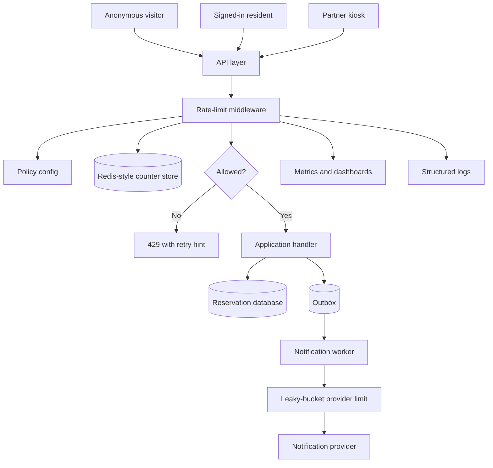

# Rate Limiter Walkthrough

This walkthrough designs a rate limiter for a public API. The system protects
shared capacity, keeps one caller from crowding out others, and gives clients a
predictable response when they hit a limit.

The example is a community events platform where residents search events,
reserve seats, and partner kiosks create reservations on behalf of walk-up
visitors. Version 1 protects expensive and abuse-prone paths without building a
large policy platform.

## Problem Statement

The events platform exposes public search, authenticated reservation, and
partner kiosk APIs. Traffic is usually modest, but school breaks and popular
events create bursts. Some clients also retry too aggressively when they receive
timeouts.

Design a rate limiter that:

- allows normal residents and kiosks to use the product comfortably;
- rejects or slows abusive and buggy traffic before it overloads the API,
  database, or notification provider;
- works across several API instances;
- produces clear metrics, logs, and retry behavior for operators and clients.

Out of scope for version 1:

- paid API plan management;
- machine-learning abuse scoring;
- global multi-region enforcement;
- per-customer custom policies through an admin UI.

## Functional Requirements

Version 1 must support:

- Anonymous visitors can search public events with a coarse source limit.
- Signed-in residents can reserve event seats with per-user and per-event
  limits.
- Partner kiosks can create reservations through API keys with per-client and
  per-tenant limits.
- Admin users can define a small set of rate-limit policies in configuration.
- The API can return a stable limited response with a retry hint.
- Operators can see allowed, denied, and limit-store-failure behavior.

Later versions may support:

- per-plan quotas;
- self-service partner limits;
- regional limit enforcement;
- adaptive limits based on observed abuse.

## Non-Functional Requirements

Assumptions for the first useful production version:

- Limit checks should add less than 10 ms p95 latency to normal API requests.
- Public search should tolerate short bursts but protect the database from
  sustained anonymous scraping.
- Seat reservation writes should fail closed when the limiter cannot verify the
  budget because overbooking and notification fanout are more harmful than a
  temporary denial.
- Low-risk public reads may fail open briefly if the limiter store is
  unavailable, with an alert and conservative local fallback.
- Limits should work across multiple API instances.
- Counter state can be eventually expired; it is not the long-term source of
  truth.
- Metrics and logs must not use raw user IDs, full IPs, API keys, request IDs,
  or search queries as metric labels.

## Core Entities

| Entity | Purpose | Key Relationships |
| --- | --- | --- |
| Rate limit policy | Defines key, algorithm, budget, window, burst, and behavior | Applied to one action or route family |
| Limit key | The caller or resource sharing a budget | Built from user, tenant, API key, source, resource, or global scope |
| Counter bucket | Runtime state for a key and policy | Stores counts, token balance, or bucket timestamps |
| Limit decision | Result of one check | Allowed, denied, delayed, fallback, or error |
| Client | API caller such as resident, kiosk, or anonymous source | Owns one or more limit keys |
| Protected action | Request or job being limited | Search, reservation create, kiosk API call, or notification fanout |

## API Sketch

The rate limiter is an internal service or library used by the API layer. It is
not a public API in version 1.

```text
POST /internal/rate-limit/check
Actor: API service
Request:
  policy_id
  action
  limit_key_parts
  request_cost
  now
Response:
  decision: allowed | denied | fallback_allowed | fallback_denied
  retry_after_seconds
  remaining_budget
  reason_code
Important errors:
  policy_not_found
  invalid_key
  limit_store_unavailable
```

Public limited response:

```text
HTTP 429 Too Many Requests
Body:
  code: "rate_limited"
  message: "Too many requests. Try again later."
  retry_after_seconds: 20
Headers:
  Retry-After: 20
```

For security-sensitive flows, the user message should not reveal exact abuse
rules. API clients can receive stable error codes and retry hints.

## Read Path

The main read path is public event search.

1. Anonymous client sends `GET /events?city=...`.
2. API normalizes route and source context.
3. Rate limiter checks a sliding-window policy keyed by coarse source identity
   and optional anonymous session.
4. If allowed, API reads event data from the database or cache.
5. API returns results with normal pagination caps.
6. If denied, API returns `429` with a retry hint and does not query the
   database.

The read limiter protects database read capacity and scraping risk. It is not a
substitute for authorization, pagination, or data minimization.

## Write Path

The critical write path is reservation creation.

1. Resident sends `POST /reservations` with event ID and seat count.
2. API authenticates the user and validates the event is reservable.
3. Rate limiter checks:
   - per-user token bucket for reservation attempts;
   - per-event token bucket for hot event pressure;
   - global provider budget if the write triggers notifications.
4. If allowed, API creates the reservation inside the database transaction that
   protects seat inventory.
5. API writes an outbox event for confirmation notification.
6. Worker later drains notification jobs with a leaky-bucket provider limit.
7. If denied, API returns a stable limited response before the database write.

Denied reservation attempts are counted because repeated failed attempts still
create load and can be abusive. Idempotent retries with the same idempotency key
should not spend extra tokens after a successful original reservation.

## Data Model

| Data | Source Of Truth? | Notes |
| --- | --- | --- |
| Rate limit policy config | Yes | Versioned configuration stored with the app release or a small admin-managed table |
| Counter bucket | No | Redis-style in-memory key-value state with expiry and atomic update |
| Reservation | Yes | Database row protected by seat inventory constraints |
| Outbox event | Yes | Durable event for confirmation notification |
| Limit decision log | No | Short-retention structured log for debugging and abuse review |
| Limit metrics | No | Aggregated allowed, denied, fallback, error, and latency metrics |

Redis-style counter storage:

| Key Shape | Value | Expiry |
| --- | --- | --- |
| `rl:search:source:{source_hash}:{minute_bucket}` | request count | slightly longer than window |
| `rl:reserve:user:{user_hash}` | token balance and last refill time | inactive bucket expiry |
| `rl:reserve:event:{event_id}` | token balance and last refill time | event end plus grace period |
| `rl:provider:notify:{tenant_id}` | queue shaping state | active tenant expiry |

The store needs atomic increment or compare-and-update behavior. Exact syntax is
implementation-specific; the design requirement is atomic counter update with
expiry, not a particular product.

## Component Choices

| Component | Requirement It Serves | Alternative Considered | Trade-Off |
| --- | --- | --- | --- |
| API middleware | Applies limits before expensive work | Put checks inside every handler | Central middleware is easier to audit, but handlers still need action-specific cost |
| Policy configuration | Keeps limits explicit and reviewable | Hard-code every limit in handlers | Configuration needs ownership and rollout discipline |
| Redis-style counter store | Shared counters across API instances | Local process counters | Adds a dependency, but avoids easy bypass by spreading traffic |
| Token bucket | Allows legitimate bursts while enforcing average rate | Fixed window for writes | More state, but better user experience for bursty actions |
| Sliding window | Reduces boundary bursts on public search | Fixed window | More counter work, but fairer for anonymous reads |
| Leaky bucket worker limit | Smooths provider calls | Immediate notification sends | Adds delay, but protects provider quota and retry storms |
| Structured decision logs | Debugs denials and abuse patterns | Metrics only | Higher log volume, but necessary for support and review |

## Architecture Diagram



The limiter sits before expensive application work. The reservation database
remains the source of truth for seat availability; the limiter protects load and
fairness but does not guarantee business correctness by itself.

## Consistency Decisions

Rate limiting has different exactness needs by workflow.

| Workflow | Consistency Choice | Reason |
| --- | --- | --- |
| Public search | Approximate sliding window is acceptable | A few extra searches are less harmful than blocking legitimate users |
| Reservation create | Shared token bucket with atomic update | Writes create inventory pressure and notification fanout |
| Partner kiosk API | Shared token bucket keyed by API key and tenant | One kiosk should not consume a whole tenant's budget silently |
| Notification provider calls | Leaky bucket in worker path | Smooths downstream traffic and makes backlog visible |
| Admin export | Fixed daily quota plus audit, future version | High-cost action but not in version 1 walkthrough scope |

Duplicate handling:

- A retried request with the same idempotency key should return the original
  result when possible.
- A denied request without an accepted prior write can count against abuse
  limits.
- Provider notification retries are shaped by queue age and provider quota, not
  by the resident's interactive request budget.

Clock behavior:

- Token buckets use server-side time from the API or counter store.
- Sliding windows use bucketed server-side timestamps.
- Client timestamps are never trusted for enforcement.

## Scaling Strategy

Version 1 estimate:

- 50,000 registered residents.
- 5,000 daily active residents during normal weeks.
- 25,000 daily active residents during popular registration weeks.
- Public search peak: 300 RPS for short bursts.
- Reservation create peak: 80 RPS for popular events.
- Partner kiosk peak: 50 RPS across all kiosks.
- Notification provider safe rate: 100 sends per second per tenant.

First bottleneck to watch:

- counter-store latency on hot reservation events;
- database read load from anonymous search;
- notification provider quota during retries.

Scaling triggers:

```text
If rate-limit check p95 exceeds 10 ms for 15 minutes, inspect hot keys and
counter-store saturation.

If one event ID becomes a hot key and reservation latency rises, split the
event-level limiter by event plus shard and keep the database seat constraint
as the final correctness guard.

If anonymous search denials rise while database CPU stays high, tighten search
limits and reduce expensive filters before adding read replicas.

If notification queue age exceeds 10 minutes while provider timeouts rise,
reduce retry concurrency and keep the leaky-bucket provider limit active.
```

Version 1 does not shard all counters. It keeps shared counters for the actions
where bypass would matter and uses coarse edge limits for low-risk anonymous
traffic.

## Failure Modes

| Failure | User Impact | System Response | Repair Or Follow-Up |
| --- | --- | --- | --- |
| Counter store unavailable for public search | Some abusive reads may pass briefly | Fail open with conservative local fallback and alert | Restore store, inspect source traffic, tighten edge limits if needed |
| Counter store unavailable for reservation writes | Residents may see temporary limited errors | Fail closed for writes that create inventory or provider work | Restore store, communicate if broad, consider short manual override only with owner approval |
| Hot event counter key saturates store | Reservation latency rises for one popular event | Keep database constraint, reduce burst size, add sharded event counter if needed | Review hot-key metrics and event-specific policy |
| Client retries after 429 without backoff | More denied requests and noisy logs | Keep retry hints stable, count repeated denials, alert on retry storm | Contact partner or block abusive client key |
| Notification provider rate-limits sends | Reminders delayed | Leaky bucket slows sends, queue age alert fires | Reduce retry concurrency, notify support, replay safely after provider recovers |
| Local fallback allows uneven limits across API instances | Some callers get extra allowance | Bound fallback duration and emit fallback metrics | Fix counter store and review fail-open policy |
| Policy misconfiguration too strict | Legitimate users are blocked | Roll back policy config and watch denial rate | Add review checklist and staged rollout |

## Security Concerns

Rate limiting is an abuse control, not the only security boundary.

Security decisions:

- Public search uses source and session limits, but sensitive event data still
  requires authorization and data minimization.
- Reservation writes require authentication and authorization before the write.
- Partner kiosks use per-client API keys and tenant-scoped limits.
- API keys are never logged; logs use client ID or key fingerprint only when
  safe.
- Denial messages do not reveal exact thresholds for login, reset, or other
  future credential flows.
- High-denial patterns by source, tenant, or client are abuse signals for
  review.
- Admin policy changes should be audited when an admin tool exists.

Abuse cases covered:

- anonymous scraping of public search;
- one resident repeatedly attempting reservations for a hot event;
- one partner kiosk or leaked key consuming shared tenant capacity;
- notification retry storms that amplify provider failures;
- accidental client loops that create high request volume.

## Observability

Metrics:

- `rate_limit_checks_total` by policy, action, decision, and result class;
- `rate_limit_denied_total` by policy and safe client category;
- `rate_limit_check_latency_ms` p50, p95, p99;
- `rate_limit_store_errors_total`;
- `rate_limit_fallback_total`;
- hot-key count or top bounded key category;
- notification queue age, retry count, and provider timeout rate.

Logs:

- timestamp, service, environment;
- policy ID and action;
- decision and reason code;
- safe caller category, tenant tier, or client fingerprint;
- request ID or trace ID for debugging, not as metric labels;
- retry hint returned;
- limit-store error class when present.

Traces:

- API request span;
- rate-limit check span;
- counter-store call span;
- database write span for allowed reservations;
- notification worker and provider call spans.

Alerts:

- limiter store unavailable for write paths;
- limiter check p95 over target;
- denial rate spike for one policy or client category;
- fallback mode active longer than the allowed window;
- notification queue age above freshness target.

Dashboards:

- allowed versus denied by action;
- check latency and counter-store errors;
- reservation write latency with limiter decision overlay;
- public search traffic and database load;
- provider limit, queue age, and retry behavior.

## Cost Considerations

Main cost drivers:

- counter-store memory for active keys and bucket history;
- counter-store write volume on high-traffic routes;
- logs for denied and fallback decisions;
- dashboard and metric cardinality;
- provider calls triggered by allowed writes;
- support work from false positives.

Cost-aware choices:

- use coarse source buckets for anonymous reads rather than per-request or
  per-user labels;
- avoid raw search query labels;
- use bucketed sliding windows instead of storing every timestamp for public
  search;
- apply token buckets only where burst behavior matters;
- expire inactive counters quickly enough to bound memory;
- sample low-risk allowed decision logs while keeping denials and failures
  complete enough to investigate.

## Version 1 Simplification

Version 1 keeps the limiter small:

- policy config is reviewed and deployed with the service;
- a Redis-style counter store holds shared counters;
- public search uses a bucketed sliding window;
- reservation and kiosk writes use token buckets;
- notification sends use worker-side leaky bucket shaping;
- no self-service customer quotas;
- no multi-region global limit enforcement;
- no adaptive scoring.

Measurements required from day one:

- limit check latency;
- allowed and denied decisions;
- fallback decisions;
- counter-store errors;
- hot-key indicators;
- user-visible reservation errors;
- notification queue age.

## What Changes At 10x Scale

At 10x traffic, the first risks are hot keys, counter-store write load, and
policy complexity.

Likely changes:

- move coarse anonymous limits closer to the edge to reject obvious bursts
  before application work;
- shard high-volume counters by policy and key hash;
- use approximate counters for low-risk reads where exactness is not worth the
  write load;
- split reservation policies by event popularity and tenant tier;
- add a policy review workflow with audit logs and staged rollout;
- isolate notification provider budgets by tenant and priority;
- add partner-facing documentation for retry behavior and quota headers;
- add capacity alerts for counter-store memory, CPU, latency, and hot-key
  pressure.

10x trigger:

```text
If counter-store CPU or p95 latency approaches saturation during normal peak
traffic, and hot-key metrics show a few policies dominate writes, shard those
counters or move low-risk anonymous limits to approximate edge enforcement.
```

The database seat constraint remains the final correctness control. A larger
limiter improves fairness and protection, but it does not replace transaction
rules for reservations.

## Related Pages

- [Rate limiting](../scalability/rate-limiting.md)
- [Rate limiting and abuse resistance](../security/rate-limiting-and-abuse.md)
- [Idempotency](../communication/idempotency.md)
- [Retries and backoff](../communication/retries-and-backoff.md)
- [Outbox pattern](../communication/outbox-pattern.md)
- [Timeouts](../reliability/timeouts.md)
- [Bulkheads](../reliability/bulkheads.md)
- [Graceful degradation](../reliability/graceful-degradation.md)
- [Metrics](../operations/metrics.md)
- [Component metrics catalog](../operations/component-metrics-catalog.md)
- [Alerting](../operations/alerting.md)
- [Runbooks](../operations/runbooks.md)
- [Capacity planning](../operations/capacity-planning.md)

## Review Checklist

Before publishing or presenting this design, confirm:

- The protected actions and harms are named before algorithms.
- Functional and non-functional requirements are separated.
- Fixed window, sliding window, token bucket, and leaky bucket are considered
  for the right traffic shapes.
- User, IP, tenant, API-key, resource, and global limits are treated as
  different tools.
- Distributed counter behavior is explicit for multi-instance API deployments.
- Redis-style storage is used for shared counter state, not as the source of
  truth for reservations.
- Failure behavior is explicit for low-risk reads and high-risk writes.
- Abuse cases include scraping, hot-event pressure, partner key misuse, retry
  storms, and notification provider pressure.
- Metrics, logs, traces, alerts, dashboards, and runbooks are named.
- Version 1 is simpler than the 10x design and includes scaling triggers.
