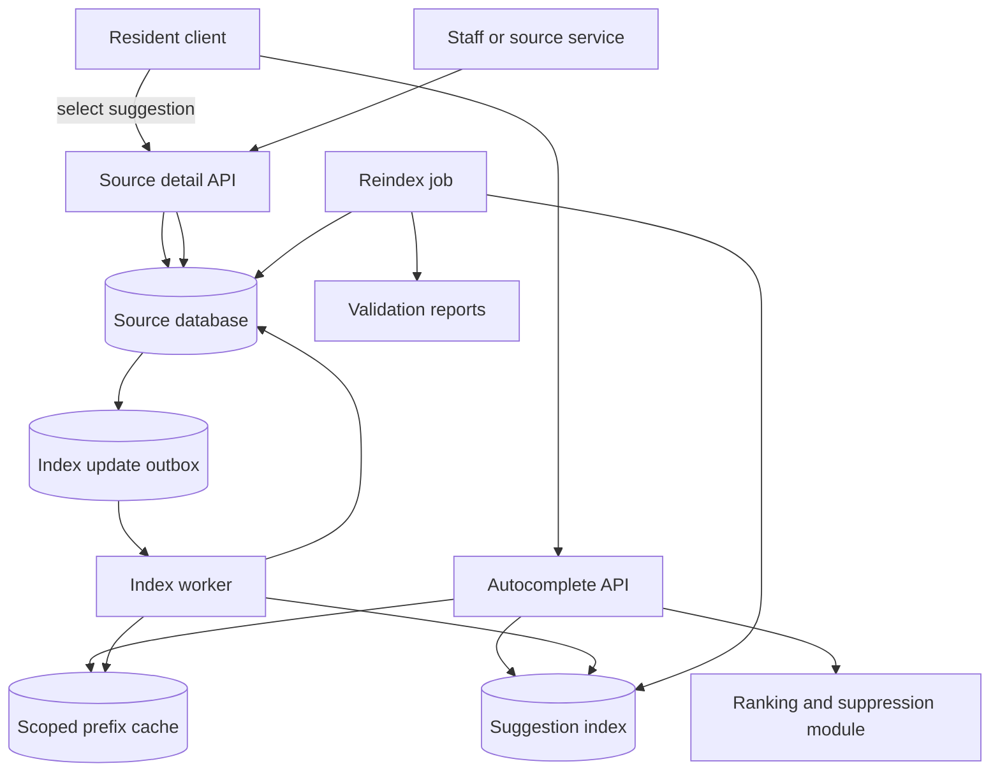

# Search Autocomplete Walkthrough

This walkthrough designs a search autocomplete system for a community services
platform. Residents type a few characters and see useful suggestions for
workshops, service topics, neighborhood programs, support categories, and
public resource names.

The design focuses on indexing, prefix search, ranking, freshness, caching,
typo tolerance, reindexing, and a version 1 that keeps source-of-truth records
authoritative while autocomplete remains a derived discovery path.

## Problem Statement

The platform needs fast as-you-type suggestions without sending every keystroke
to broad source-of-truth queries or exposing private terms. Autocomplete should
help users discover public, allowed content, but selecting a suggestion should
still open a source-backed result or run a source-backed search.

Original scenario: A resident starts typing `gar` while looking for city
services. The UI should suggest `garden workshops`, `garbage pickup schedule`,
and `garage sale permit` if those terms are public and relevant in the user's
tenant or city. If a staff-only draft program contains `garden grant appeal`,
that draft should not appear in public suggestions just because its prefix
matches.

Version 1 scope:

- autocomplete for public and permission-safe searchable entities;
- a suggestion index optimized for prefix search;
- simple ranking by exact prefix, curated priority, popularity, recency, and
  stable tie-breakers;
- bounded freshness lag from source changes to suggestions;
- cache-aside for repeated prefixes and popular suggestions;
- conservative typo tolerance only after a safe prefix length;
- reindexing and validation from source records when index drift appears.

Out of scope:

- personalized machine-learning suggestions;
- raw user-query mining without review;
- private-message or staff-note suggestions;
- cross-language synonym expansion;
- full document search ranking;
- paid placement or ad-style boosting.

## Functional Requirements

Version 1 must support:

- Users can request suggestions for a short text prefix.
- The system can return only suggestions the actor is allowed to see.
- Suggestions can include public service topics, programs, locations, and
  approved resource names.
- The system can rank suggestions with deterministic version 1 rules.
- The system can update suggestions after source records are created, changed,
  hidden, deleted, or reclassified.
- The system can cache common prefixes without leaking private or
  tenant-scoped data.
- The system can apply controlled typo tolerance for longer prefixes.
- Operators can suppress unsafe, abusive, private, or low-quality suggestions.
- Operators can run and monitor a reindex to rebuild suggestions from source
  records.

Later versions may support:

- richer synonym dictionaries;
- locale-aware tokenization;
- personalized ranking based on explicit user context;
- analytics-driven suggestion curation;
- full search result previews;
- multi-region suggestion serving;
- offline index snapshots for disaster recovery.

## Non-Functional Requirements

Assumptions for the first useful production version:

- Autocomplete should feel fast enough for interactive typing, with a tight
  latency target for common prefixes.
- The source database remains authoritative for records, permissions, status,
  and final result detail.
- Suggestion freshness can lag source changes by a few minutes for public
  content, but deletion, privacy, and suppression updates need a tighter path.
- Suggestions should be scoped by tenant, locale, audience, permission class,
  and minimum prefix length.
- Short prefixes are noisy and expensive, so the API should reject or limit
  requests below the minimum length.
- Typo tolerance must prefer exact and prefix matches over fuzzy matches.
- The cache must include scope in its key and must have bounded TTLs.
- Reindexing must be observable, pauseable, and safe for source database load.
- The system should degrade to ordinary search or category browse if
  autocomplete is unavailable.

## Core Entities

| Entity | Purpose | Key Relationships |
| --- | --- | --- |
| Source record | Authoritative program, service topic, location, organization, or resource | Owns status, visibility, tenant, locale, title, aliases, and source version |
| Suggestion document | Derived searchable suggestion record | References source record, prefix tokens, display text, filters, ranking fields |
| Prefix token | Normalized token or phrase prefix used for lookup | Belongs to suggestion document and scope |
| Ranking signal | Version 1 score input for ordering suggestions | Includes exactness, curated priority, popularity bucket, recency, and tie-breaker |
| Suppression rule | Operator-owned block or demotion for unsafe suggestions | References term, source record, tenant, reason, and expiry |
| Index update event | Durable intent to add, update, hide, delete, or suppress a suggestion | References source record, source version, event type, and status |
| Prefix cache entry | Cached suggestion list for one scoped prefix | Contains generated_at, index version, TTL, and result IDs |
| Reindex job | Controlled rebuild from source records into the suggestion index | Tracks range, progress, validation, rate limits, and rollback state |

The suggestion document is derived. It can be rebuilt from source records,
approved aliases, suppression rules, and ranking configuration.

## API Sketch

Get suggestions:

```text
GET /search/autocomplete?q={prefix}&limit={k}&locale={locale}&audience={audience}
Actor: anonymous visitor or signed-in user
Scope:
  tenant_id from host, session, or route
  audience: public | resident | staff
Response:
  suggestions:
    suggestion_id
    display_text
    suggestion_type
    source_id
    rank_reason
    matched_text
  generated_at
  index_freshness_seconds
Important errors:
  prefix_too_short
  invalid_locale
  rate_limited
  autocomplete_unavailable
```

Open suggestion:

```text
GET /search/suggestions/{suggestion_id}/resolve
Actor: user who received the suggestion
Response:
  source_id
  canonical_url
  current_status
Important errors:
  forbidden
  hidden
  deleted
  stale_suggestion
```

Create index update intent:

```text
POST /internal/search-index/events
Actor: source service or outbox relay
Request:
  source_type
  source_id
  source_version
  event_type: upsert | hide | delete | suppress
Response:
  event_id
  status: accepted | duplicate
Important errors:
  invalid_source_type
  stale_source_version
  payload_too_large
```

Start reindex:

```text
POST /operator/search-autocomplete/reindex-jobs
Actor: authorized operator
Request:
  source_type
  scope
  reason
  mode: shadow | replace | repair
Response:
  reindex_job_id
  status: queued
Important errors:
  forbidden
  overlapping_reindex
  unsafe_scope
```

Resolve and detail APIs recheck the source of truth. Autocomplete suggests
where to go; it does not decide access or final correctness.

## Read Path

The main read path is fetching suggestions while the user types.

1. Client waits until the prefix reaches the minimum length and applies a small
   debounce.
2. Client calls the autocomplete endpoint with prefix, locale, audience, and
   user context when available.
3. API normalizes the prefix and validates length, allowed characters, tenant,
   locale, rate limit, and scope.
4. API reads a user/tenant/locale-scoped prefix cache entry when present and
   fresh enough.
5. On cache miss, API queries the suggestion index by normalized prefix tokens
   and safe filters.
6. API applies ranking, suppression, and stable tie-breakers.
7. API returns a short list of suggestions with `generated_at` and index
   freshness metadata.
8. If the user selects a suggestion, the resolve or source-detail path checks
   the authoritative record before showing content or starting an action.

The cache can serve common prefixes such as `gar`, but it must not be shared
across tenants or permission classes. A cache hit is safe only because the
suggestion list contains derived, scoped IDs and display text that are allowed
for that actor class.

If autocomplete is degraded, the UI can hide suggestions and let the user
submit a normal search or browse categories. It should not show stale private
terms as a fallback.

## Write Path

The critical write path is updating the suggestion index after a source record
changes.

1. Staff creates or updates a public program, service topic, or resource in the
   source system.
2. Source write commits with a source version and visibility status.
3. The same transaction records an outbox event or index update intent.
4. Index worker claims the event, reads the current source record, suppression
   rules, aliases, tenant, locale, and visibility policy.
5. Worker builds or deletes the suggestion document using a deterministic
   document ID such as `source_type + source_id + locale`.
6. Worker writes prefix tokens, display text, filters, ranking signals, source
   version, and index schema version to the suggestion index.
7. Worker invalidates or expires affected scoped prefix cache keys when they
   can be named. Otherwise, short TTLs bound stale suggestions.
8. Worker records success, retry, dead-letter, or repair-needed state.
9. Reconciliation compares source records and suggestion documents to detect
   missing, stale, deleted, or private entries.

Deletion, privacy changes, and suppressions should be high-priority index
updates. It is better to temporarily remove a suggestion than to keep showing a
private or unsafe term while the index catches up.

## Data Model

| Data | Source Of Truth? | Notes |
| --- | --- | --- |
| Source record | Yes | Public service, program, location, or organization with status, visibility, tenant, locale, and version |
| Approved alias | Yes | Curated synonym or alternate name allowed for suggestions |
| Suppression rule | Yes | Operator-owned hidden term, demotion, expiry, reason, and audit metadata |
| Index update event | Yes for indexing intent | Durable event with source ID, version, event type, status, attempts, and next retry |
| Suggestion document | No | Derived display text, tokens, filters, rank signals, source version, schema version |
| Prefix token list | No | Derived normalized prefixes for lookup; may be rebuilt |
| Prefix cache entry | No | Scoped cached result list with generated_at, index version, and TTL |
| Query analytics | No | Aggregated prefix frequency, zero-result rate, click-through, and reformulation data |
| Reindex job | Yes for job state | Tracks source range, mode, progress, validation, pause, rollback, and owner |

Recommended indexes:

- suggestion index by `tenant, locale, audience_scope, prefix_token`;
- suggestion filters by `suggestion_type, status, source_version`;
- stable sort by `score_bucket, curated_priority, popularity_bucket,
  updated_at, suggestion_id`;
- unique suggestion document ID by `source_type, source_id, locale`;
- update event lookup by `status, next_attempt_at`;
- suppression lookup by `tenant, locale, normalized_term`;
- cache key by `tenant, locale, audience_scope, normalized_prefix,
  index_schema_version`.

Concrete suggestion document example for prefix `gar`:

```text
suggestion_id: sug_service_garbage_pickup_en
source_type: service_topic
source_id: svc_172
tenant: city_4
locale: en
audience_scope: public
display_text: Garbage pickup schedule
prefix_tokens: gar, garb, garba, garbag, garbage, pickup
rank_signals:
  exact_prefix: true
  curated_priority: 80
  popularity_bucket: 6
  updated_at: 2026-05-20
tie_breaker: sug_service_garbage_pickup_en
```

For query `gar`, exact prefix matches rank above typo-tolerant candidates.
Curated public service terms rank above noisy popularity-only terms, and the
stable tie-breaker keeps pagination and repeated reads predictable.

Retention:

- source records follow their product lifecycle;
- suggestion documents for hidden or deleted records are removed or tombstoned
  quickly;
- index update events are retained long enough for replay and audit;
- prefix cache entries expire quickly;
- query analytics should aggregate or sample prefixes and avoid storing raw
  sensitive terms beyond the approved policy;
- reindex logs keep enough evidence to explain rebuilds and validation.

## Component Choices

| Component | Requirement It Serves | Alternative Considered | Trade-Off |
| --- | --- | --- | --- |
| Source database | Authoritative records, status, visibility, and versions | Treat search index as primary | Keeps correctness clear, but requires update pipeline |
| Suggestion index | Fast prefix search and ranked suggestions | Broad database `LIKE` queries | Better latency and ranking, but adds freshness and rebuild work |
| Index worker | Update derived documents after source changes | Synchronous index write in source request | Protects source latency, but index freshness lags |
| Prefix cache | Reduce load for repeated common prefixes | Query index for every keystroke | Lower latency and cost, but needs scoped keys and TTLs |
| Ranking module | Deterministic ordering and explainable suggestions | Return alphabetical results only | More useful results, but ranking bugs need metrics |
| Typo-tolerance matcher | Recover from common misspellings | Exact prefix only | Improves recall, but false positives and privacy risk need guardrails |
| Reindex job | Repair drift and schema changes | Manual document edits | Rebuildable and auditable, but backfills can load sources |
| Suppression rules | Remove unsafe or private terms quickly | Wait for source update only | Stronger safety, but needs operator ownership and audit |

Version 1 should use a constrained suggestion index, not a general full-text
search product feature set. Add capabilities only when they improve the
as-you-type workflow.

Version 1 typo tolerance is intentionally narrow: require at least four
characters, allow only a bounded edit distance, cap fuzzy candidates per query,
and always rank exact prefix matches first.

## Architecture Diagram



The source database owns records and visibility. The suggestion index and cache
serve fast discovery. Selection and final actions return to the source so stale
or suppressed suggestions do not become authoritative.

## Consistency Decisions

- Source writes are authoritative; autocomplete updates are eventually
  consistent.
- Index update events should be durable before the source request is considered
  fully repairable.
- Suggestion documents include source version so stale index writes can be
  ignored.
- Deletion, privacy, and suppression updates are high priority and should have
  tighter freshness targets than ordinary title or popularity changes.
- Prefix cache entries have short TTLs and include scope and index schema
  version in the key.
- Suggestion selection rechecks the source record before showing full content
  or allowing an action.
- Typo-tolerant matches should never outrank exact prefix matches for the same
  query.
- Reindex jobs should write to a shadow index or versioned schema when the
  rebuild is risky, then switch reads only after validation passes.
- Shadow reindex cutover should happen only when document counts, sampled
  source/index comparisons, suppression checks, latency, and rollback path are
  acceptable for the workflow.

The design accepts stale suggestions for discovery, but it does not accept stale
permissions, deleted records, or private terms as final truth.

## Scaling Strategy

Version 1 assumptions:

- autocomplete reads are high volume because one search intent creates several
  prefix requests;
- common prefixes are much hotter than long-tail prefixes;
- source writes are much less frequent than reads;
- most suggestions are public or tenant-scoped;
- result lists are small, usually 5 to 10 suggestions;
- index freshness can lag by minutes for ordinary updates.

Start with one suggestion index, one index worker pool, a scoped prefix cache,
and a small ranking module. The first expected bottlenecks are hot prefixes,
cache miss storms after deploys or cache expiry, index query latency for broad
prefixes, index update lag, and reindex load on source records.

Scaling triggers:

- autocomplete p95 exceeds the interactive target for common prefixes;
- cache miss rate spikes for top prefixes;
- indexing lag exceeds the freshness promise;
- private or deleted suggestions remain visible longer than the safety target;
- zero-result rate or reformulation rate stays high for common user intents;
- reindex jobs cannot finish within the maintenance or freshness window;
- one tenant or prefix dominates index or cache capacity.

At that point, add request coalescing, prefix prewarming, top-prefix replicas,
tenant or locale partitioning, read replicas for source-backed validation,
index-worker lanes by source type, and dual-index rollout for ranking or schema
changes.

## Failure Modes

| Failure | User Impact | System Response | Repair Or Follow-Up |
| --- | --- | --- | --- |
| Source update event is delayed | New suggestion is missing or old title remains | Keep source detail authoritative; alert on indexing lag | Worker retries from outbox |
| Deleted private record remains suggested | User may see unsafe term | Prioritize delete/suppress events and source recheck on resolve | Invalidate cache, remove document, audit exposure |
| Prefix cache key omits tenant or permission scope | Cross-tenant suggestion leak | Fail security review; include scope in key | Purge affected keys and add key-scope tests |
| Cache miss storm hits common prefix | Autocomplete latency rises | Coalesce refresh and serve stale-if-safe public suggestions | Prewarm or replicate top prefixes |
| Typo tolerance overmatches short prefix | User sees noisy or wrong suggestions | Require minimum length and exact-first ranking | Track false-positive reports and fuzzy rate |
| Ranking deploy produces poor order | Useful suggestions are buried | Fall back to previous ranking policy or exact/recency order | Compare click-through and zero-result metrics |
| Reindex overloads source DB | Source workflows slow down | Rate limit, pause, or run from snapshot | Resume after capacity recovers |
| Reindex misses records | Suggestions disappear | Validate counts and sample source/index comparisons | Repair missing ranges and rerun validation |
| Suggestion index unavailable | Suggestions disappear | Hide autocomplete and allow ordinary search/browse | Alert and restore index path |
| Suppression rule fails to apply | Unsafe suggestion remains visible | Treat suppression as high-priority update | Audit rule, invalidate cache, and repair document |

The unsafe failures are privacy leaks, deleted records still appearing, and
suggestions becoming trusted for final actions. Slow or missing suggestions are
preferable to unsafe suggestions.

## Security Concerns

- Suggestions should include only fields approved for the actor's tenant,
  locale, audience, and permission class.
- Prefix cache keys must include scope. Do not share personalized or
  permissioned suggestions through public cache keys.
- Avoid autocomplete from raw private queries, support notes, messages, or
  unpublished drafts.
- Suppression should remove abusive terms, private names, legal holds, or
  accidentally exposed content quickly.
- Logs and metrics should avoid storing full raw prefixes when those prefixes
  may contain personal data. Use aggregation, hashing, sampling, or policy
  limits where appropriate.
- Rate limits should protect anonymous prefixes, expensive typo matching, and
  scraping of suggestion space.
- Resolve and source-detail APIs must recheck source visibility and current
  permission before showing full content.
- Operator reindex and suppression actions should record actor, reason, scope,
  and affected terms or source IDs.

## Observability

Useful metrics:

- autocomplete request rate by tenant, locale, prefix length, and result count;
- p50/p95/p99 autocomplete latency and cache hit rate;
- top prefixes by QPS, miss rate, stale age, and index latency;
- zero-result rate, reformulation rate, suggestion click-through, and selected
  rank position;
- exact match rate, fuzzy match rate, and fuzzy false-positive reports;
- indexing lag, update failure rate, delete/suppress lag, and dead-letter age;
- reindex progress, throughput, source load, validation mismatch count, and
  rollback count;
- cache key scope errors, suppression hits, and private-result audit findings.

Useful logs and traces:

- request ID, tenant, locale, audience scope, normalized prefix length, cache
  hit/miss, index version, and ranking policy version;
- source ID and source version for selected suggestions;
- index update event ID, worker attempt, source version, schema version, and
  safe error class;
- reindex job ID, range, mode, progress, validation result, and operator
  reason.

Alerts should be tied to symptoms: latency above interactive target, private or
deleted suggestion exposure, indexing lag beyond freshness target, cache miss
storms, zero-result spikes, reindex stalls, and suppression failures.

## Cost Considerations

Main cost drivers:

- high request volume from typing and repeated prefixes;
- suggestion index storage for tokens, aliases, filters, and ranking fields;
- prefix cache memory and hot-key replication;
- index worker compute and source reads;
- reindex jobs and validation scans;
- typo-tolerance computation for broad or short prefixes;
- observability volume from high-cardinality prefixes and tenants.

Cost-aware choices:

- enforce minimum prefix length and client debounce;
- cache top scoped prefixes with short TTLs and jitter;
- store only approved display fields and source IDs in the index;
- keep ranking signals simple until quality metrics justify more fields;
- enable typo tolerance only for longer prefixes and bounded result sets;
- run reindex jobs in batches with source-load limits;
- aggregate query analytics instead of storing every raw prefix.

Cost controls should never justify leaking private suggestions or trusting
stale suggestions for final actions.

## Version 1 Simplification

Start with:

- approved public and tenant-scoped source records only;
- one suggestion index optimized for normalized prefix tokens;
- a minimum prefix length and client debounce;
- deterministic ranking: exact prefix, curated priority, popularity bucket,
  recency, and stable ID tie-breaker;
- cache-aside for top scoped prefixes with short TTL and jitter;
- typo tolerance only for prefixes of at least four characters, with exact
  matches ranked first;
- source recheck on suggestion resolve and final action;
- durable index update events from source writes;
- reindex jobs that can rebuild from source records into a versioned or shadow
  index;
- dashboards for latency, cache hot keys, zero results, indexing lag,
  suppression lag, and reindex progress.

Defer personalization, broad synonym expansion, raw-query suggestions,
cross-language matching, and complex ranking models until quality metrics show
the simple approach is insufficient.

## What Changes At 10x Scale

At 10x autocomplete traffic or indexed records:

- Prefix cache needs request coalescing, prewarming, top-key replication, and
  per-tenant limits.
- The suggestion index may need partitioning by tenant, locale, or token range.
- Broad prefixes may need precomputed top suggestions instead of live index
  queries.
- Index workers need separate lanes for ordinary updates, delete/suppress
  updates, and reindex work.
- Reindexing needs shadow indexes, sampled validation, cutover checks, and
  rollback playbooks.
- Ranking changes need offline evaluation, A/B-safe rollout, and degraded
  fallback to the previous policy.
- Query analytics need aggregation and privacy controls to avoid storing
  sensitive typed text.
- Typo tolerance may need dedicated candidate generation so fuzzy matching does
  not dominate latency.
- Multi-region serving may use regional read caches or replicated suggestion
  indexes, but source writes and suppression still need a clear freshness and
  propagation target.

The next design step should be triggered by measured latency, freshness,
quality, or safety pressure, not by the presence of autocomplete alone.

## Related Pages

- [Search index](../components/search-index.md)
- [Caching strategies](../scalability/caching-strategies.md)
- [Cache](../components/cache.md)
- [Read and write patterns](../data/read-write-patterns.md)
- [Schema evolution](../data/schema-evolution.md)
- [Consistency models](../data/consistency-models.md)
- [Outbox pattern](../communication/outbox-pattern.md)
- [Queues](../communication/queues.md)
- [Database read scaling](../scalability/database-read-scaling.md)
- [Hot-key mitigation](../scalability/hot-key-mitigation.md)
- [Graceful degradation](../reliability/graceful-degradation.md)
- [Metrics](../operations/metrics.md)
