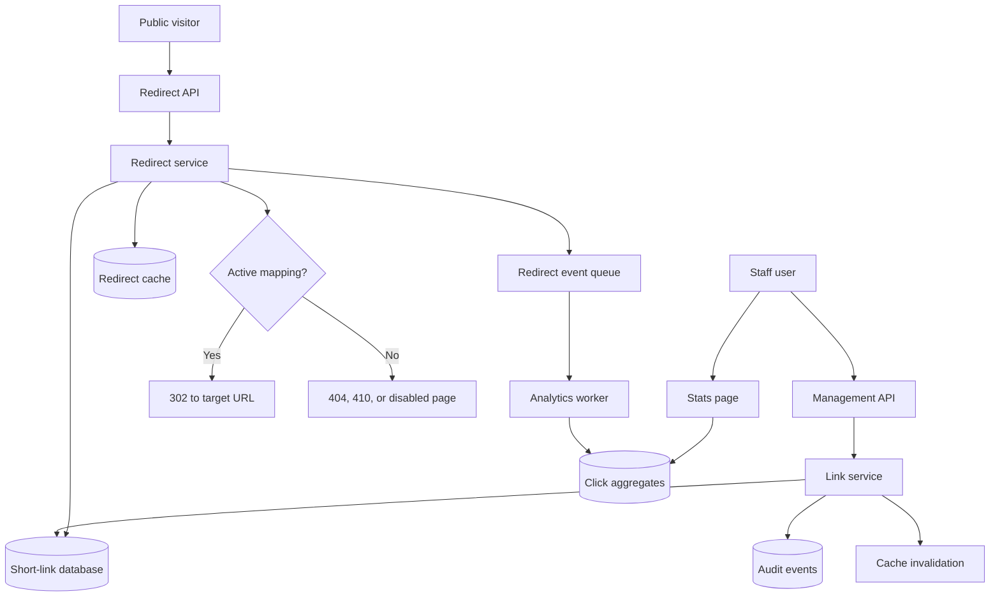
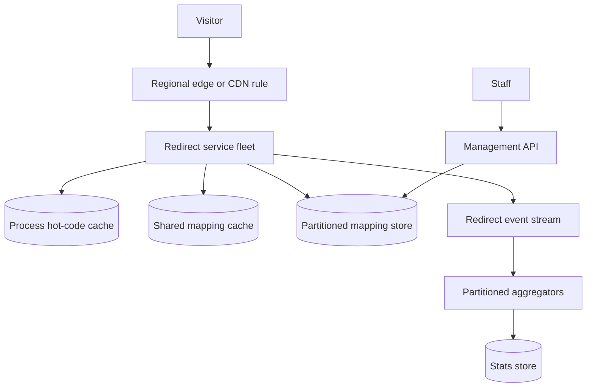

# URL Shortener Walkthrough

This walkthrough designs a URL shortener for a community services platform. The
system lets staff create short links for flyers, SMS messages, printed posters,
and social posts, then redirects residents to the full destination with low
latency.

The design focuses on short-code generation, fast redirects, durable mapping
storage, caching, click analytics, abuse controls, failure handling, and what
changes when redirect traffic grows. It intentionally keeps version 1 smaller
than a global link-management product.

## Problem Statement

A city volunteer team publishes long URLs for recycling appointments, tool
library reservations, workshop signup forms, and emergency resource pages. Long
URLs are hard to print, type, and share by SMS. Staff need a service that turns
an approved destination into a short code such as `go.example/r7K2mQp`.

Original scenario: A coordinator prints 5,000 flyers for a weekend tool repair
clinic. The flyer uses one short link. Most residents scan or type it during the
two days before the event, so the redirect path receives far more traffic than
the link creation path.

Version 1 scope:

- internal staff and approved partners can create and manage short links;
- public residents can open a short link and be redirected;
- operators can disable an unsafe link and inspect basic click trends;
- analytics are best-effort and must not slow down redirects.

Out of scope:

- public self-service link creation;
- paid branded domains;
- global active-active redirects;
- personalized redirects by user profile;
- full marketing attribution, campaign automation, or ad-tech tracking.

## Functional Requirements

Version 1 must support:

- Staff can create a short link for an approved `https` destination.
- Staff can optionally request a custom alias when it passes validation and is
  unused.
- The system can generate a random short code when no custom alias is requested.
- Public users can open `GET /{code}` and receive an HTTP redirect to the target
  URL.
- Staff can disable, expire, or update a short link according to policy.
- Operators can see link state, creator, target host, creation time, disabled
  reason, and basic click counts.
- The system can record redirect events for later aggregation without blocking
  the redirect response.
- The system can return a safe not-found or disabled page when a code is
  missing, expired, or blocked.

Later versions may support:

- multiple branded domains;
- tenant-owned custom aliases;
- region-aware redirect edges;
- link preview and malware scanning workflow;
- richer analytics, bot filtering, and UTM campaign reports;
- public API keys for partner-created links.

## Non-Functional Requirements

Assumptions for the first useful production version:

- Redirects are read-heavy. Creation and updates are low-volume staff actions.
- Redirect p95 latency should stay below 100 ms inside the primary region when
  cache is healthy.
- Link creation can take hundreds of milliseconds because it is an authenticated
  staff workflow.
- Mapping writes must be durable before a short link is shown as active.
- Code uniqueness must be enforced by the source of truth, not only by the
  generator.
- Disabling or expiring a link should take effect quickly, with a bounded stale
  cache window and explicit invalidation attempt.
- Analytics can lag by minutes and can drop a small number of events during
  severe failure, but redirect correctness must be protected.
- The service should not log full destination URLs in high-volume operational
  logs unless a safe debugging policy allows it.
- Cost should scale mainly with redirects, cache capacity, event volume, and
  analytics retention.

## Core Entities

| Entity | Purpose | Key Relationships |
| --- | --- | --- |
| Short link | The durable mapping from code to target URL and state | Created by a staff actor, addressed by one short code |
| Short code | Public token in the short URL | Unique across an active domain and backed by one short link |
| Creator | Staff user or partner identity that creates or changes a link | Owns audit events and management permissions |
| Redirect event | Best-effort event emitted when a code is visited | References short link, request metadata, and redirect decision |
| Click aggregate | Derived counts by link and time window | Built from redirect events, not authoritative for redirect behavior |
| Audit event | Append-only record of create, update, disable, and restore actions | References actor, link, reason, and request ID |

The short-link mapping is the source of truth. Redirect events and aggregates
are derived data; they can lag or be rebuilt without changing where a code
redirects.

## API Sketch

Create short link:

```text
POST /links
Actor: authenticated staff user
Request:
  target_url
  optional_custom_alias
  expires_at
  campaign_label
Response:
  link_id
  short_url
  code
  state: active
Important errors:
  invalid_target_url
  target_host_not_allowed
  custom_alias_unavailable
  custom_alias_reserved
```

Redirect:

```text
GET /{code}
Actor: public visitor
Response:
  302 Found
  Location: target_url
Important errors:
  404 code_not_found
  410 link_expired
  451 link_disabled_by_policy
```

Use `302` for version 1 redirects so browsers, crawlers, and intermediate
caches do not permanently remember a destination that staff may later update or
disable. A permanent `301` is a later option only for stable links with a clear
cache and invalidation policy.

Manage link:

```text
PATCH /links/{link_id}
Actor: staff user with link-management permission
Request:
  state: active | disabled
  target_url: optional replacement
  expires_at: optional timestamp
  reason
Response:
  link_id
  code
  state
  updated_at
Important errors:
  forbidden
  link_not_found
  invalid_state_transition
  unsafe_target_url
```

Read basic stats:

```text
GET /links/{link_id}/stats?window=24h
Actor: staff user with link-report permission
Response:
  link_id
  total_redirects
  redirects_by_hour
  top_referrer_classes
  last_aggregated_at
Important errors:
  forbidden
  stats_not_ready
```

The redirect API exposes stable public behavior. It does not reveal internal
cache state, analytics queue status, or whether a disabled target failed a
security review.

## Read Path

The critical read path is redirecting a resident from a short code to the
target URL.

1. Visitor requests `GET /r7K2mQp`.
2. API layer validates the code shape before doing any expensive work.
3. Redirect service checks the cache for `code -> target_url, state, expires_at,
   version`.
4. On cache hit:
   - if active and not expired, return `302` with `Location: target_url`;
   - if disabled or expired, return the safe error page.
5. On cache miss, redirect service reads the short-link mapping by code from the
   database.
6. Service populates the cache with a bounded TTL:
   - active links get a normal TTL with jitter;
   - missing or disabled links get a short negative TTL.
7. Service returns the redirect response.
8. Service emits a redirect event asynchronously with safe metadata.

Redirect correctness depends on the mapping store and state checks. Analytics
must never sit on the critical redirect path. Cache failure should increase
database load and latency, not silently redirect to an unsafe or stale target.

## Write Path

The main write path is staff creating a short link.

1. Staff submits `POST /links` with a target URL and optional alias.
2. API authenticates the staff user and checks link-management permission.
3. Service normalizes and validates the target:
   - scheme must be `https`;
   - host must pass allowlist, denylist, or review policy;
   - target length and redirect-chain behavior are bounded.
4. Service chooses a code:
   - custom alias if requested and valid;
   - otherwise random base62-style code with enough entropy for expected scale.
   A seven-character base62 code has many more possible values than the first
   version needs for thousands or low millions of links. Lengthen new generated
   codes when collision retries, code-space occupancy, or abuse scanning make
   the current length uncomfortable.
5. Service inserts the row into the database with a unique constraint on
   `(domain, code)`.
6. If a generated code collides, service retries code generation a small bounded
   number of times.
7. Service writes an audit event for creation.
8. Service returns the short URL only after the mapping and audit event are
   durable.

Update and disable writes follow the same pattern: authorize, validate, update
the source-of-truth row, write an audit event, invalidate the cache key, and
accept that a tiny stale window may remain until TTL expiry if invalidation
fails.

## Data Model

Mapping storage is the durable part of the system: it decides which target, if
any, a public code resolves to. Keep that source of truth separate from cache
entries and analytics events.

| Data | Source Of Truth? | Notes |
| --- | --- | --- |
| `short_links` | Yes | `link_id`, `domain`, `code`, `target_url`, `target_host`, `state`, `expires_at`, `created_by`, `version`, timestamps |
| Code uniqueness index | Yes | Unique `(domain, code)` prevents collisions and alias reuse |
| Management audit events | Yes | Append-only create, update, disable, restore, and delete-policy events; retained longer than raw redirect data and included in authoritative backups |
| Redirect cache entries | No | Derived `code -> target/state/expires/version`, TTL with jitter, short negative cache; rebuilt from database after cache loss |
| Redirect events | No | Best-effort append events for analytics, abuse review, and trend analysis; short retention and not required for restore |
| Click aggregates | No | Hourly or daily counts by link, built asynchronously; retained for reporting windows and rebuildable from retained events when available |

Recommended version 1 indexes:

- unique index on `(domain, code)`;
- lookup index on `(created_by, created_at)` for staff management;
- partial or filtered index for active non-expired links if the database
  supports it and measured queries need it;
- time-window index on redirect events or aggregates for reports.

The target URL is sensitive enough to handle deliberately. It may reveal private
campaigns, internal drafts, or partner systems. Store it in the source of truth,
but avoid placing full URLs in high-cardinality metric labels or public error
messages.

## Component Choices

| Component | Requirement It Serves | Alternative Considered | Trade-Off |
| --- | --- | --- | --- |
| REST API layer | Staff management and public redirect contract | Separate API style per workflow | REST is simple and inspectable; redirect path must stay very small |
| Redirect service | Centralizes code validation, lookup, state checks, and event emission | Put redirect logic in a static edge rule | Service adds runtime cost, but supports disable, expiry, audit, and analytics |
| Relational database | Durable mapping, uniqueness, audit, and management queries | Key-value source of truth | Relational storage is simpler for constraints and staff views; key-value may be faster later |
| Cache-aside store | Speeds repeated code lookups and protects database | No cache in all cases | Adds stale data and invalidation work, but redirect path is read-heavy |
| Event queue or stream | Decouples analytics from redirect latency | Write analytics synchronously | Async events can lag or drop under severe failure, but protect redirects |
| Analytics worker | Builds click aggregates from redirect events | Query raw events for every report | Aggregates are cheaper and faster, but freshness is delayed |
| Audit log | Explains staff changes and disables | Rely on application logs | Audit adds write and retention work, but management actions need accountability |

The relational database is the version 1 source of truth because code
uniqueness, state transitions, auditability, and management queries matter more
than raw lookup speed at small scale. The cache is a derived optimization for
the hot redirect read.

## Architecture Diagram



The diagram separates management writes from public redirects. The public
redirect path can use cache and database lookup, while analytics processing is
asynchronous and not required for a resident to reach the destination.

## Consistency Decisions

Short-code uniqueness must be strongly enforced at write time. The generator can
try to avoid collisions, but only a unique database constraint can prove that
two links do not receive the same active code for the same domain.

Redirect freshness has a bounded-staleness trade-off:

- new links should become available immediately after the durable insert;
- disabled or expired links should stop redirecting quickly;
- cache invalidation attempts reduce stale time;
- TTL expiry is the fallback when invalidation is missed.

Analytics can be eventually consistent. A click count that lags by a few minutes
is acceptable. A redirect to the wrong target is not.

Duplicate handling:

- link creation can use an idempotency key for staff clients that retry after
  timeouts;
- generated-code collision retries are bounded and observable;
- redirect events include an event ID or request ID so the analytics worker can
  deduplicate if it sees the same event twice;
- disabling a link is idempotent when repeated with the same target state and
  reason.

## Scaling Strategy

Version 1 assumptions:

- creates: tens or hundreds per day;
- redirects: thousands to low millions per day, with campaign spikes;
- reads dominate writes by several orders of magnitude;
- code lookup is by exact code, not full-text search;
- analytics can lag by minutes;
- one primary region is acceptable.

First expected bottlenecks:

- database read load on popular short links if cache hit rate is low;
- one hot code during a campaign or emergency post;
- analytics event volume if every redirect creates a large log or raw event;
- bandwidth and latency if users are far from the primary region.

Scaling triggers:

| Trigger | Next Move |
| --- | --- |
| Cache hit rate is low and database code lookups dominate latency | Review TTL, negative caching, invalidation, and key construction |
| One code creates a hot-key problem | Add request coalescing, local in-process cache, prewarming, or split read load |
| Redirect p95 exceeds target while database is healthy | Profile API path, reduce logging, keep redirect service minimal, or add regional edge |
| Analytics queue age exceeds freshness promise | Batch events, scale workers, aggregate earlier, or sample low-value dimensions |
| Management queries slow down redirects | Separate read replicas or isolate analytics and management queries |

Do not start with sharding. The first useful design has one authoritative store,
one cache, and one async analytics path. Sharding the mapping table is a later
move when measured lookup volume, write volume, storage, or regional needs make
the simpler design insufficient.

## Failure Modes

| Failure | User Impact | System Response | Repair Or Follow-Up |
| --- | --- | --- | --- |
| Generated code collision | Staff creation may take longer or fail after retries | Retry generation with unique constraint; return safe error after bounded attempts | Alert on collision rate that suggests code space pressure or generator bug |
| Cache unavailable | Redirect latency rises and database load increases | Fall back to database lookup with rate limits and alerts | Restore cache and watch database saturation |
| Database unavailable on cache miss | Some redirects fail, especially cold or expired cache entries | Serve only safe cached active entries within a short maximum stale window; fail closed for unknown, expired, disabled, or abuse-reviewed codes | Restore database, review cache TTL and failover readiness |
| Disabled link remains cached | Users may reach a blocked target briefly | Invalidate on write and use bounded TTL/version checks | Reconcile stale cache entries and audit invalidation failures |
| Analytics queue unavailable | Redirect still works but click data is delayed or partially missing | Drop or buffer best-effort events according to policy; alert on sustained failure | Backfill from safe access logs only if policy allows |
| Target URL becomes unsafe | Users could be sent to malicious or wrong destination | Allow operator disable; validate host on create/update; audit changes | Add scanning or review workflow if incidents repeat |
| Hot code overloads one cache key | Redirect latency rises during campaign spike | Prewarm, coalesce misses, local cache, and limit expensive logging | Review campaign launch checklist and hot-key metrics |
| Bot or scanner traffic floods redirects | Cost, analytics noise, and database pressure rise | Rate-limit abusive sources and classify bot events separately | Tune abuse rules and exclude bot-like traffic from user analytics |

## Security Concerns

Actors and permissions:

- public visitors can resolve only active short codes;
- staff creators can create and manage links in their scope;
- operators can disable unsafe links and inspect audit trails;
- analytics workers can read redirect events but should not change mappings.

Key security choices:

- validate target URLs on create and update; reject unsupported schemes,
  suspicious hosts, internal network targets, and overly long URLs;
- use random high-entropy generated codes so public codes are difficult to
  enumerate;
- reserve sensitive aliases such as `admin`, `login`, `support`, and common
  phishing words;
- authorize custom aliases because memorable names are easier to abuse;
- keep management APIs authenticated and audited;
- avoid exposing full target URLs in public error pages, metric labels, or broad
  logs;
- rate-limit creation, custom alias attempts, and suspicious redirect traffic;
- make disable and restore actions auditable with actor, reason, link ID, and
  request ID.

A URL shortener can be abused for phishing, malware distribution, scraping, and
cost amplification. Version 1 does not need a full trust-and-safety platform,
but it does need quick disable, safe target validation, and enough evidence to
investigate harmful links.

## Observability

Metrics:

- redirect request rate, success rate, and latency by result class;
- cache hit rate, miss rate, stale serve count, invalidation failures, and hot
  key concentration;
- database lookup latency and error rate for code reads;
- link creation rate, custom alias conflicts, and generated-code collision
  retries;
- analytics queue depth, oldest event age, worker errors, and aggregate lag;
- disabled, expired, not-found, and abuse-limited redirect counts.

Logs:

- redirect logs should include request ID, code hash or link ID, result class,
  cache hit/miss, and safe reason code;
- management logs should include actor ID, link ID, action, state change, and
  request ID;
- avoid raw target URLs, full user agents, IP addresses, or referrers unless a
  policy-approved debugging path requires them.

Traces:

- trace cold redirects across API, cache, database, and event emission;
- trace link creation across validation, database insert, audit write, and cache
  invalidation.

Alerts and dashboards:

- page when redirect error rate or p95 latency threatens the user promise;
- page when database lookups spike because cache is unhealthy;
- alert on analytics lag only when reporting freshness matters;
- dashboard top hot codes, cache health, code not-found rate, disabled-link
  hits, and cost-related event volume.

Runbooks:

- disable unsafe link;
- restore cache after outage;
- handle hot campaign link;
- drain analytics backlog;
- investigate unexpected not-found spike.

## Cost Considerations

Main cost drivers:

- redirect compute and always-on capacity;
- cache memory for active mappings and negative entries;
- database reads on cache misses and writes for staff management;
- analytics event storage, queue retention, and aggregation jobs;
- logs, metrics, traces, and audit retention;
- bandwidth if redirects include preview pages, interstitials, or regional
  traffic through the application.

Cost-aware choices:

- keep redirect response small and avoid synchronous analytics writes;
- cache only the mapping data needed for redirect decisions;
- use TTL and lifecycle rules for redirect events and aggregates;
- aggregate click data instead of querying raw events for every report;
- sample or reduce low-value bot-like analytics dimensions;
- defer CDN or regional edge until measured latency, bandwidth, or origin load
  justifies it.

Cost trade-off: richer analytics can be valuable for staff, but each dimension
increases storage, privacy review, and dashboard complexity. Version 1 should
answer "is this link being used?" before it answers every marketing attribution
question.

## Version 1 Simplification

Version 1 keeps the design intentionally small:

- one relational source-of-truth database for links and audit events;
- one cache-aside store for code lookups;
- one redirect service and one management API in the same deployable service if
  the team is small;
- random generated codes plus optional reviewed custom aliases;
- asynchronous redirect events and hourly aggregates;
- one primary domain and one primary region;
- manual operator disable for unsafe links;
- basic dashboards and runbooks instead of a full trust-and-safety workflow.

Deferred until measurements justify them:

- global edge routing and multi-region active-active storage;
- separate analytics warehouse;
- public link-creation API;
- complex branded-domain tenancy;
- real-time click dashboards;
- automated malware scanning and link reputation scoring.

Measurements required from day one:

- redirect p95 and error rate;
- cache hit rate and database miss load;
- generated-code collision retries;
- analytics event lag;
- disabled-link hits and abuse-limited traffic;
- cost per million redirects and event volume growth.

## What Changes At 10x Scale

At 10x redirect volume, the design changes only where measurements show
pressure.

Likely changes:

- redirect service scales horizontally behind a load balancer;
- local in-process cache is added for the hottest codes to reduce network cache
  calls;
- cache prewarming is added for planned campaigns and emergency links;
- analytics events are batched and partitioned by link ID or time window;
- raw redirect events move to cheaper retention while aggregates stay queryable;
- management queries and analytics reads are isolated from redirect lookups;
- CDN or regional edge redirect handling is considered if user latency or
  origin bandwidth becomes the constraint;
- code length may increase for new generated links before collision probability
  becomes uncomfortable.

Possible later architecture:



Triggers for the 10x step:

- redirect p95 misses target after application profiling and cache tuning;
- shared cache or database shows hot-key saturation;
- analytics queue age regularly exceeds the staff reporting promise;
- one region becomes a latency problem for a meaningful user population;
- operational cost per million redirects rises faster than traffic value;
- manual abuse disable cannot keep up with harmful link volume.

Do not jump straight to global active-active storage. It adds consistency,
invalidation, audit, and incident complexity. Start by keeping the hot redirect
path simple, measurable, cacheable, and easy to disable when a link becomes
unsafe.

## Related Pages

- [Walkthroughs](./)
- [System design process](../method/system-design-process.md)
- [Functional vs non-functional requirements](../method/functional-vs-nonfunctional-requirements.md)
- [Scale estimation](../method/scale-estimation.md)
- [Database selection](../components/database-selection.md)
- [Cache](../components/cache.md)
- [CDN](../components/cdn.md)
- [API layer](../components/api-layer.md)
- [Queues](../communication/queues.md)
- [Read/write patterns](../data/read-write-patterns.md)
- [Indexes](../data/indexes.md)
- [Caching strategies](../scalability/caching-strategies.md)
- [Hot-key mitigation](../scalability/hot-key-mitigation.md)
- [Rate limiting](../scalability/rate-limiting.md)
- [Metrics](../operations/metrics.md)
- [Cost analysis](../operations/cost-analysis.md)
- [Security design](../security/)
