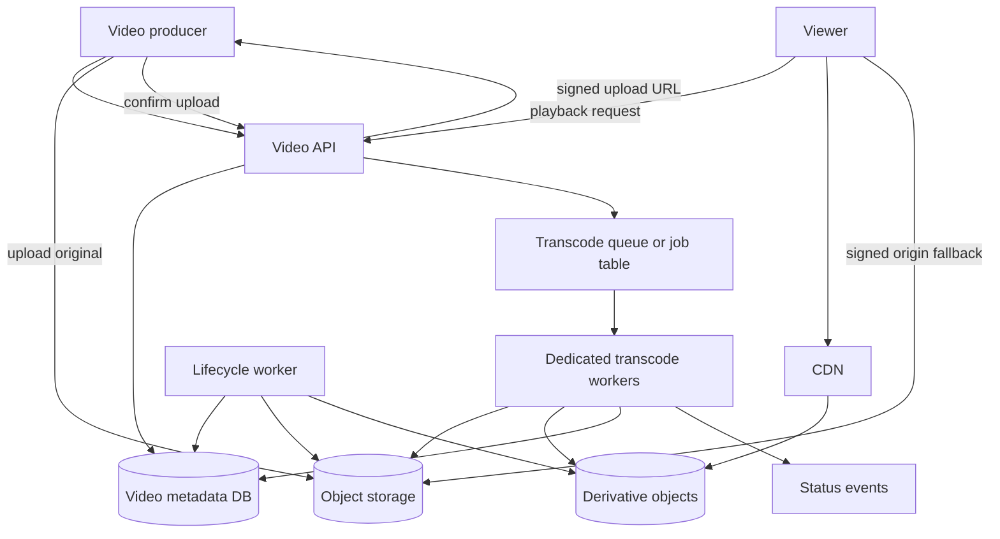

# Video Processing Walkthrough

This walkthrough designs video upload and processing for a community services
platform. Staff and approved partners upload short videos for workshops,
training, public notices, and event recaps. Residents can stream approved
videos after the system validates, transcodes, and publishes playback-ready
derivatives.

The design focuses on upload, object storage, transcoding, queues, workers,
CDN delivery, status tracking, retries, and a version 1 that keeps media
processing reliable without becoming a full video platform.

## Problem Statement

The platform needs to accept large video uploads, process them into playback
formats, and serve them efficiently. Upload and transcoding can take longer
than a normal request, so users need visible status instead of a fake immediate
success.

Original scenario: A workshop coordinator uploads a 12-minute composting
tutorial. The browser may use an unreliable network. The original video should
land in object storage, metadata should show `uploaded` and then `processing`,
workers should create a few playback renditions and a thumbnail, and the video
should become viewable only after the required derivatives are ready. If
transcoding fails, operators should see why and retry safely without creating
conflicting outputs.

Version 1 scope:

- authenticated staff and partners can upload videos tied to an approved source
  record;
- large original files are stored in object storage through signed upload URLs;
- metadata records track upload, validation, processing, ready, failed, and
  deleted states;
- queue-backed workers validate the original and transcode required
  derivatives;
- CDN delivery serves public or approved playback objects after publication;
- users and operators can see processing status and retry history;
- retries are bounded and idempotent by video ID, source version, rendition,
  and processing profile.

Out of scope:

- livestreaming;
- studio editing tools;
- user-generated public uploads without review;
- digital rights management;
- global active-active media processing;
- per-title machine-learning recommendations;
- comments, likes, and social video features.

## Functional Requirements

Version 1 must support:

- Authorized producers can create a video upload session for an approved source
  record.
- Clients can upload original video bytes directly to object storage.
- Clients can confirm upload completion.
- The system can validate size, content type, checksum when provided, duration,
  and basic media metadata.
- The system can enqueue transcoding work after upload completion.
- Workers can produce required playback renditions and thumbnail or poster
  derivatives.
- The system can track status for the original video and each processing step.
- The system can retry temporary processing failures without duplicating
  derivatives.
- Operators can inspect, retry, cancel, quarantine, delete, or mark a video
  for manual review.
- Approved videos can be streamed or downloaded through object storage or CDN
  delivery paths.

Later versions may support:

- resumable multipart uploads for very large files;
- subtitles, captions, transcripts, and accessibility review workflows;
- adaptive bitrate manifests;
- regional processing pools;
- richer moderation or malware scanning;
- live events and scheduled premieres;
- per-tenant processing profiles.

## Non-Functional Requirements

Assumptions for the first useful production version:

- Upload session creation should be fast; byte transfer happens outside the
  application tier.
- Upload completion should become visible immediately as `uploaded` or
  `processing`.
- Most short videos should become ready within a predictable processing window,
  such as minutes rather than hours.
- Original files and playback derivatives should be durable after acceptance.
- Metadata remains authoritative for ownership, status, permissions, lifecycle,
  and which derivatives are current.
- Transcoding is CPU-heavy and should run in isolated worker capacity.
- A failed derivative should not make the video look ready.
- Retries need idempotency and bounded attempts because video jobs are costly.
- CDN delivery is justified when videos are public, approved, repeated, or
  watched by distant users.
- Private or unapproved videos should fail closed and should not be cached as
  public CDN content.

## Core Entities

| Entity | Purpose | Key Relationships |
| --- | --- | --- |
| Video record | Source-of-truth metadata for one uploaded video | Belongs to tenant, source record, owner, object keys, status, and policy |
| Upload session | Short-lived permission to upload the original bytes | References video, expected size/type, signed URL scope, and expiry |
| Original object | Immutable uploaded video bytes | Stored in object storage and referenced by video record |
| Processing profile | Required outputs for a video class | Defines renditions, codecs, thumbnail rules, and publish gate |
| Transcode job | Durable work item for one processing profile or rendition | References video, source object version, attempt state, and worker pool |
| Derivative object | Playback rendition, thumbnail, poster, or manifest | References original video, profile version, status, and object key |
| Playback manifest | Entry point for streaming or download | References ready derivative objects and CDN/cache policy |
| Status event | User- and operator-visible state transition | Captures video ID, job ID, state, safe error, and timestamp |
| Lifecycle job | Cleanup, archive, delete, or derivative rebuild work | Applies retention and deletion policy to originals and derivatives |

The video record and job records explain the workflow. Object storage holds the
large bytes, but object keys are not the permission model or status model.

## API Sketch

Create upload session:

```text
POST /videos/upload-sessions
Actor: authorized staff user, partner, or internal service
Request:
  source_entity_type
  source_entity_id
  filename
  content_type
  declared_size_bytes
  checksum_optional
  processing_profile
Response:
  video_id
  upload_session_id
  status: pending_upload
  signed_upload_url
  expires_at
  required_headers
Important errors:
  forbidden
  unsupported_type
  size_limit_exceeded
  invalid_profile
  upload_quota_exceeded
```

Confirm upload:

```text
POST /videos/{video_id}/upload-complete
Actor: upload owner or authorized client
Request:
  upload_session_id
  observed_size_bytes
  checksum_optional
Response:
  video_id
  status: uploaded | processing
  processing_job_ids
Important errors:
  forbidden
  session_expired
  object_missing
  checksum_mismatch
  already_completed
```

Read status:

```text
GET /videos/{video_id}/status
Actor: producer, support user, or authorized viewer
Response:
  video_id
  status
  current_step
  percent_hint_optional
  renditions:
    name
    status
    attempts
    last_safe_error
  ready_at_optional
Important errors:
  forbidden
  video_not_found
```

Playback:

```text
POST /videos/{video_id}/playback-url
Actor: authorized viewer
Request:
  preferred_delivery: origin | cdn
Response:
  video_id
  playback_url
  expires_at
  manifest_version
Important errors:
  forbidden
  not_ready
  quarantined
  deleted
```

Operator repair:

```text
POST /operator/videos/{video_id}/processing-decision
Actor: authorized operator
Request:
  action: retry | cancel | quarantine | delete | rebuild_derivatives
  reason
Response:
  video_id
  new_status
  job_ids
Important errors:
  forbidden
  invalid_transition
  retry_not_safe
```

The playback API issues short-lived delivery URLs only after authorization and
status checks. Public videos may use CDN URLs; private videos need signed
delivery and fail-closed cache rules.

## Read Path

There are two important read paths: status tracking and playback.

Status tracking:

1. Producer opens the video page after upload confirmation.
2. API checks producer or support permission.
3. API reads the video record, processing jobs, derivative states, status
   events, and last safe error categories.
4. API returns a user-safe status such as `pending_upload`, `uploaded`,
   `processing`, `ready`, `failed`, `quarantined`, `archived`, or `deleted`.
5. The UI can poll status or receive a later notification when processing
   completes.

Playback:

1. Viewer requests playback for a video.
2. API checks authentication, source-record visibility, video status, and
   playback policy.
3. API reads the current playback manifest and required derivative objects.
4. API returns a short-lived signed origin URL or signed CDN URL.
5. Client streams or downloads bytes from CDN or object storage.

The status path reads metadata and job state. The playback path serves bytes
only after metadata says the video is ready and visible. If CDN or object
storage is degraded, private videos should fail clearly rather than exposing a
direct public object URL.

## Write Path

The main write path is upload completion followed by processing.

1. Producer creates an upload session and receives a signed upload URL.
2. Client uploads original video bytes directly to object storage.
3. Client confirms upload completion.
4. API verifies the upload session, object metadata, size, content type, and
   checksum when provided.
5. API transitions the video to `uploaded` or `processing`, records a status
   event, and creates durable transcode jobs for the required profile.
6. Workers claim jobs with leases and idempotency keys based on `video_id`,
   original object version, profile version, and rendition name.
7. Workers read the original object, validate media metadata, transcode a
   rendition or thumbnail, and write derivative objects to object storage.
8. Workers update derivative state and job attempts.
9. When required derivatives pass validation, the system creates or updates the
   playback manifest and transitions the video to `ready`.
10. CDN invalidation, prewarming, or short TTL behavior is applied only for
    published content that uses CDN delivery.

The upload transaction does not include transcoding. The durable state is the
video metadata and job records. Processing can retry and repair without asking
the uploader to start over unless the original object is invalid or missing.

## Data Model

| Data | Source Of Truth? | Notes |
| --- | --- | --- |
| Video record | Yes | Owner, tenant, source record, original object key, status, policy, profile version, lifecycle timestamps |
| Upload session | Yes | Expiry, expected type/size, signed URL scope, completion state, and client correlation ID |
| Original object | Yes, for original bytes | Immutable payload in object storage; metadata record owns meaning and access |
| Processing profile | Yes | Required renditions, codecs, thumbnail policy, manifest rules, and publish gate |
| Transcode job | Yes | Durable job state, lease, attempts, next retry, worker pool, safe error category |
| Derivative metadata | Yes | Rendition name, object key, object version, checksum, duration, dimensions, status, rebuildability |
| Derivative bytes | No | Rebuildable output in object storage as long as original and profile remain available |
| Playback manifest | Yes for current playback pointer | References ready derivative versions and cache policy |
| Status event | Yes | User/operator-visible state history and audit-safe errors |
| CDN cache entry | No | Edge copy of public or signed content with explicit cache and invalidation rules |
| Metrics and traces | No | Operational signals for upload, processing, playback, retries, and cost |

Recommended indexes:

- `source_entity_type, source_entity_id, status` for product pages;
- `owner_id, created_at` for producer views;
- `video.status, updated_at` for stuck status inspection;
- `transcode_job.state, next_retry_at, priority` for workers;
- `transcode_job.video_id, rendition_name, profile_version` for idempotency;
- `derivative.video_id, rendition_name, profile_version` for playback manifest;
- `lifecycle_deadline_at, status` for cleanup and retention jobs.

Retention:

- abandoned upload sessions expire and partial uploads are cleaned up;
- original videos are retained according to source-record policy and legal
  holds;
- derivatives can be deleted and rebuilt when originals are retained;
- temporary processing files and failed derivative objects expire quickly;
- deleted videos remove normal playback objects and keep only approved minimal
  audit evidence;
- restore procedures reconcile metadata, original bytes, derivatives, and
  playback manifests.

## Component Choices

| Component | Requirement It Serves | Alternative Considered | Trade-Off |
| --- | --- | --- | --- |
| Object storage | Durable storage for large originals and derivatives | Store video bytes in primary database | Scales byte storage, but needs metadata, lifecycle, and access design |
| Signed upload URL | Direct large upload without application bandwidth proxy | Upload through API server | Reduces app load, but upload completion and cleanup need state |
| Metadata database | Status tracking, ownership, permissions, lifecycle | Object tags only | Stronger workflow queries, but requires object reconciliation |
| Queue or durable job table | Transcoding can finish after upload response | Synchronous transcode during request | Protects user latency, but adds backlog, retries, and job visibility |
| Dedicated worker pool | CPU-heavy transcoding isolation | Shared application workers | Prevents request starvation, but needs capacity planning |
| Processing profile | Defines required outputs and publish gate | Ad hoc worker options | Repeatable outputs, but version changes require rebuild rules |
| CDN | Efficient delivery of public or approved videos | Always stream from object origin | Lowers latency and origin load, but adds cache and signing rules |
| Status API | User and operator visibility into async work | Hide processing details | Reduces support confusion, but status must stay accurate |

Version 1 can keep the number of renditions small. The important design choice
is not the exact codec set; it is the workflow that makes upload, processing,
status, retries, and delivery visible and repairable.

## Architecture Diagram



The API owns metadata, authorization, status, and signed URL issuance. Object
storage owns bytes. Workers own CPU-heavy transformations. CDN delivery is a
serving optimization after the video is ready, not the source of truth.

## Consistency Decisions

- Upload session creation and video metadata creation should be atomic.
- Upload completion moves the video out of `pending_upload` only after object
  metadata is verified.
- Transcode jobs are idempotent by video ID, original object version, profile
  version, and rendition name.
- A derivative should not replace the current playback manifest until it is
  validated.
- The video becomes `ready` only when all required derivatives for the publish
  profile are ready.
- Optional derivatives can lag if the UI labels them as unavailable or lower
  quality.
- Retryable worker failures keep the video in `processing` or `retrying`;
  permanent failures move it to `failed` or `needs_review`.
- Playback URL issuance rechecks metadata status and permission; object URLs
  alone do not authorize access.
- CDN entries may be stale until TTL or invalidation, so deleted or private
  videos need short signed URLs, object movement, or explicit purge behavior.

The strongest consistency is on metadata and status transitions. Processing
and CDN delivery are eventually consistent derived paths with repair and
invalidation behavior.

## Scaling Strategy

Version 1 assumptions:

- videos are short, such as workshop clips and public notices rather than
  feature-length media;
- upload traffic is bursty but much lower than playback traffic;
- transcoding is CPU-heavy and slower than ordinary requests;
- most viewers watch recently published public or approved videos;
- playback bandwidth and derivative storage dominate cost as usage grows.

Start with one metadata database, one object storage area, one transcode queue,
one dedicated worker pool, and direct object delivery or CDN for approved
public playback. The first expected bottlenecks are upload bandwidth,
transcode worker CPU, object storage I/O, queue backlog age, CDN origin misses,
and derivative storage growth.

Scaling triggers:

- p95 time from upload completion to `ready` exceeds the product promise;
- queue oldest age grows during normal traffic;
- worker CPU is saturated while request APIs are healthy;
- object storage or CDN bandwidth becomes a dominant cost;
- popular videos create repeated origin misses;
- retry rate rises after bad input, worker deploys, or object storage errors;
- restore or cleanup jobs cannot reconcile metadata and objects within the
  operational window.

Next steps include larger or separate worker pools by profile, priority queues
for urgent videos, multipart upload for large originals, per-tenant processing
quotas, CDN prewarming for planned launches, derivative lifecycle rules, and
regional delivery caches when viewer latency justifies them.

## Failure Modes

| Failure | User Impact | System Response | Repair Or Follow-Up |
| --- | --- | --- | --- |
| Upload URL expires mid-upload | Producer must retry upload | Keep video `pending_upload` until expiry | Issue new session and clean partial upload |
| Upload completes but client never confirms | Video remains pending | Expire session and reconcile unclaimed object | Cleanup partial or orphaned bytes |
| Client confirms upload twice | Producer may see confusing status | Make completion idempotent by upload session and object version | Return current state and suppress duplicate jobs |
| Original object missing after metadata says uploaded | Processing cannot start | Mark `failed` or `needs_review` and alert | Restore object if possible or ask producer to reupload |
| Worker crashes mid-transcode | Rendition is incomplete | Lease expires and job retries idempotently | Remove partial derivative and retry |
| Two workers claim the same rendition | Duplicate CPU work and conflicting outputs | Use job leases and idempotent derivative keys | Keep the validated output and discard stale attempts |
| Transcode output is corrupt | Playback fails or poor quality | Validate derivative before manifest update | Rebuild derivative and record safe error |
| Retry storm after object-store outage | Workers amplify dependency failure | Backoff with jitter and cap concurrent reads | Pause workers or reduce concurrency |
| One large video blocks small videos | Users wait behind expensive job | Separate queues or priority lanes | Move large jobs to dedicated pool |
| CDN serves deleted or old derivative | Viewer sees stale unsafe content | Short signed URLs, versioned object keys, and purge path | Invalidate CDN and audit affected video |
| Status is stuck in processing | Producer cannot tell if work failed | Alert on status age and job heartbeat | Retry, cancel, or mark needs review |
| Lifecycle deletes original before derivatives are rebuilt | Video cannot be repaired | Keep original until retention permits deletion | Restore from backup or mark unrecoverable |

The safest degraded state is clear unavailability. It is worse to publish a
corrupt, unauthorized, or stale video as ready than to keep it in processing
with an honest status.

## Security Concerns

- Upload and playback require authorization against the source record, tenant,
  producer role, and video state.
- Signed upload URLs should be short-lived, method-scoped, size-bounded, and
  tied to opaque object keys.
- Object keys are not secrets and should not include private titles, emails, or
  predictable IDs.
- Private or unapproved videos should not be cached as public CDN responses.
- Worker logs should store video IDs, job IDs, object versions, and safe error
  classes, not raw signed URLs or private file names.
- Processing workers need least-privilege access to original and derivative
  object paths.
- Operator repair actions should create audit events with actor, reason, video,
  job, and status change.
- Upload quotas and rate limits should prevent storage and transcoding abuse.
- If malware or moderation scanning is added, readiness should fail closed
  until required safety checks pass.

## Observability

Useful metrics:

- upload session creation rate, upload completion rate, and upload failure
  class;
- time from upload session creation to completion;
- time from upload completion to `ready`;
- transcode queue depth, oldest age, worker utilization, and job duration by
  profile;
- retry count, retry reason, dead-letter count, and stuck running jobs;
- derivative validation failures and manifest publish failures;
- CDN hit rate, origin fetch rate, edge errors, signed URL denials, and
  bandwidth;
- object storage read/write errors, latency, and bytes by original,
  derivative, temporary, and orphan class;
- status age by state, especially `pending_upload`, `processing`, `retrying`,
  and `failed`;
- cost per video, tenant, processing profile, rendition, and playback path.

Useful logs and traces:

- correlation ID from upload session through upload completion, jobs,
  derivative writes, manifest update, and playback URL issuance;
- video ID, original object version, profile version, rendition name, job ID,
  attempt number, worker pool, and safe error class;
- CDN request ID or object version for playback debugging;
- lifecycle job ID for cleanup, archive, delete, and rebuild actions.

Alerts should be tied to symptoms: processing age above promise, worker pool
saturation, object-store errors, retry spikes, stuck jobs, CDN origin miss
storms, stale deleted video reports, and storage growth above forecast.

## Cost Considerations

Main cost drivers:

- original video storage;
- derivative storage for each rendition, thumbnail, and manifest;
- transcoding CPU or managed processing minutes;
- object storage read/write requests and bandwidth;
- CDN bandwidth, origin fetches, and cache invalidation;
- retry storms that repeat expensive transcodes;
- observability volume from per-segment or per-object metrics;
- operator time for failed processing, deletion, and restore workflows.

Cost-aware choices:

- start with a small set of required renditions;
- avoid transcoding optional outputs until viewers need them;
- delete temporary and failed derivative objects quickly;
- keep originals only as long as retention and rebuild requirements require;
- use CDN for repeated public playback instead of app proxying bytes;
- cap retries and use backoff to avoid repeated expensive work;
- attribute cost by tenant, profile, and video class so noisy producers are
  visible.

Cost controls should not skip status tracking, permission checks, or validation.
A cheaper pipeline that silently publishes bad outputs is not acceptable.

## Version 1 Simplification

Start with:

- staff/partner uploads only;
- signed direct upload to object storage;
- one metadata table family for video, upload session, derivative, job, and
  status state;
- one processing profile with two playback renditions and one thumbnail;
- one transcode queue and dedicated worker pool;
- bounded retries with dead-letter or `needs_review` status;
- CDN delivery only for approved public videos or large repeated downloads;
- signed origin URLs for private playback;
- status polling for producers and operators;
- lifecycle jobs for abandoned uploads, temporary objects, failed derivatives,
  and deleted videos.

Defer livestreaming, complex adaptive bitrate ladders, regional processing,
captions, transcripts, moderation automation, and rich analytics until the core
upload-processing-playback loop is reliable and measured.

## What Changes At 10x Scale

At 10x upload or playback volume:

- multipart or resumable uploads become necessary for large and unreliable
  client networks.
- worker pools split by job cost, profile, priority, and tenant so one expensive
  video does not block all work.
- transcode scheduling needs per-tenant quotas, queue fairness, and admission
  control.
- CDN delivery needs origin protection, prewarming for planned releases, and
  hot-object alerts.
- derivative lifecycle rules become important for cost, rebuild, and retention.
- metadata reads may need read replicas or derived producer/operator views.
- restore drills must verify metadata, originals, derivatives, and manifests
  together.
- processing profile changes need versioned rebuild jobs and compatibility
  windows.
- regional playback may justify regional CDN and object replication, but
  processing and deletion still need a clear source-of-truth home.

The next design step should be triggered by processing age, playback latency,
origin load, worker saturation, storage growth, retry cost, or restore gaps, not
by adding media-platform features early.

## Related Pages

- [Object storage](../components/object-storage.md)
- [Background workers](../components/background-workers.md)
- [Queue](../components/queue.md)
- [Queues](../communication/queues.md)
- [Retries and backoff](../communication/retries-and-backoff.md)
- [CDN](../components/cdn.md)
- [API layer](../components/api-layer.md)
- [Data retention](../data/data-retention.md)
- [Backups and restore](../data/backups-and-restore.md)
- [Capacity estimation](../scalability/capacity-estimation.md)
- [Batching and backpressure](../scalability/batching-and-backpressure.md)
- [Hot-key mitigation](../scalability/hot-key-mitigation.md)
- [Metrics](../operations/metrics.md)
- [Cost analysis](../operations/cost-analysis.md)
