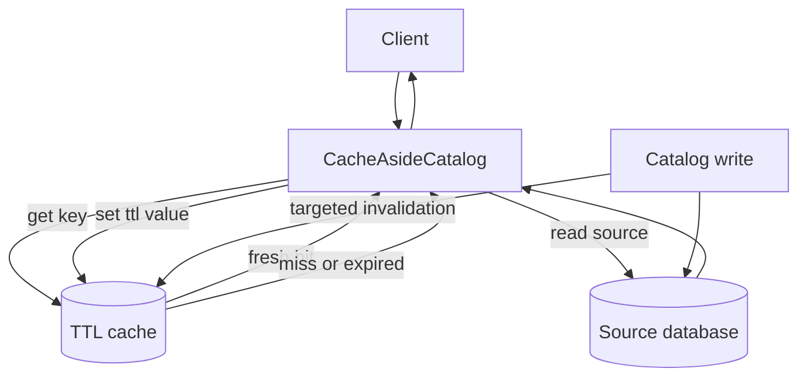

# Cache-Aside Demo Design

## Problem

A class catalog page receives repeated reads for the same public class. Reading
from the source database every time is correct but wastes database capacity. A
cache can reduce source reads, but it introduces freshness and failure-mode
questions that the design must make visible.

## Simplified Model

The lab uses three objects:

- `SourceDatabase`: the source of truth for class title, available seats, and
  record version;
- `TTLCache`: a key-value cache with a fixed TTL, invalidation, and injectable
  outage behavior;
- `CacheAsideCatalog`: application logic that checks the cache first, reads the
  database on miss or expiry, and fills the cache after a successful source
  read.

The clock is manual so tests can advance time without sleeping.

## Core Behavior

The cache-aside read path is:

```text
read class key
-> check cache
-> if fresh hit, return cached value
-> if miss or expired, read source database
-> write the returned source value into the cache
-> return the source value
```

The lab also models two failure paths:

- if the cache is unavailable, the application reads the database directly;
- if the database is unavailable after a cached value expires, the application
  can serve the expired value only when `stale_if_error` is enabled.

## Mermaid Flow



## Assumptions

- Cached class details are public and safe to reuse for a short window.
- The source database owns correctness and version changes.
- The cache is an optimization, not the system of record.
- Seat count staleness is acceptable for browsing but not for final booking.
- Targeted invalidation is possible because the write path knows the class key.

## What The Lab Omits

The lab intentionally omits distributed locks, request coalescing, replication,
serialization formats, network timeouts, and real cache clients. Those details
matter in production, but they would hide the core cache-aside decisions this
lab is meant to expose.
