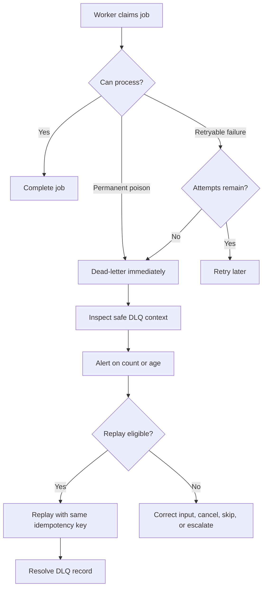

# Design

## Problem

Asynchronous systems accept work before the worker completes it. When a message
is malformed, impossible, or repeatedly failing, the system needs a visible
repair path. Retrying forever wastes capacity; dropping the work hides an
accepted promise.

This lab demonstrates:

- poison messages that should fail fast;
- retry exhaustion for a retryable job;
- dead-letter records with safe inspection context;
- alerting on DLQ risk;
- replay for a repaired, replayable failure;
- blocking replay for a non-replayable failure.

## Model

The demo uses pickup reminder jobs for a lending library.

| Concept | Meaning In This Lab | Production Equivalent |
| --- | --- | --- |
| Job | Pickup reminder work item | Queue message, task, or command |
| Poison message | Invalid recipient payload | Malformed, unauthorized, expired, or impossible work |
| Retry exhaustion | Handler bug fails until max attempts | Automatic retry budget is spent |
| Dead-letter record | Safe repair context | DLQ message, incident record, or repair ticket |
| Replay | New job from a replayable dead letter | Operator-triggered reprocessing |
| Alert | Open count and oldest age signal | Page, ticket, or review SLA alert |

## Flow

## Core Behavior

The baseline scenario should show:

- one normal job completing successfully;
- one invalid-recipient poison message entering the DLQ without retries;
- one handler-bug job retrying until retry exhaustion;
- DLQ inspection showing safe categories, attempts, owner, and replayability;
- alerts firing when open count and oldest age cross thresholds;
- a replayable dead letter producing a new successful job;
- a non-replayable dead letter rejecting replay.

## Assumptions

- Jobs and dead letters are in memory so behavior is deterministic.
- Payload strings are safe toy summaries, represented as `payload_summary` in
  DLQ records, not raw personal data.
- Replay uses the same idempotency key when it represents the same business
  action.
- The replayed handler bug is fixed by changing the payload from
  `template=bad-locale` to `template=fixed`.
- The invalid-recipient poison message requires input correction or
  cancellation, not blind replay.

## Why This Is Simplified

Real DLQ systems need durable storage, access control, payload redaction,
operator workflows, replay batch limits, source-of-truth rechecks, audit logs,
and retention policies. This lab keeps those concerns visible in the prose
while the code focuses on the state transitions learners need to understand.
