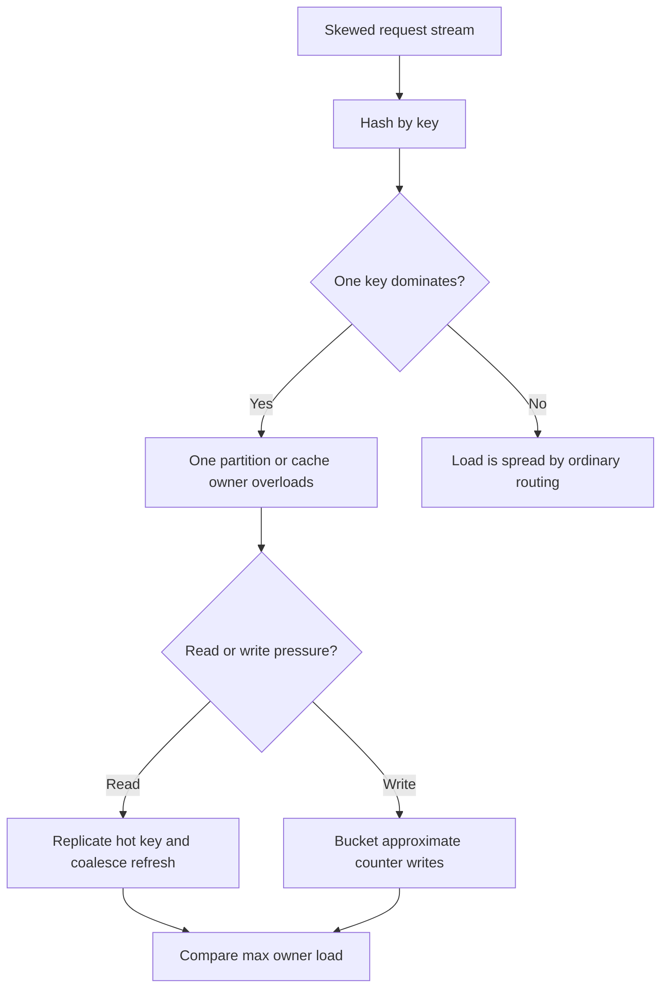

# Design

## Problem

A single key can receive enough reads or writes to become the limiting point of
a system. Adding more partitions, cache nodes, or workers does not fix the
problem if requests for that key still converge on one owner.

This lab makes that behavior visible with three small scenarios:

- read traffic where one public post receives most requests;
- cache refresh traffic where many callers miss the same hot cache key at once;
- write traffic where one counter receives every increment.

## Model

The demo creates a deterministic request stream:

- one hot key, `post:city-marathon`, receives most read requests;
- normal keys share the remaining read requests;
- each key is assigned to a partition or cache owner with a stable hash;
- each owner has a simple capacity threshold;
- an owner is overloaded when its load exceeds that threshold.

The mitigation scenarios then change the routing behavior:

- hot read replication spreads the hot key across several cache owners;
- request coalescing lets one refresh serve many waiting callers;
- write bucketing splits a hot counter into several buckets that can be
  aggregated later.

## Assumptions

- The hot read key is public content, so it is safe to replicate across cache
  owners in this toy model.
- Replica placement uses adjacent cache owners to keep the math visible; real
  systems often use virtual nodes, independent placement, or topology-aware
  routing.
- The hot write key is an approximate counter where the exact live value may lag
  while buckets are aggregated.
- Capacity is an educational threshold, not a real CPU, memory, or network
  measurement.
- Hash routing is stable so tests and expected output are repeatable.

## Simplifications

The lab does not implement a real cache, database, queue, lock, or network. It
counts requests and shows where they would land. That keeps the lesson focused
on skew and mitigation instead of infrastructure setup.

Production systems would also need permissions in cache keys, targeted
invalidation, request deadlines, tenant isolation, abuse controls, and
observability by key.

## Core Behavior

The baseline scenario should show:

- one key accounts for a large share of requests;
- the partition and cache owner for that key exceed capacity;
- ordinary keys remain spread across other owners;
- read replication lowers the maximum cache-owner load;
- request coalescing reduces origin refresh work;
- bucketed writes lower the maximum write load per bucket.
