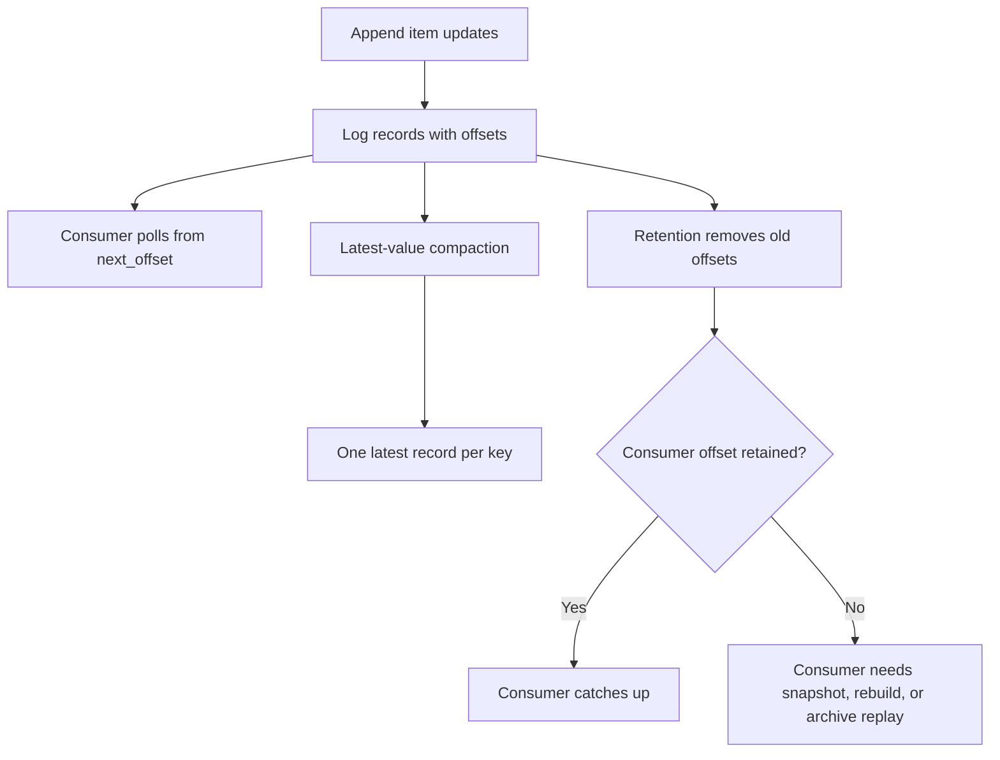

# Design

## Problem

Event streams are useful when consumers need retained history, replay, and
independent progress. That creates a second design question: how much history
should stay hot, and what can be compacted or removed?

This lab demonstrates the difference between:

- an append-only log that records every update with a stable offset;
- latest-value compaction that keeps the newest record for each key;
- retention that removes old offsets from the hot log;
- consumers that must track offsets and handle gaps.

## Model

The demo uses a lending inventory stream. Each record says the latest available
count for an item key, such as `item:tent=available=2`. A tombstone record means
the item has been removed.

| Concept | Meaning In This Lab | Production Equivalent |
| --- | --- | --- |
| Offset | Monotonic integer assigned at append time | Stream offset or log sequence number |
| Key | Inventory item ID | Entity, account, tenant, resource, or compacted topic key |
| Value | Latest availability string | Serialized event or latest entity state |
| Tombstone | `None` value that deletes a key from projections | Delete marker retained long enough for compaction |
| Consumer | In-memory projection with `next_offset` | Search, analytics, notification, or cache projection consumer |
| Retention | Keep only the last N records | Hot retention window, segment deletion, or archive cutoff |

## Flow

## Core Behavior

The baseline scenario should show:

- every update remains visible in the append-only history before retention;
- the same key can appear at several offsets;
- compaction keeps only the latest record for each key;
- tombstones remove deleted keys from a consumer projection;
- one consumer catches up from its saved offset;
- another consumer starting from offset `0` fails after retention removes that
  offset.

## Assumptions

- The log is in memory and single-partitioned so offsets are easy to inspect.
- Values are strings, not serialized schemas.
- Compaction returns a compacted view instead of rewriting segment files.
- Retention is count-based rather than time-based.
- Consumer processing is deterministic and idempotent for this projection.

## Why This Is Simplified

Real logs have partitions, segment files, broker replicas, checksums, schemas,
authorization, compression, tombstone retention rules, archives, and operational
limits. This lab omits those details so the learner can focus on the design
relationship between history, compaction, offsets, and retention.

The lesson still transfers: consumers need a replay promise, compaction changes
what old versions remain useful for, and retention can break backfills when it
is shorter than the recovery window.
