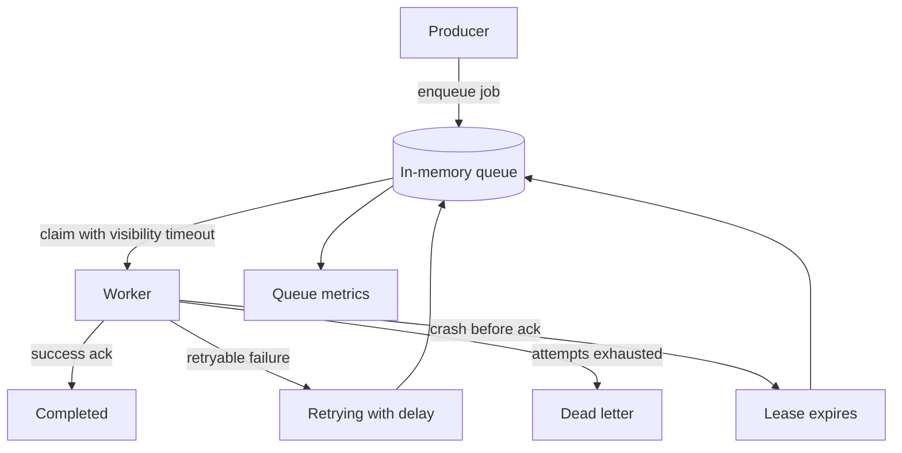

# Queue Worker Demo Design

## Problem

Many systems accept work in a user request and process it later. This improves
latency and absorbs bursts, but it also creates delayed completion, duplicate
delivery, retry exhaustion, and stuck job problems.

This lab makes those behaviors visible with a small in-memory queue.

## Requirements

Version 1 must:

- demonstrate enqueue and worker claim behavior;
- demonstrate successful processing and acknowledgement;
- demonstrate retryable failure with a retry delay;
- demonstrate failure after maximum attempts;
- demonstrate visibility timeout redelivery when a worker crashes before
  acknowledging work;
- print basic observability signals;
- include tests for the important behavior.

Version 1 does not need:

- a real broker, database, or worker process manager;
- network calls;
- concurrent threads;
- production-grade scheduling;
- global ordering guarantees.

## Model

| Concept | Meaning In This Lab | Production Equivalent |
| --- | --- | --- |
| `InMemoryQueue` | Durable toy queue stored in memory | Queue, job table, or broker topic |
| `Job` | One unit of background work | Message, task, or durable job row |
| `Worker` | Claims one visible job and records an outcome | Worker process or consumer |
| Visibility timeout | Lease that hides a claimed job | Broker visibility timeout or job lease |
| Retry delay | Time before retryable failure becomes visible | Backoff schedule or delayed message |
| Dead letter | Terminal failed state after attempts run out | DLQ, quarantine queue, or failed job table |
| Queue metrics | Counts and oldest visible age | Dashboards and alerts |

## Flow

## Assumptions

- Jobs are independent, so the lab does not model ordering by key.
- A worker handles one job at a time so the output stays readable.
- Time is manual, not real, so tests do not sleep.
- Worker side effects are represented by the chosen outcome rather than a real
  provider call.
- Dead-lettered jobs require operator inspection in production, but the lab only
  records the terminal state.

## Why This Is Simplified

Production queues add persistence, partitions, leases renewed by heartbeat,
provider idempotency keys, concurrency limits, poison-message inspection, and
operator replay tools. The lab omits those pieces so learners can focus on the
contract that matters first: a job can be accepted, claimed, completed, retried,
redelivered, or failed, and every state needs observability.
