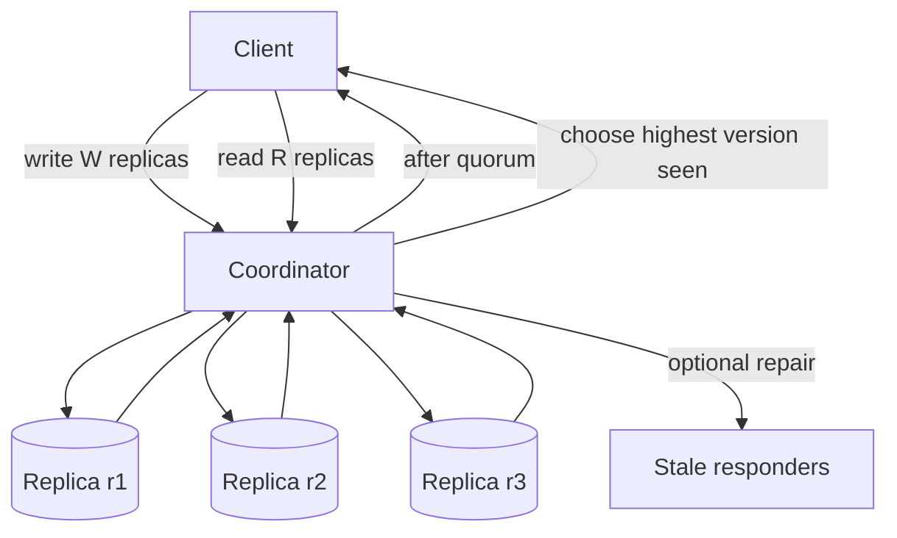

# Quorum Read/Write Simulator Design

## Problem

Replicated storage often lets a client wait for only some replicas instead of
all replicas. That can improve availability and latency, but it changes the
freshness and failure behavior of reads and writes.

This lab models a single replicated key so the quorum trade-offs are visible.

## Requirements

Version 1 must:

- demonstrate read quorum;
- demonstrate write quorum;
- demonstrate unavailable replicas;
- demonstrate stale reads;
- demonstrate latency trade-offs;
- include tests for the important behavior.

Version 1 does not need:

- real networking;
- anti-entropy protocols;
- hinted handoff;
- vector clocks;
- conflict resolution;
- multi-key transactions.

## Model

| Concept | Meaning In This Lab | Production Equivalent |
| --- | --- | --- |
| `Replica` | One copy of a single key | Storage node or shard replica |
| `ValueVersion` | Value with monotonically increasing version | Timestamp, log position, or version vector simplification |
| `read_quorum` | Number of replica responses needed for a read | R value |
| `write_quorum` | Number of acknowledgements needed for a write | W value |
| `latency_ms` | Deterministic response time | Network and service latency |
| `read repair` | Updating stale responders from the newest read response | Background or read-path repair |

## Flow

## Assumptions

- The lab stores one key and one version chain.
- A write sends to the fastest available replicas until `write_quorum` replies.
- A read consults the fastest available replicas until `read_quorum` replies.
- The read returns the highest version among the responses it received.
- Latency is the slowest responder in the quorum.
- Stale data exists when the chosen read version is behind the newest known
  replica version.

## Why This Is Simplified

Production quorum systems must handle concurrent writes, conflict resolution,
clock uncertainty, repairs outside the read path, membership changes, and
multiple partitions. This lab intentionally omits those concerns so the learner
can focus on the first-order question: how do R, W, unavailable replicas, stale
copies, and latency interact?
