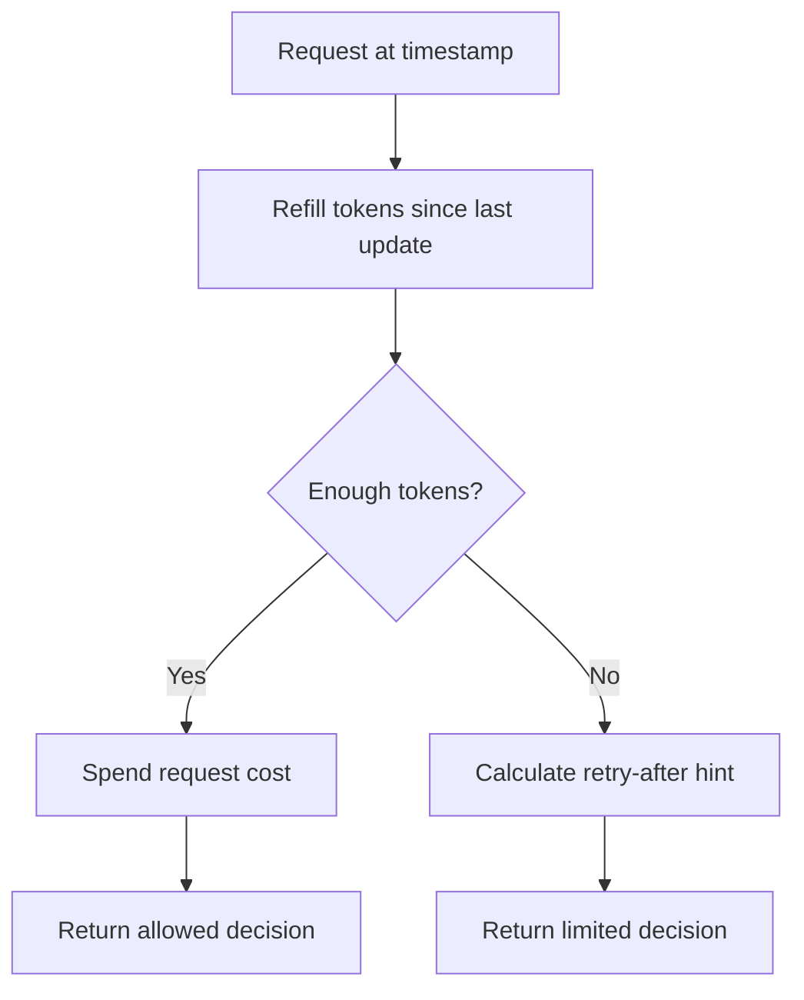

# Token Bucket Rate Limiter Design

## Problem

A reservation API needs to protect a write path from sustained request pressure
without punishing a resident for a short burst of normal activity. A token
bucket fits this requirement because it lets unused capacity accumulate up to a
burst limit while enforcing a long-term refill rate.

## Requirements

Version 1 must:

- implement token bucket allow/limit behavior;
- let the learner change burst capacity and refill rate;
- print each request decision with token balance and retry hint;
- include tests for burst, refill, capacity cap, and simulation behavior.

Version 1 does not need:

- distributed counters;
- network APIs;
- persistence;
- authentication or abuse scoring;
- real clocks or background refill threads.

## Model

| Concept | Meaning In This Lab | Production Equivalent |
| --- | --- | --- |
| Bucket capacity | Maximum stored tokens | Allowed burst size for one limit key |
| Refill rate | Tokens added per second | Sustained allowed request rate |
| Cost | Tokens spent by one request | Request weight for cheap or expensive actions |
| Current time | Deterministic timestamp passed by the demo | Server-side clock or counter-store clock |
| Decision | Allowed or limited with retry hint | HTTP success or `429` with `Retry-After` |

Tokens refill only when the lab evaluates a request or explicitly calls
`refill()`. This keeps the model deterministic and easy to test.

## Flow

## Assumptions

- One bucket represents one limit key, such as one user or API key.
- Each default request costs one token.
- Time is monotonic. The lab raises an error if a caller moves the clock
  backward.
- Decisions are local and exact. Distributed counters and concurrent updates are
  explained in the related docs, not simulated here.

## Why This Is Simplified

Production systems must choose limit keys, shared storage, fallback behavior,
metrics, logs, and client response rules. This lab focuses only on the token
bucket mechanics so the learner can see how burst size and refill rate shape
request outcomes.
