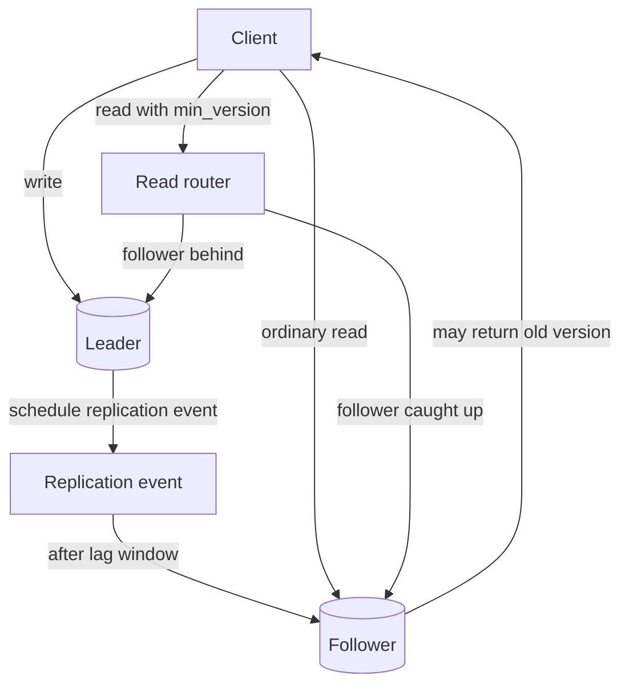

# Replication Lag Simulator Design

## Problem

Read replicas can reduce leader load, but they may not contain the latest
leader write yet. A user who writes and then immediately reads from a follower
can see missing or old data even though the write succeeded.

This lab makes that lag visible without requiring a database server.

## Requirements

Version 1 must:

- demonstrate leader writes;
- demonstrate follower lag;
- demonstrate stale reads;
- demonstrate read-your-writes violations;
- include demo scenarios;
- include tests for the important behavior.

Version 1 does not need:

- real networking;
- multi-node databases;
- failover;
- concurrent writers;
- conflict resolution;
- production-grade replication protocols.

## Model

| Concept | Meaning In This Lab | Production Equivalent |
| --- | --- | --- |
| `LeaderFollowerStore` | One authoritative leader and one lagging follower | Primary database and read replica |
| `Record` | Key, value, version, and write time | Row or document version |
| `ReplicationEvent` | Scheduled follower application | Replication log entry |
| `min_version` | Version the caller has already observed | Session token, LSN, timestamp, or version token |
| `ReplicationStatus` | Versions behind and pending events | Replica lag dashboard |

## Flow

## Assumptions

- The leader is the only write authority.
- Each key has monotonically increasing versions.
- Follower reads apply all replication events whose scheduled time has arrived.
- `min_version` represents the version returned by a previous successful write.
- The lab focuses on one key so the stale-read behavior is easy to see.

## Why This Is Simplified

Production replication includes durable logs, network failures, replica health,
promotion, fencing, read routing, and monitoring by log position or timestamp.
The lab keeps those details out so learners can focus on the core decision:
which reads may use a follower, and which reads must route to the leader or a
caught-up replica.
