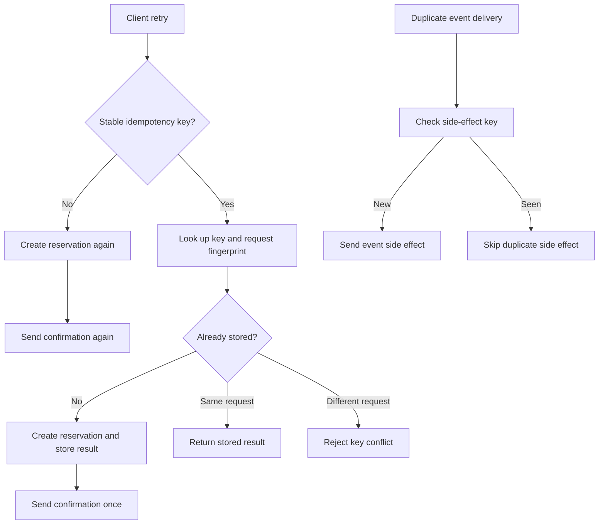

# Retry And Idempotency Demo Design

## Problem

A workshop reservation API receives duplicate submissions when a mobile client
times out after the server already created a reservation. A separate event
consumer may also receive duplicate reservation events during redelivery or
replay.

Without idempotency, retries can create extra reservations and repeat side
effects. With an idempotency key and side-effect records, the same retry can
return the original result and skip duplicate sends.

## Requirements

Version 1 must:

- demonstrate duplicate request processing;
- demonstrate unsafe retries that create repeated business work;
- demonstrate idempotency keys that return the first result;
- demonstrate duplicate event handling and safe side effects;
- include tests for the important behavior.

Version 1 does not need:

- production networking;
- a database server;
- real message brokers;
- payment provider integration;
- background workers or async scheduling.

## Model

| Concept | Meaning In This Lab | Production Equivalent |
| --- | --- | --- |
| Reservation | In-memory record with one generated ID | Source-of-truth write |
| Idempotency record | Key plus request fingerprint and stored result | Idempotency table or unique command record |
| Email send | In-memory side-effect record | Email, payment, webhook, or external provider call |
| Event delivery | Repeated calls to the event handler | Broker redelivery, replay, or subscriber retry |
| Side-effect key | Stable dedupe key for one outbound action | Send record, provider operation key, or delivery table |

The lab intentionally separates command idempotency from event side-effect
dedupe. A request key protects the reservation command. A side-effect key
protects the outbound event response.

## Flow

## Assumptions

- One process owns all in-memory state for the demo.
- A request fingerprint is the tuple of member ID and workshop ID.
- The client reuses the same key for retries of the same intended operation.
- Duplicate event handling uses both event IDs and side-effect keys.
- The side effect is represented by a confirmation or receipt email record.

## Why This Is Simplified

Production systems need durable storage, uniqueness constraints, request
retention, audit events, reconciliation, and privacy-aware payload storage. This
lab keeps state in memory so the learner can focus on the decision: where the
idempotency boundary lives and which side effects must not repeat.
