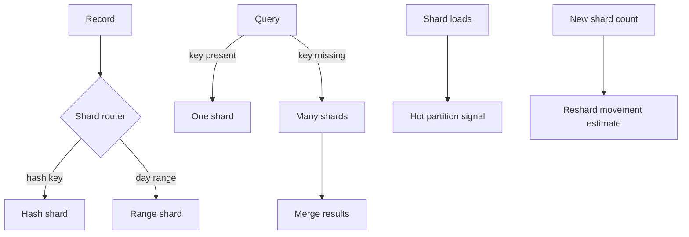

# Sharding Simulator Design

## Problem

Sharding can raise storage and throughput ceilings, but the shard key decides
which workflows are simple and which become distributed. A key that balances
individual records can still make tenant reports expensive. A range key can
make time-window operations natural while concentrating current writes.

This lab makes those trade-offs visible with one in-memory record type.

## Requirements

Version 1 must:

- demonstrate hash sharding;
- demonstrate range sharding;
- demonstrate resharding;
- demonstrate hot partitions;
- demonstrate cross-shard query limitations;
- include a runnable demo and behavior tests.

Version 1 does not need:

- a real database;
- network calls;
- automatic balancing;
- online dual-write migration;
- cross-shard transactions;
- production-grade consistent hashing.

## Model

| Concept | Meaning In This Lab | Production Equivalent |
| --- | --- | --- |
| `Record` | One task with record ID, tenant ID, day, and value | Row or document |
| `HashRouter` | Hashes record ID or tenant ID to a shard | Hash shard map |
| `RangeRouter` | Routes day ranges to named shards | Time or numeric range partitioning |
| `ShardedStore` | In-memory shard containers | Storage cluster or table group |
| `ReshardPlan` | Count of records whose hash route changes | Data movement plan |
| Query result | Records plus shards touched | Query fanout plan |

## Flow

## Assumptions

- Records are independent.
- Hash routing uses deterministic SHA-256 modulo shard count.
- Range routing uses fixed inclusive day ranges.
- Cross-shard queries fan out to every shard in this toy model.
- Resharding estimates route changes only; it does not copy records.

## Why This Is Simplified

Production sharding needs placement maps, online movement, backfill,
verification, retries, cache invalidation, schema changes, and rollback. This
lab omits those concerns so learners can focus on the first decision: whether
the shard key keeps the important workflow local.
