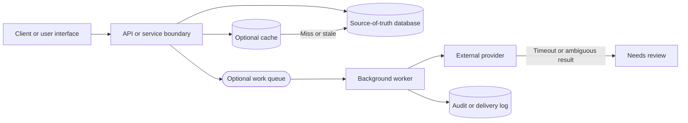

# Architecture Diagram Template

Use this template when a page needs a small Mermaid architecture or data-flow
diagram. Start from the decision the diagram should clarify, then delete any
node that does not affect that decision.

Follow the [diagram style guide](../docs/visuals/diagram-style-guide.md) and
[diagram legend](../docs/visuals/diagram-legend.md). Keep the diagram original
to the page you are writing.

## Diagram Purpose

```text
[State the question this diagram answers, such as "Where does async retry
state live?" or "Which component owns the source-of-truth write?"]
```

## Mermaid Starter



## Guidance Comments

When adapting the template:

- rename every node for the page's actual scenario;
- keep `Client`, `Api`, `PrimaryDb`, `Queue`, `Worker`, `Provider`, and
  `NeedsReview` style node IDs readable in diffs;
- label stores by role, such as `Permit database`, `Product cache`, or
  `Audit log`;
- remove optional cache, queue, worker, provider, or failure nodes when they do
  not affect the decision;
- add a boundary with `subgraph` only when ownership, trust, latency, privacy,
  or failure behavior changes across that boundary;
- include failure edges only for outcomes the surrounding text explains;
- avoid vendor logos, copied layouts, decorative shapes, and color-only
  meaning.

## Explanation Prompt

After the diagram, write a short explanation:

```text
This diagram shows [decision or flow]. The important boundary is [boundary].
The main trade-off is [trade-off]. If [failure path] happens, the system
[recovery or degraded behavior].
```

## Review Checklist

Before publishing:

- The diagram answers the stated purpose.
- The Mermaid source is readable in Markdown.
- Standard nodes and labels match the diagram legend.
- Every included cache, queue, worker, store, and provider is justified by the
  surrounding text.
- Failure paths are explicit when they change the design.
- The diagram is original and not copied or traced from another source.
