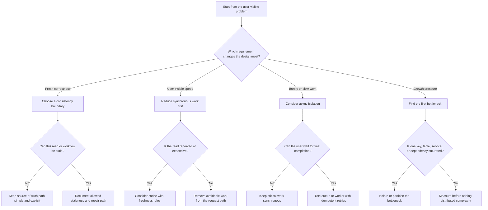

# Decision Tree Template

Use this template when a cookbook page helps readers choose a requirement,
component, pattern, or simplification path. A decision tree should start from
the problem pressure, not from a preferred tool.

Replace bracketed placeholders with original content for the page. Keep the
tree small enough to review, then explain the trade-offs below it.

Follow the [diagram style guide](../docs/visuals/diagram-style-guide.md),
[diagram legend](../docs/visuals/diagram-legend.md), and
[Mermaid examples](../docs/visuals/mermaid-examples.md).

## Purpose

`[State the design question this page helps answer.]`

Prompts:

- What decision does the reader need to make?
- Which requirement or constraint makes the decision necessary?
- What is intentionally out of scope for this page?

## When This Matters

`[Describe the signals that tell a reader to use this tree.]`

Use this tree when:

- `[Trigger, such as a strict latency target, bursty workload, or freshness
  requirement.]`
- `[Trigger, such as an external dependency, failure mode, or cost limit.]`
- `[Trigger, such as unclear ownership, consistency, or scaling pressure.]`

Skip this tree when:

- `[Simpler path is enough.]`
- `[The decision needs a different page or a deeper walkthrough.]`

## Quick Decision

`[Give the short version before the full tree.]`

| If the system needs... | Start with... | Watch for... |
| --- | --- | --- |
| `[Requirement or constraint]` | `[Default choice]` | `[Trade-off or failure mode]` |
| `[Requirement or constraint]` | `[Default choice]` | `[Trade-off or failure mode]` |
| `[Requirement or constraint]` | `[Default choice]` | `[Trade-off or failure mode]` |

Default to the simplest choice that satisfies the current requirements. Add
components, guarantees, or operational complexity only when the tree identifies
the pressure that justifies them.

## Questions To Ask

- Who is the user, caller, operator, or external system affected by this
  decision?
- Which functional requirement is non-negotiable?
- Which non-functional requirement changes the design: latency, throughput,
  availability, durability, consistency, security, privacy, operability, or
  cost?
- What can be delayed, approximated, retried, degraded, or handled manually in
  version 1?
- Which failure would produce user harm, data loss, duplicate work, security
  exposure, or excessive cost?

## Decision Tree



Use this starter as a shape, not as final content. Rename every node for the
page's concrete topic, remove irrelevant branches, and add only the branch
points needed to explain the decision.

## Requirements Discovered

Record the requirements the tree uncovered.

| Requirement | Why It Matters | Design Impact |
| --- | --- | --- |
| `[Functional or non-functional requirement]` | `[User or system reason]` | `[Component, guarantee, or simplification it affects]` |
| `[Functional or non-functional requirement]` | `[User or system reason]` | `[Component, guarantee, or simplification it affects]` |
| `[Functional or non-functional requirement]` | `[User or system reason]` | `[Component, guarantee, or simplification it affects]` |

## Options

Compare the credible choices fairly. Include the simplest option even when it
is not the final recommendation.

| Option | Use When | Trade-Off |
| --- | --- | --- |
| `[Simplest credible option]` | `[Requirements it satisfies]` | `[What it does not handle]` |
| `[More capable option]` | `[Requirement that justifies it]` | `[New complexity, cost, or failure mode]` |
| `[Deferred or manual option]` | `[Why version 1 can accept it]` | `[Revisit signal]` |

## Decision Guidance

`[Explain how to interpret the tree result.]`

Prompts:

- Start with `[default path]` when `[common simple case]`.
- Choose `[stronger option]` only when `[specific requirement]`.
- Defer `[advanced option]` until `[metric, incident, scale, or user need]`.
- Revisit the decision when `[measurement or failure signal]`.

## Trade-Offs

| Choice | Improves | Costs Or Risks |
| --- | --- | --- |
| `[Choice]` | `[Benefit]` | `[Complexity, latency, cost, failure mode, or operational burden]` |
| `[Choice]` | `[Benefit]` | `[Complexity, latency, cost, failure mode, or operational burden]` |

## Failure Modes

| Failure Mode | Impact | Design Response |
| --- | --- | --- |
| `[Failure, such as stale read, duplicate request, timeout, overload, or data loss]` | `[User/system impact]` | `[Retry, reject, degrade, repair, alert, or manual review]` |
| `[Failure]` | `[Impact]` | `[Response]` |
| `[Failure]` | `[Impact]` | `[Response]` |

## Common Mistakes

- Starting from a preferred technology instead of a requirement.
- Treating every branch as equally likely instead of naming the version 1 path.
- Adding caches, queues, replicas, or services without a requirement that
  justifies them.
- Hiding a failure mode because it makes the recommended option look simpler.
- Leaving the tree result disconnected from the page's checklist or examples.

## Original Example

`[Invent a small scenario that exercises the tree.]`

Example shape:

```text
A team is designing [small system]. Users need [core workflow]. The first
constraint is [requirement]. The tree points to [option] because [reason].
The team defers [more complex option] until [measurement or failure signal].
```

## Checklist

Before publishing the page, confirm:

- The tree starts from a requirement or constraint.
- The Mermaid diagram is original and readable in Markdown review.
- Each major branch names a decision outcome.
- Requirements discovered by the tree are recorded.
- Options are compared with trade-offs, not just ranked.
- Failure modes and common mistakes are explicit.
- The example is original to this project.
- Related requirement, component, method, walkthrough, or visual pages are
  linked.

## Related Pages

- [Diagram style guide](../docs/visuals/diagram-style-guide.md)
- [Diagram legend](../docs/visuals/diagram-legend.md)
- [Mermaid examples](../docs/visuals/mermaid-examples.md)
- [Architecture diagram template](architecture-diagram-template.md)
- [Sequence diagram template](sequence-diagram-template.md)
- [Decision record template](decision-record-template.md)
