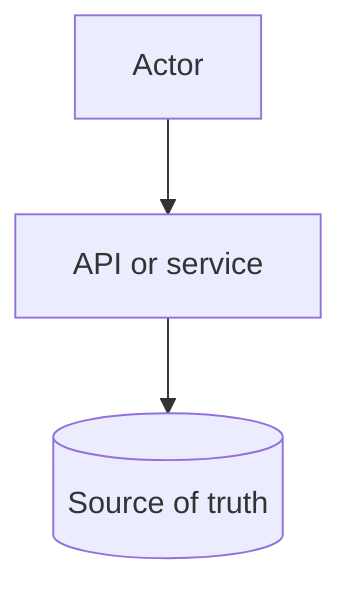

# Design Doc Template

Use this template for walkthroughs, exercises, and architecture proposals in the
System Design Decision Cookbook.

Replace bracketed placeholders with original content. Keep sections short when
the system is small, but do not delete a required walkthrough section unless the
design explicitly explains why it is not relevant.

## Problem Statement

`[State the user, job, and system boundary in one or two sentences.]`

Guidance:

- Name the user or actor.
- Name the core job the system performs.
- Name what is out of scope for version 1.

## Functional Requirements

`[List the product behaviors the system must support.]`

Prompts:

- `[Actor] can [action].`
- `[Operator or staff role] can [admin action].`
- `[External system] can [integration action].`

## Non-Functional Requirements

`[List the quality constraints that shape the architecture.]`

Prompts:

- Latency: `[workflow] should complete within [target or range].`
- Consistency: `[data] must / may not [staleness or conflict rule].`
- Availability: `[critical path] should continue when [failure mode].`
- Scale: `[traffic, storage, bandwidth, or fanout assumption].`
- Security: `[actor] may access [data/action] only when [condition].`
- Observability: `Operators need to know [signal].`

## Core Entities

`[List the main entities and relationships.]`

Example shape:

| Entity | Purpose | Key Relationships |
| --- | --- | --- |
| `[Entity]` | `[What it represents]` | `[Related entities]` |

## API Sketch

`[Sketch the smallest useful API surface or commands.]`

```text
POST /example
Request: [fields]
Response: [fields]
Errors: [important errors]
```

Guidance:

- Include actor and authorization assumptions.
- Include important error cases.
- Keep details at design level, not framework level.

## Read Path

`[Describe the critical read flow from request to response.]`

Prompts:

- Who sends the read request?
- Which data is read from the source of truth?
- Which derived, cached, or indexed data is used?
- What latency or freshness assumption matters?

## Write Path

`[Describe the critical write flow from request to durable state.]`

Prompts:

- What validation happens first?
- What data changes atomically?
- What happens on conflict or retry?
- What work happens after the response?

## Data Model

`[Describe storage shape, ownership, and retention.]`

Prompts:

- Which data is authoritative?
- Which fields are indexed?
- Which data is derived or denormalized?
- What is retained, archived, or deleted?

## Component Choices

`[List each component and the requirement it satisfies.]`

| Component | Why It Exists | Alternative Considered | Trade-Off |
| --- | --- | --- | --- |
| `[Component]` | `[Requirement or constraint]` | `[Alternative]` | `[Cost of this choice]` |

Guidance:

- Start with the simplest component that satisfies the requirement.
- Do not add a cache, queue, replica, or separate service without a reason.

## Architecture Diagram

`[Add an original Mermaid diagram that clarifies the design.]`



Guidance:

- Use Mermaid.
- Show trust boundaries, queues, stores, and async paths when they matter.
- Explain the diagram in the surrounding text.

## Consistency Decisions

`[Explain where correctness or freshness matters.]`

Prompts:

- Which write must be atomic?
- Which reads can be stale?
- Which duplicates are acceptable or unacceptable?
- Which conflict rule protects the user workflow?

## Scaling Strategy

`[Explain the scale assumption and version 1 strategy.]`

Prompts:

- Users: `[rough count or range]`
- RPS: `[average and peak estimate]`
- Read/write ratio: `[ratio]`
- Storage growth: `[rough growth and retention]`
- Bandwidth or fanout: `[rough estimate if relevant]`
- Bottleneck to watch: `[likely first limit]`

## Failure Modes

`[List important failures and expected behavior.]`

| Failure | User Impact | System Response | Repair Or Follow-Up |
| --- | --- | --- | --- |
| `[Failure mode]` | `[What user sees]` | `[Retry, degrade, reject, or queue]` | `[Operator or automated action]` |

## Security Concerns

`[Name actors, permissions, trust boundaries, and abuse risks.]`

Prompts:

- Who can perform privileged actions?
- What data is sensitive?
- What input must be validated?
- What abuse or cost-amplification path exists?
- What audit trail is required?

## Observability

`[Name the signals needed to debug and operate the design.]`

Prompts:

- Logs: `[IDs and fields needed for one request or user issue]`
- Metrics: `[latency, error, saturation, or business counters]`
- Traces: `[critical path spans if relevant]`
- Alerts: `[symptoms that require action]`
- Dashboards: `[operator questions answered]`

## Cost Considerations

`[Explain the main cost drivers and cost-aware choices.]`

Prompts:

- Compute: `[services, workers, or batch jobs]`
- Storage: `[data, indexes, backups, retention]`
- Bandwidth: `[large responses, uploads, downloads, fanout]`
- Managed services or external APIs: `[cost driver]`
- Operational labor: `[manual review or support process]`

## Version 1 Simplification

`[State what the first useful version intentionally keeps simple.]`

Prompts:

- What advanced component is deferred?
- What rare workflow can be manual?
- What limit keeps the design understandable?
- What must still be measured from day one?

## What Changes At 10x Scale

`[Explain which assumptions break and what would change.]`

Prompts:

- Which bottleneck appears first?
- Which component needs isolation, replication, partitioning, or replacement?
- Which manual process stops working?
- Which metric or incident triggers the next design step?

## Review Notes

`[Use this section during review.]`

- Blocking gaps:
- Non-blocking improvements:
- Revisit signals:

Related checklist: `[Link to docs/method/design-review-checklist.md when used from docs.]`
