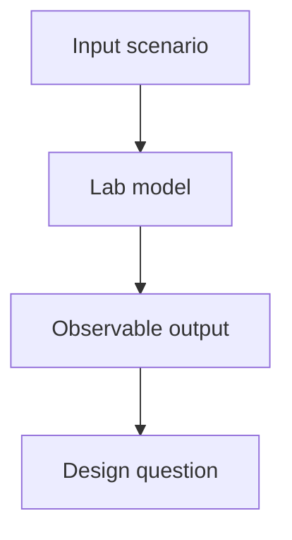

# [Lab Name] Design

## Problem

`[State the behavior this lab demonstrates and why it matters in system
design.]`

## Requirements

Version 1 must:

- demonstrate `[core behavior]`;
- let the learner change `[important variable]`;
- print or record observable output;
- include tests for the important behavior.

Version 1 does not need:

- production networking;
- external services;
- persistence beyond local files or memory unless the ticket requires it;
- complex configuration.

## Model

Describe the simplified entities and rules.

| Concept | Meaning In This Lab | Production Equivalent |
| --- | --- | --- |
| `[Concept]` | `[Toy representation]` | `[Real system concept]` |

## Flow

## Assumptions

- `[Assumption that keeps the lab small]`
- `[Assumption that affects interpretation]`

## Why This Is Simplified

Explain which production concerns are intentionally omitted and why the lab is
still useful for learning the decision.
