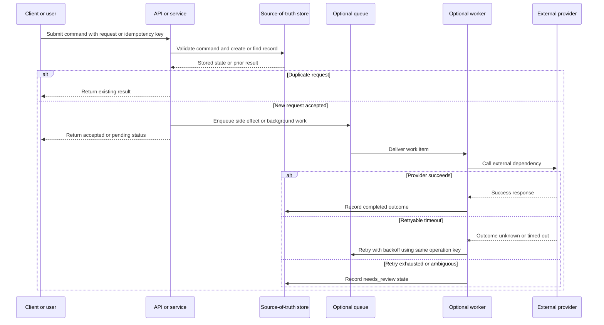

# Sequence Diagram Template

Use this template when a page needs to show request order, async handoff,
retries, duplicate handling, or failure paths. Keep the sequence tied to one
workflow and delete any participant that does not affect the decision.

Follow the [diagram style guide](../docs/visuals/diagram-style-guide.md),
[diagram legend](../docs/visuals/diagram-legend.md), and
[Mermaid examples](../docs/visuals/mermaid-examples.md). Keep the diagram
original to the page you are writing.

## Diagram Purpose

```text
[State the question this sequence answers, such as "What happens when the
provider times out?" or "Where does duplicate request handling happen?"]
```

## Mermaid Starter



## Guidance Comments

When adapting the template:

- use participant names that match the page's terminology;
- keep the sequence focused on one workflow;
- use `alt` branches for duplicate requests, success, retryable errors, and
  exhausted or ambiguous outcomes;
- reuse the same operation or idempotency key across retries when the page
  discusses safe retries;
- show async handoff only when queueing, workers, delay, isolation, or retry
  behavior changes the design;
- distinguish `Provider succeeds`, `Provider times out`, and `Retry exhausted`
  instead of merging them into one response;
- avoid vendor names unless the page explicitly compares products.

## Explanation Prompt

After the diagram, write a short explanation:

```text
This sequence shows [workflow]. The important ordering decision is [decision].
The duplicate or retry boundary is [boundary]. If [failure path] happens, the
system [recovery or review behavior].
```

## Review Checklist

Before publishing:

- The sequence answers the stated purpose.
- Participants are concrete and consistently named.
- Request, async handoff, retry, and failure paths are included only when they
  affect the decision.
- Ambiguous outcomes lead to retry, reconciliation, or review instead of fake
  success.
- The Mermaid source is readable in Markdown.
- The diagram is original and not copied or traced from another source.
