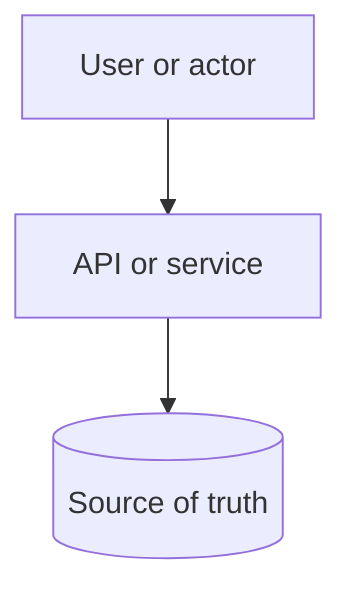

# Walkthrough Template

Use this template for end-to-end walkthrough pages under `docs/walkthroughs/`.
It builds on the broader [design doc template](design-doc-template.md), but it
expects more narrative reasoning, explicit alternatives, and a clear version 1
shape.

Replace bracketed placeholders with original content. Keep the walkthrough
practical: show how the design changes as requirements, scale, failures, and
operational concerns become clearer.

## Title

`# [System Name] Walkthrough`

Use a concrete system name, such as `URL Shortener Walkthrough`, not a generic
topic label.

## Problem Statement

`[State the user, job, system boundary, and version 1 scope in one or two
paragraphs.]`

Include:

- primary users or actors;
- the job the system performs;
- what is out of scope;
- one original example scenario.

## Functional Requirements

`[List the product behaviors the system must support.]`

Use direct statements:

- `[Actor] can [action].`
- `[Operator] can [admin or repair action].`
- `[External system] can [integration action].`

Separate must-have version 1 behavior from later behavior.

## Non-Functional Requirements

`[List the quality constraints that shape the design.]`

Cover relevant targets or expectations:

- latency;
- throughput and peak load;
- availability;
- durability;
- consistency and freshness;
- security and privacy;
- observability;
- cost;
- operability.

State assumptions when exact numbers are unknown.

## Core Entities

`[List the main entities and relationships.]`

| Entity | Purpose | Key Relationships |
| --- | --- | --- |
| `[Entity]` | `[What it represents]` | `[Related entities]` |

Keep entities product-oriented. Avoid starting with tables or services before
the domain is clear.

## API Sketch

`[Sketch the smallest useful API, command, or event surface.]`

```text
[METHOD] /[resource]
Actor: [actor]
Request: [fields]
Response: [fields]
Important errors: [errors]
```

Include authorization assumptions and important failure cases. Keep framework
details out of the walkthrough unless they change the design.

## Read Path

`[Describe the critical read path from request to response.]`

Include:

- actor and request;
- source-of-truth reads;
- derived, cached, or indexed reads;
- latency and freshness expectation;
- what happens when the read path is degraded.

## Write Path

`[Describe the critical write path from request to durable state.]`

Include:

- validation and authorization;
- idempotency or duplicate handling;
- transaction boundary;
- conflict behavior;
- asynchronous follow-up work;
- response timing.

## Data Model

`[Describe the storage shape, ownership, indexes, and retention.]`

| Data | Source Of Truth? | Notes |
| --- | --- | --- |
| `[Data]` | `[Yes/No]` | `[Indexes, retention, derived views, privacy notes]` |

Call out:

- authoritative data;
- derived projections;
- indexes;
- retention and deletion;
- backup and restore expectations.

## Component Choices

`[Explain each component and why it exists.]`

| Component | Requirement It Serves | Alternative Considered | Trade-Off |
| --- | --- | --- | --- |
| `[Component]` | `[Requirement or constraint]` | `[Alternative]` | `[Cost or risk]` |

Do not add caches, queues, replicas, search indexes, or separate services
without a named requirement or failure mode.

## Architecture Diagram

`[Add an original Mermaid diagram.]`



Explain the diagram after it appears. Show queues, stores, trust boundaries,
external providers, and async paths when they matter.

## Consistency Decisions

`[Explain where correctness, freshness, ordering, and conflict handling matter.]`

Prompts:

- Which write must be atomic?
- Which reads can be stale?
- Which duplicates are safe or unsafe?
- Which operation needs idempotency?
- Which conflicts are rejected, merged, retried, or repaired?

## Scaling Strategy

`[Explain version 1 scale assumptions and likely bottlenecks.]`

Include:

- users or actors;
- average and peak request rate;
- read/write ratio;
- storage growth and retention;
- bandwidth or fanout;
- first expected bottleneck;
- scaling trigger.

Link to capacity estimation or bottleneck analysis when relevant.

## Failure Modes

`[List important failure modes and expected behavior.]`

| Failure | User Impact | System Response | Repair Or Follow-Up |
| --- | --- | --- | --- |
| `[Failure mode]` | `[What user sees]` | `[Retry, degrade, reject, queue, or compensate]` | `[Operator or automated action]` |

Cover both component failures and workflow failures. Include dependency failure,
retry exhaustion, stale data, duplicate work, and partial completion when
relevant.

## Security Concerns

`[Name actors, permissions, trust boundaries, and abuse risks.]`

Include:

- authentication and authorization assumptions;
- sensitive data;
- input validation;
- abuse and cost-amplification paths;
- audit trail needs;
- third-party or external boundary risks.

## Observability

`[Name the signals needed to debug and operate the design.]`

Cover:

- metrics for user-visible health and saturation;
- logs with safe correlation identifiers;
- traces for cross-component paths;
- alerts tied to symptoms or data/security risk;
- dashboards and runbooks;
- SLOs when the workflow has a reliability target.

## Cost Considerations

`[Explain main cost drivers and cost-aware choices.]`

Consider:

- compute;
- storage, indexes, backups, and retention;
- bandwidth and large payloads;
- external API or provider calls;
- observability volume;
- operational labor.

## Version 1 Simplification

`[State what the first useful version intentionally keeps simple.]`

Include:

- advanced components deferred;
- manual processes accepted for rare cases;
- limits that keep the design understandable;
- measurements required from day one.

## What Changes At 10x Scale

`[Explain which assumptions break and what changes.]`

Prompts:

- Which bottleneck appears first?
- Which component needs isolation, replication, partitioning, caching, queueing,
  or replacement?
- Which manual process stops working?
- Which reliability, observability, security, or cost requirement becomes more
  strict?
- Which metric or incident triggers the next design step?

## Related Pages

`[Link the cookbook pages that support this walkthrough.]`

Recommended links to consider:

- requirements or method pages;
- component decision pages;
- data, communication, scalability, reliability, security, and operations pages
  used by the design.

## Review Checklist

Before publishing, confirm:

- The walkthrough starts from the problem, not the architecture.
- Requirements are separated from component choices.
- Every component has a reason and at least one trade-off.
- Read and write paths are explicit.
- The source of truth and derived data are named.
- Consistency and idempotency decisions are clear where relevant.
- Failure modes include user impact and repair behavior.
- Security, privacy, abuse, observability, and cost are covered.
- Version 1 is simpler than the future design.
- The 10x section explains triggers, not just bigger machines.
- Examples and diagrams are original.
